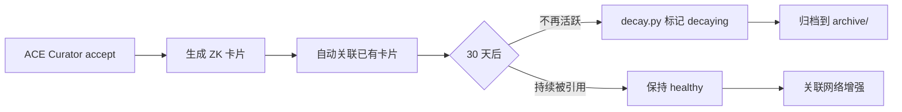

# 你的 AI 助手总在「失忆」？FlowWiki 的 A-MEM 卡片记忆系统来了

> 每次新开一个 AI 会话，就像跟一个失忆的医生对话——它有所有的医学知识，但完全不知道你昨天刚做过什么检查。A-MEM 卡片记忆系统就是为了解决这个问题。

---

## 一、"我上周让你分析的那份报告呢？"

这是我最常听到的抱怨——不是来自 AI 新手，而是那些已经深度使用 AI 的开发者。

场景是这样的：你上周扔给 Claude Code 一份 50 页的技术方案，要求它分析后写入团队知识库。它做了，做得还不错。今天你想追问一个衍生问题："上次那个方案的容灾设计部分，有没有提到异地多活？"

AI 的回答：「我没有您之前对话的上下文，无法确认您提到的方案内容。」

不是它不想回答。是它**真的不记得**。

这就是无状态 LLM 的致命问题。每一轮对话都是独立世界——你的 agent 有所有公开的知识，但关于"你"和"你之前做了什么"，它就是个新生儿。

上两篇文章我们聊了 FlowWiki 的总览（6 gaps → 7 layers）和 ACE 反思循环（防幻觉机制）。今天要拆的是第二个核心创新——这个问题的直接解方：**A-MEM 卡片记忆系统**。

---

## 二、为什么传统 LLM Wiki 的 ingest 是"一次性的"

Karpathy 的原始 LLM Wiki 设计很美：raw → wiki → query。四个操作的闭包很优雅。

但它有一个结构性的盲区：**ingest 是一次性操作**。

```
raw/ 文件 → AI 编译 → wiki/ 页面 → 结束
                                   ↑
                              没有"过程记录"
```

那会有什么后果？

| 场景 | 传统 LLM Wiki 的表现 | 后果 |
|------|---------------------|------|
| 新会话想了解上次 ingest 了哪些内容 | 只能读 wiki/ 最终结果，看不到过程 | 不知道为什么那么写、有什么争议 |
| ingest 100 篇文档后问"我覆盖全了吗" | 无法回答——不记得做过什么 | 重复劳动、遗漏 |
| AI 在上次 ingest 中有过犹豫/矛盾 | 信息丢了 | 下次遇到同样矛盾无法预警 |
| 知识库用 3 个月后想审查 ingest 质量 | 除了 wiki/ 页面本身，无任何可查 | 知识库变成黑箱 |

这不是 AI 不够聪明。是**架构就没有给"记忆"留位置**。

---

## 三、A-MEM 的核心思想：把知识拆成卡片，而不是堆成文件

A-MEM 的名字来自一篇论文中的 Zettelkasten（卡片笔记法）思想。核心逻辑很简单：

> 不是把所有知识存成一个大文件，而是拆成独立卡片。每张卡片记录**一个知识点 + 来源证据 + 与其他卡片的关联**。

类比一下：Wiki 页面像一本百科全书的条目——完整但笨重。ZK 卡片像索引卡片——轻量、可组合、可关联。

```
wiki/ 页面：                          A-MEM 卡片：
┌─────────────────────────┐           ┌──────────────────┐
│ # 异常检测方法           │           │ ZK-2026-07-17-001 │
│                         │           │                  │
│ ## 概述                 │           │ > P99 比平均值    │
│ 异常检测是...（500字）   │           │   更早发现尾部    │
│                         │           │   延迟恶化        │
│ ## 统计方法             │           │                  │
│ 3-Sigma 法则...（300字） │           │ source: raw/xxx   │
│                         │           │ related: ZK-002   │
│ ## 机器学习方法          │           │ confidence: high  │
│ Isolation Forest...     │           │                  │
│ （400字）               │           │ ACE: 已审查       │
│ ...                     │           └──────────────────┘
│ （总共 2000 字）         │
└─────────────────────────┘
```

卡片不替代 wiki 页面，而是**补充**。wiki 页面是"编译后的知识产出"，卡片是"产出的过程记忆 + 关键论点索引"。两者配合使用。

---

## 四、FlowWiki 的 A-MEM 实现：164 行 Python，零数据库

这是我最自豪的部分——A-MEM 的整个实现只用了 **164 行 Python，零外部数据库依赖**。所有卡片以 Markdown 文件存在 `.memory/zettelkasten/` 目录下。

### 一张卡片的解剖

```markdown
---
id: ZK-2026-07-17-example
date: 2026-07-17
tags: ['flow-wiki', 'root-cause', 'anomaly-detection']
source: raw/root-cause/sample-incident-report.md
related: ['ZK-2026-07-17-001']
confidence: high
---

# 异常检测方法的实际应用：支付网关延迟异常

> 从支付网关 P99 延迟异常案例中提炼的异常检测方法论要点

## 关键论点
- 百分位指标（P99/P95）比平均值更敏感，能更早发现尾部延迟恶化
- 多层监控体系交叉验证能大幅缩短 MTTR
- 配置变更是高频根因来源
- 动态阈值优于静态阈值

## 关联知识
- [[wiki/concepts/异常检测方法]]
- [[wiki/playbooks/根因分析五步法]]

## 关联卡片
- [[ZK-2026-07-17-001]]

## 原始证据
- [[raw/root-cause/sample-incident-report.md]]
```

每张卡片包含 6 个标准段：

| 段 | 作用 |
|----|------|
| **Frontmatter** | id、日期、标签、来源、关联卡片、置信度 |
| **标题 + 摘要** | 一眼知道这张卡片在说什么 |
| **关键论点** | 提炼后的要点，不是全文搬运 |
| **关联知识** | 指向 wiki/ 中相关的编译页面 |
| **关联卡片** | 指向其他 A-MEM 卡片（自增长关联网络） |
| **原始证据** | 指向 raw/ 源文件，保证可溯源 |

### 自动关联：卡片之间自己"找到彼此"

A-MEM 最巧妙的设计不是卡片本身，而是 **`_find_related_cards()` 方法**。

每次生成新卡片时，系统自动扫描已有卡片，基于关键词匹配找到最相似的前 3 张，填入 `related` 字段。这样，随着卡片数量增长，关联网络自动形成：

```
ZK-001 (异常检测基础理论)
  ├── ZK-002 (3-Sigma vs Isolation Forest 适用场景)
  ├── ZK-003 (动态阈值在支付场景的实践)
  └── ZK-004 (监控告警误报率优化)
        └── ZK-005 (告警疲劳与 on-call 效率)
```

这个关联网络的价值在于：**新会话的 AI 启动时，读最近的 5 张卡片 → 沿 related 链展开 → 自动恢复对知识库"发生了什么"的记忆。**

### 记忆生命周期：从创建到归档

A-MEM 的记忆不是永生的。它有完整的生命周期管理：



- **生成**：每次 ACE Curator 决策为 `accept` 后，自动调用 `ZKCardGenerator.generate_card()`
- **关联**：`_find_related_cards()` 自动建立关联链
- **衰减**：`decay.py` 每日扫描，标记长时间未被引用的卡片
- **归档**：30 天后自动移入 `archive/` 目录
- **配置**：`config.toml` 中 `card_limit=10000`、`auto_prune=true`、`prune_threshold=0.3`

---

## 五、跨会话的"记忆力"是怎么来的

这里说一个真实的 FlowWiki 内置流程：

### 会话 A（周一）：ingest 一批文档

```
用户: 请把 raw/docs/ 下的 5 份技术文档入库

AI 执行 ingest pipeline:
  → Generator: 为每份文档生成 wiki 摘要
  → Reflector: 审查 5 份摘要，发现 doc-03 引用的版本已过时
  → Curator: doc-01/02/04/05 accept，doc-03 标记 "待核"
  → ZKCardGenerator: 生成 5 张卡片
    ZK-0719-001: doc-01 的核心论点
    ZK-0719-002: doc-02 的核心论点
    ZK-0719-003: doc-03 被拒原因 → conflict/ 记录矛盾
    ZK-0719-004: doc-04 的核心论点
    ZK-0719-005: doc-05 的核心论点
    (每张卡片自动关联了前序卡片)
```

### 会话 B（周三）：追问

```
用户: 上次入库的文档里有提到微服务拆分策略吗？

AI 启动时:
  1. 读取 .memory/zettelkasten/ 最近 5 张卡片
  2. 发现 ZK-0719-002 标签包含 "microservices"
  3. 沿 related 链展开：ZK-002 → ZK-004 → ZK-005
  4. 从卡片中找到 wiki/playbooks/微服务拆分指南

AI 回答:
  "是的，周一的 doc-02（微服务拆分指南）中提到了按业务边界拆分的策略。
   具体在 wiki/playbooks/微服务拆分指南，关键论点是..."
```

**关键点**：会话 B 的 AI 没有访问会话 A 的对话历史（那是上下文窗口做不到的），但它通过读取 A-MEM 卡片，恢复了关于"周一做了什么"的记忆。这就是卡片系统的价值。

### 更厉害的场景：换 Agent 也不丢记忆

因为卡片是纯 Markdown 文件，任何 agent 都能直接读取：

| Agent | 启动文件 | 读取卡片方式 |
|-------|---------|------------|
| Claude Code | `CLAUDE.md` | `read .memory/zettelkasten/*.md` |
| Codex | `AGENTS.md` | `read .memory/zettelkasten/*.md` |
| WorkBuddy | `WORKBUDDY.md` | `read .memory/zettelkasten/*.md` |
| Gemini CLI | `GEMINI.md` | `read .memory/zettelkasten/*.md` |

周一用 Claude Code 做了 ingest，周三换 Codex 追问——卡片完全可读。**记忆跟随知识库，不跟随 Agent。**

---

## 六、不止于"记住"：A-MEM 的完整记忆体系

Zettelkasten 卡片只是 A-MEM 的一部分。完整的 `.memory/` 目录结构覆盖了 Agent 记忆的全维度：

```
.memory/
├── zettelkasten/     ← 知识卡片（今天讲的主角）
├── episodic/         ← 跨会话问答记录（每次 query 后回存）
├── ace/              ← ACE 反思记录（每次审查的完整决策链）
├── conflict/         ← 知识矛盾追踪（新旧知识打架时记录）
├── gaps/             ← 知识缺口卡片（发现缺失时自动标记）
├── decay/            ← 记忆衰减日志（哪些卡片被归档了）
├── minority/         ← 少数派分支（矛盾缓存 + 晋升管道）
└── ops/              ← 操作日志（谁在什么时候做了什么）
```

其中 `conflict/` 和 `minority/` 是 v2.2 新增的**冲突路由矩阵**的一部分。当新知识与已有知识矛盾时，不是简单覆盖，而是：

```
V4: 单源矛盾 → 缓存到 minority/ 分支
    ↓ 积累 ≥3 条独立证据
V5: 多源矛盾 → Curator 触发 label_pending 晋升
```

这个机制确保了**知识库不会因为一次偶然的矛盾就推翻已有结论**，但也**不会永远忽视重复出现的矛盾信号**。这是 A-MEM 从"被动记录"进化到"主动管理"的关键一步。

---

## 七、坦诚地比一比：A-MEM vs 市面上的记忆方案

| 维度 | A-MEM (FlowWiki) | agentmemory | mem0 | MemGPT |
|------|:---:|:---:|:---:|:---:|
| 存储方式 | **Markdown 文件** | JSON/SQLite | 向量数据库 | SQLite + 向量 |
| 外部依赖 | **零** | pip install | pip + 向量服务 | pip + LLM |
| 可读性 | **人类直接可读** | 需解析 | 需解析 | 需解析 |
| Agent 兼容 | **任何 agent** | Python SDK | Python SDK | Python SDK |
| 记忆关联 | **自动关联链** | 手动关联 | 向量相似度 | LLM 抽取 |
| 衰减管理 | **内置 decay.py** | ❌ | ❌ | 手动归档 |
| 矛盾追踪 | **conflict/ + minority/** | ❌ | ❌ | ❌ |
| Git 版本控制 | **天然兼容** | 二进制不可 diff | 不可 diff | 不可 diff |

A-MEM 的选择是刻意的："我们不做又一个记忆数据库，我们做一个任何 agent 都能直接读的文件系统记忆层。"

agentmemory 和 mem0 都是优秀的工具，但它们是为 Python agent 设计的 SDK。而 FlowWiki 的 A-MEM 设计哲学是：**记忆应该是知识库的一部分，不是 agent 的附属品**。换 agent 不应该丢记忆。

唯一的代价：文件系统在大规模（10 万+卡片）时检索效率不如向量数据库。但 FlowWiki 的规模定位（默认 10,000 张卡片上限）下，纯文件关键词匹配完全够用。而且如果真的需要大规模语义检索，配置切换到 LightRAG 就可以——L2 检索层本来就有这个能力。

---

## 八、总结 + 下一篇预告

A-MEM 卡片记忆系统解决了 FlowWiki 要补的第二个致命缺口：**跨会话记忆**。

它不复杂——164 行 Python，Markdown 文件，零数据库——但这正是它的力量所在。在一个动辄要上向量数据库、要装几十个依赖的 AI 工具生态里，A-MEM 证明了**好的设计不一定要重**。

回顾一下前三篇的递进关系：

```
第一篇: 6 个缺口 → 7 层架构 → 总览全景
第二篇: 缺口 1 → ACE 反思循环 → 防幻觉,错误进不了 wiki
第三篇: 缺口 2 → A-MEM 卡片记忆 → 跨会话不丢上下文
第四篇: 缺口 3 → Skill 化层 → 知识自动变成能力
```

知识存进去了（第一篇）、存对了（第二篇）、记住了（第三篇）——下一步自然是**怎么让知识自动变成能力**。这就是下一篇文章的主题：**任务 → 知识 → Skill 三元组**——FlowWiki 如何把高频操作从"每次从头做"升级为"O(1) 调用"。

---

*本文是 FlowWiki 从零到一系列第 3 篇，下一篇：[知识不应该只躺着等被查──FlowWiki 的「任务→知识→Skill」三元组]*

*系列目录：[第一篇：Karpathy 提出了 LLM Wiki 的构想，我把 6 个致命缺口全补上了](https://juejin.cn/post/xxxxx) | [第二篇：ACE 反思循环如何拦截幻觉](https://juejin.cn/post/xxxxx) | 下一篇：Skill 化层*

*GitHub：[xiejianjun000/FlowWiki](https://github.com/xiejianjun000/FlowWiki)*
