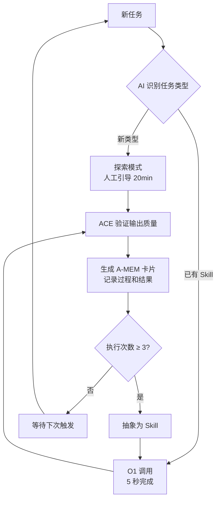
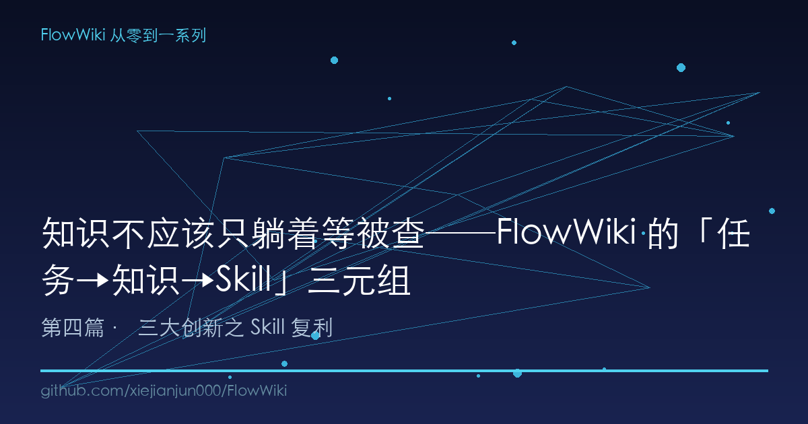

# 知识不应该只躺着等被查──FlowWiki 的「任务→知识→Skill」三元组

> 你的知识库已经有了 ACE 防幻觉（内容可靠）和 A-MEM 记忆（记得住），但在"用得起来"这件事上还是裸奔的。今天聊聊知识复利的最后一公里：怎么让知识自动变成能力。

---

## 一、知识库最大的浪费：内容在，能力不在

先讲一个真实场景。

我在做一个执法督察评查知识库，里面有 155 篇专业文档：法律法规、检查标准、案例判据、程序规范。ACE 反思循环让内容质量有了保障（详见系列第二篇），A-MEM 卡片记忆让跨会话不丢上下文（详见第三篇）。

但有一天我发现一个问题。

我想让 AI 帮我做"判据匹配"──把一份检查报告里的数据，逐一匹配到判据库里，判断哪些合规、哪些异常。这事儿我每做一次报告就要做一次，流程完全固定：

1. 打开判据库，找到适用条目
2. 逐条读取检查报告里的数据
3. 比对数值，判断通过/不通过
4. 汇总结果，标注异常项

第一次，我花了 20 分钟一步步告诉 AI 怎么做。

第二次，AI 识别到同类任务，但还是要我确认流程。10 分钟。

第三次，又来了。我盯着屏幕，忽然意识到一个荒谬的事：

**我的知识库里有完整的判据库（wiki/ 里躺着几十条结构化判据），有完整的执行记录（A-MEM 卡片里记着前两次怎么做），但每次都要我从头讲一遍──就跟教一个新员工重复同样的入职培训一样荒唐。**

这就是 Karpathy 原始 LLM Wiki 架构里藏得最深的一个缺口：**知识的复利停在了"能被查到"这个层次。**

---

## 二、Karpathy 停在了第二层，真正的复利在第三层

回顾一下 LLM Wiki 的两层模型：

```
raw/ ──ingest──→ wiki/
（源文件）       （编译后知识）
```

这张图很美。raw 是只读的"源代码"，wiki 是 AI 编译的"机器可读知识库"。每次 query 都从 wiki 里检索相关页面，合成回答。

但这里有个沉默的假设：**"查得到" = "有结果"。**

现实呢？

你查到了一条判据"pH 值应在 6-9 之间"。AI 告诉你这条信息。然后呢？你要自己对照检查报告，自己找 pH 值的数据，自己做比对，自己写结论。

查到了，然后？还是一样要花时间**执行**。

这就是复利的瓶颈：

```
知识量 ↑  →  查询速度 ↑  →  但执行效率 →
```

知识越多，查得越快，但在"用"这个环节，效率增长是趋零的。你仍然是个查字典的人类──字典再大，查完还得自己造句。

**FlowWiki 的方案是加第三层：Skill 层。**

```
         ┌─────────────┐
         │  raw/ (只读)  │
         └──────┬──────┘
                │ ingest + ACE
         ┌──────▼──────┐
         │ wiki/ (编译)  │
         └──────┬──────┘
                │ 高频任务 → 抽象
         ┌──────▼──────┐
         │ Skill (能力)  │  ← 第三层
         └─────────────┘
```

不只是"知道判据是什么"，而是"会做判据匹配"。不是"查信息"，是"执行操作"。

---

## 三、升级路径：探索 → 标准化 → O(1)

每一段知识从"被查"到"被执行"，要走三个台阶：

### 台阶一：探索（Exploration）

用户首次遇到一个任务，手动告诉 AI 怎么做。这时候没有 Skill，AI 每一步都在"问路"。高质量的输出靠人工引导，耗时 15-30 分钟。

**这一阶段的特征是：高频对话、反复修正、依赖人的领域知识。**

### 台阶二：标准化（Standardization）

同一个任务执行了 3 次以上，人已经不想重复了。AI 开始能识别模式，但仍需要确认边界条件。这时就该把流程抽成 Skill──不是一段 Prompt 模板，而是一个带输入/输出契约、执行步骤、约束条件的**可调用模块**。

以 `criteria-matching` 为例，标准化后的 skill 结构：

```markdown
# Criteria Matching Skill
> 判据匹配 — 将数据与判据体系进行匹配

## 功能
将输入数据与判据库进行自动匹配，识别满足的判据和异常特征。

## 输入
{
  "data": "待匹配数据",
  "data_type": "数据类型标识",
  "criteria_set": "判据集名称（可选）"
}

## 输出
{
  "matched": [
    {"criterion": "判据名称", "value": "数据值", "result": "通过|不通过"}
  ],
  "unmatched": ["未找到适用判据的数据项"],
  "summary": "匹配概况"
}

## 约束
- 判据库需要持续维护
- 新数据类型需先注册判据
- 匹配结果需人工复核
```

关键点：**约束部分**一句话说明了这个 skill 的局限──它不能自动注册新判据、结果必须人类复核。这比一个黑箱 AI 输出诚实得多。

### 台阶三：O(1) 调用

Skill 一旦标准化，AI agent 再遇到同类任务时，不需要任何对话就能直接调用。从"20 分钟人机协作"变成"5 秒自动执行"。

这就是从 O(n) 到 O(1) 的质变：**任务类型越重复，效率提升倍数越大。**

```
┌──────────┬──────────┬──────────┬──────────┐
│          │ 第 1 次  │ 第 2 次  │ 第 N 次  │
├──────────┼──────────┼──────────┼──────────┤
│ 无 Skill │ 20min    │ 15min    │ 12min    │
│ 有 Skill │ 20min    │  5min    │  5s      │
└──────────┴──────────┴──────────┴──────────┘
```

第一次耗时一样──因为创建 Skill 本身需要投入。但从第二次开始，差距指数级拉大。

到目前为止，FlowWiki 已经沉淀了 **40+ 个 Skill**，分为两层：

| 层级 | 数量 | 内容 | 示例 |
|------|:----:|------|------|
| L5 核心操作 | 4 | Karpathy 四操作 | ingest、query、lint、research |
| L5 行业 Skill | 30+ | 通用专业能力 | criteria-matching、risk-identification、time-limit-calc |
| L5 行业专属 | 8 | 特定领域深度 | 执法督察评查的 evidence-verification、onsite-checklist |

---

## 四、双部署机制：一套 Skill，两个世界

这个机制说起来简单，但很实用。

Claude Code 和 WorkBuddy/Codex/Gemini 对 Skill 的加载机制完全不同。Claude Code 读 `.claude/skills/`，WorkBuddy 读 `.agents/skills/`。如果你只维护一个目录，换个 agent 就没法用。

FlowWiki 的做法是：**同一个 Skill 在两边各存一份，结构完全一致。**

```
项目根目录/
├── .agents/skills/
│   ├── ingest/SKILL.md
│   ├── criteria-matching/SKILL.md
│   ├── enforcement-review/
│   │   ├── evidence-verification/SKILL.md
│   │   └── ...
│   └── ...
│
└── .claude/skills/
    ├── ingest/SKILL.md           ← 内容完全一样
    ├── criteria-matching/SKILL.md  ← 内容完全一样
    ├── enforcement-review/
    │   ├── evidence-verification/SKILL.md
    │   └── ...
    └── ...
```

**关键约束：`.agents/skills/` 和 `.claude/skills/` 必须保持同步。** 新增一个 Skill 要同时更新两端，修改也要同步。这个约束已经被写进 FlowWiki 的开发规范里。

> 这个设计的哲学是：**不追求"一个格式兼容所有 agent"的银弹**（实际上也不存在这种银弹──每个 agent 对 skill 加载的协议都不同），而是用最简单的文件复制来保证兼容性。代价是轻微的双倍维护，好处是无论你用什么 AI 工具，Skill 都能正常工作。

---

## 五、知识复利的完整飞轮

把 ACE（防幻觉）、A-MEM（记忆）、Skill（能力）串联起来，FlowWiki 的完整飞轮是这样的：



飞轮一旦转起来：

1. **ACE 保证输入正确**──幻觉进不了知识库
2. **A-MEM 保证上下文不断**──新会话知道旧会话干了什么
3. **Skill 保证执行提效**──重复任务从 20 分钟降到 5 秒

三个创新是三角关系，缺了任何一个，复利都不成立：

```
         ACE（质量）
          /\
         /  \
        /    \
       /      \
A-MEM（记忆）── Skill（能力）
```

- 没有 ACE → Skill 执行基于错误知识，越用越错
- 没有 A-MEM → Skill 每次重新学习上下文，效率打折
- 没有 Skill → 知识和记忆只能"看"，不能"动"

---

## 六、坦诚说说不完美的地方

1. **Skill 的创建目前仍需人工判断阈值**。什么时候该抽成 Skill？靠人决定"这个操作已经做了 3 次"，而不是自动检测。理想的方案是系统自动统计任务频率，触发 skill 化建议──这个还没做。

2. **双部署是简单方案，不是优雅方案**。两个目录完全重复，如果 Skill 数量继续增长（从 40+ 到 100+），人工同步的维护成本会越来越高。需要一个自动化同步工具──这也是待办的。

3. **Skill 的版本管理和测试还没有**。代码有 CI跑测试，Skill 改了内容怎么验证它还能正常工作？目前靠人工 review。

---

## 七、系列连载到这里，三大创新全部展开

第一篇我们说过 FlowWiki 的三个核心创新：ACE、A-MEM、Skill。

- 第二篇深挖了 **ACE 反思循环**──三 agent 交叉审查，幻觉进不了 wiki。
- 第三篇解剖了 **A-MEM 卡片记忆**──Zettelkasten 方法让 AI 跨会话不丢上下文。
- 今天这篇补齐了最后一环：**Skill 三元组**──知识不仅要能查，还要能自动执行。

三篇加起来：**内容可信 + 上下文不断 + 能力复用**。Karpathy 原始构想里没考虑到的三个工程问题，都有了答案。

但故事还没完。下一篇我们要讲一个更"人"的问题：你的知识库 AI 用着很爽，但**你自己能找到东西吗**？

---

下一篇预告：**AI 看 index.md，人类看 6 板块──FlowWiki 的双索引人机协作架构**。聊聊为什么"机器用得好"和"人类找得到"是两套完全不同的设计逻辑，以及 FlowWiki 怎么同时伺候好两边。

---

*本文是 FlowWiki 从零到一系列第 4 篇*

*系列目录：*
* [第一篇：Karpathy 提出了 LLM Wiki 的构想，我把 6 个致命缺口全补上了──FlowWiki 开源首发]*
* [第二篇：让 AI 互相吵架然后裁决──FlowWiki 的 ACE 反思循环如何拦截幻觉]*
* [第三篇：你的 AI 助手总在「失忆」？FlowWiki 的 A-MEM 卡片记忆系统来了]*
* [**第四篇：知识不应该只躺着等被查──FlowWiki 的「任务→知识→Skill」三元组**] ← 你在这里
* [第五篇：AI 看 index.md，人类看 6 板块──FlowWiki 的双索引人机协作架构]

*GitHub：[xiejianjun000/FlowWiki](https://github.com/xiejianjun000/FlowWiki)*

---

## 本文配图




