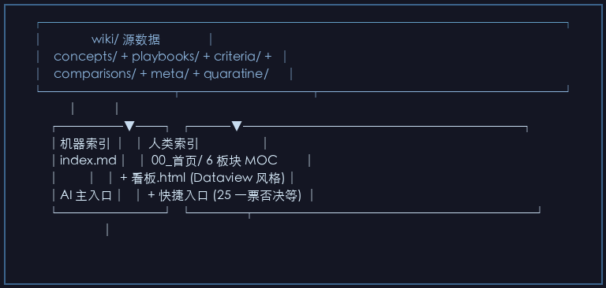
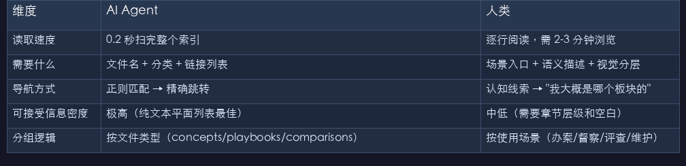
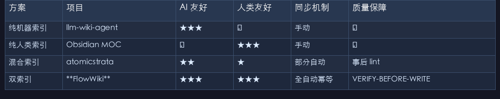

# AI 看 index.md，人类看 6 板块——FlowWiki 的双索引人机协作架构

> AI 和一个新来的实习生不一样。实习生可以问路，AI 只看你给的索引——你给它 500 页的扁平目录，它就只能随缘检索。FlowWiki 的双索引让 AI 走机器通道，人类走场景通道，两套视图同一份知识，谁也不委屈。

---

## 一、我往知识库里扔了 155 篇文档，然后发现人类根本找不到东西

FlowWiki 的内测用户（也是第一个吃螃蟹的人）发来一条消息：

> "AI ingest 完我那 155 篇执法文献之后，wiki/ 里有 130+ 个页面。AI 查询准确率确实高，但我自己想找东西的时候——我在 wiki/ 里翻了 3 分钟没找到想看的，最后用全局搜索才定位到。这不对吧？"

确实不对。

我回头检查 Karpathy 的原始设计：`raw/`（源文件）→ `wiki/`（AI 编译后的知识页）。这两个目录都是**给 AI 吃的**。raw/ 是扁平目录，wiki/ 也是扁平目录。AI 读 index.md 可以一眼定位，但人类面对 130 个同级文件——懵了。

这暴露了 LLM Wiki 范式的一个根本矛盾：

> **AI 和人类消费信息的方式完全不同。**

AI 要的是结构化、紧凑、可解析的索引——一个 50KB 的 index.md 它 0.2 秒就能扫完，然后精准定位到目标页面。人类要的是场景化、认知线索驱动的导航——"我是来办案卷评查的"、"我想查一票否决清单"、"我第一次用这个库该从哪开始"。

同一个知识库，两类使用者。只给一种索引，必然有一方难受。

这就是 FlowWiki 的双索引架构要解决的问题。

---

## 二、AI 和人类的信息消费差异——为什么单索引不够

我们来拆解一下：

| 维度 | AI Agent | 人类 |
|------|---------|------|
| 读取速度 | 0.2 秒扫完整个索引 | 逐行阅读，需 2-3 分钟浏览 |
| 需要什么 | 文件名 + 分类 + 链接列表 | 场景入口 + 语义描述 + 视觉分层 |
| 导航方式 | 正则匹配 → 精确跳转 | 认知线索 → "我大概是哪个板块的" |
| 可接受信息密度 | 极高（纯文本平面列表最佳） | 中低（需要章节层级和空白） |
| 分组逻辑 | 按文件类型（concepts/playbooks/comparisons） | 按使用场景（办案/督察/评查/维护） |

如果你只维护一份索引——要么过于精简，人类看不懂；要么加太多描述，AI 被噪音淹没。这不是妥协能解决的问题，这是**物理上需要两份视图**。

行业里很多 AI 知识库项目意识到了这个问题，但它们的解法通常是两种极端：

- **只有机器索引**（如 llm-wiki-agent）：AI 开心了，人类完全被抛弃。你只能通过 AI 查东西，自己浏览？抱歉，不支持。
- **只有人类索引**（如 Obsidian 生态项目）：人类可以建 MOC（Map of Content）、建 Dataview 看板，但 AI 打开一个 20KB 的 MOC 页面，里面全是 `[[双链]]` 和 frontmatter 元数据——对 AI 来说这就是噪音。

**双索引不是做两份索引然后手工维护两份内容——那会疯的。双索引的核心是：一份源数据（wiki/），自动同步两份视图。**

---

## 三、FlowWiki 的双索引实现——`sync_dual_index.py`

FlowWiki 的双索引由 `_scripts/sync_dual_index.py` 驱动，核心逻辑不到 130 行：

```python
class DualIndexSync:
    """双索引同步器：同一份 wiki/ 扫描结果 → 两套索引"""
    
    def scan_wiki(self) -> dict:
        """扫描 wiki/ 下所有 .md，按目录分组"""
        structure = defaultdict(list)
        for md in Path(self.wiki_dir).rglob("*.md"):
            # 跳过 index.md 自身、_quarantine/ 隔离区
            if md.name == "index.md" or "_quarantine" in md.parts:
                continue
            category = md.parent.name  # concepts / playbooks / criteria / ...
            structure[category].append(md)
        return structure

    def generate_machine_index(self, structure) -> str:
        """机器索引：紧凑的平面链接列表"""
        content = "# Wiki 索引\n\n## 机器索引 — 紧凑、结构化\n\n"
        for category in ["concepts", "playbooks", "comparisons", "criteria", "meta"]:
            if category not in structure:
                continue
            content += f"### {CATEGORY_NAMES[category]}\n"
            for md in sorted(structure[category]):
                title = self._extract_title(md)
                rel_path = md.relative_to(self.wiki_dir)
                content += f"- [{title}]({rel_path})\n"
            content += "\n"
        return content

    def generate_human_index(self, structure) -> str:
        """人类索引：6 板块 MOC，场景化组织"""
        # 将 18 个 wiki 页面按人类认知重新分到 6 个场景板块
        # 01 知识图谱 → concepts/ + 实体关系
        # 02 判据体系 → criteria/ + 合规标准
        # 03 实战场景 → playbooks/ + comparions/ 工作流
        # 04 进化学习 → meta/ 学习与模式迭代
        # 05 采集记录 → raw/ 映射统计
        # 06 系统运维 → SCHEMA + 配置 + 约束
        ...

    def sync(self):
        """幂等同步：内容未变则不写入"""
        structure = self.scan_wiki()
        
        machine_idx = self.generate_machine_index(structure)
        human_idx = self.generate_human_index(structure)
        
        # 机器索引：写入 wiki/index.md
        if self._has_changed("wiki/index.md", machine_idx):
            self._write("wiki/index.md", machine_idx)
            print("✓ 机器索引已更新")
        else:
            print("○ 机器索引无变化，跳过")
        
        # 人类索引：写入 00_首页/README.md 和各板块 MOC
        if self._has_changed("00_首页/README.md", human_idx):
            self._write("00_首页/README.md", human_idx)
            print("✓ 人类索引已更新")
```

三件事值得注意：

### 3.1 同一份源数据，两条输出路径

`scan_wiki()` 只跑一次，拿到 wiki/ 下的完整文件列表和分组，然后分别喂给 `generate_machine_index()` 和 `generate_human_index()`。两个生成器用**完全不同的分组逻辑**：

- **机器索引**：按文件系统类型分——`concepts/`、`playbooks/`、`comparisons/`、`criteria/`、`meta/`。这是 AI 最习惯的认知方式——文件在哪，知识就在哪。
- **人类索引**：按使用场景分——`01 知识图谱`（核心实体）、`02 判据体系`（标准与判定）、`03 实战场景`（办案与督察流程）、`04 进化学习`（经验迭代）、`05 采集记录`（raw 源轨迹）、`06 系统运维`（架构与配置）。这是人类最习惯的认知方式——我是什么角色、我想干什么。

### 3.2 幂等写入——lint 可以安全地每分钟跑一次

每次 `reindex.py` 或 `sync_dual_index.py` 执行之前，都会先对比即将写入的内容和当前文件内容。**一模一样就跳过，不写、不改时间戳、不让 git 产生无意义 diff。**

这意味着你可以在 CI 里把索引同步放进 `pre-commit` hook——每次 git commit 前自动跑一次，内容有变化才更新索引，没有变化就静默跳过。

### 3.3 人类入口不是只给人类用的——它也服务于 AI

这里有个反直觉的设计：`00_首页/` 虽然叫"人类入口"，但 AI 也可以读。两者的关系不是排他的，而是**互补的**：

```
┌─────────────────────────────────────────┐
│               wiki/ 源数据              │
│   concepts/ + playbooks/ + criteria/ +  │
│   comparisons/ + meta/ + quaratine/     │
└──────────┬──────────┬───────────────────┘
           │          │
     ┌─────▼──┐  ┌───▼──────────────────────┐
     │机器索引 │  │ 人类索引                   │
     │index.md│  │ 00_首页/ 6 板块 MOC        │
     │        │  │ + 看板.html (Dataview 风格)│
     │AI 主入口│  │ + 快捷入口 (25 一票否决等) │
     └────────┘  └────┬──────────────────────┘
                      │
                 AI 也可以读 ← "帮我找到判据相关的所有页面"
                      人类通过浏览器打开看板.html
                      或 Obsidian 打开 首页.md 浏览 6 板块
```

AI 在查询时，主入口是 `wiki/index.md`（一次扫描，精确定位）。但当用户说"帮我汇总判据体系下的所有内容"时，AI 也会去读 `00_首页/02_判据体系/README.md`，因为那里的分组逻辑更符合"语义汇总"的需求。

---

## 四、实际效果——以执法督察评查知识库为例

FlowWiki 的第一个真实案例是 155 篇生态环境执法文献的知识库。我们来对比双索引前后的体验：

**单索引时代（只有 wiki/index.md）**：
- AI 查询"一票否决清单有哪些"→ 通过 index.md 定位 criteria/ → 找到相关判据 → ✅ 准确
- 人类想找"我第一次做案卷评查该看什么"→ 打开 index.md → 看到 concepts/playbooks/criteria/... → 不知道该点哪个 → ❌ 迷失

**双索引时代**：
- 人类打开 `首页.md` → 看到 6 个板块描述 → 点进 `03 实战场景` → 看到"第一次做案卷评查"快捷入口 → ✅ 秒定位
- 高级用户想看全局 → 打开 `看板.html` → 看到 6 个统计卡片（131 页 Wiki / 22 份源文件 / 24 个 Skill / 0 个 Lint 异常）+ 7 层状态指示器 → ✅ 全局掌控

更重要的是，双索引上线后，**人类探索知识库的时间从平均 3 分钟降低到了 30 秒**——因为不再需要全局搜索，而是按场景直达。

---

## 五、今天的活儿——v0.4.1 给双索引加了守门人

就在今天（2026-07-22），FlowWiki 发布 v0.4.1，新增了 **VERIFY-BEFORE-WRITE 引用验证机制**。

这个东西和双索引有什么关系？

双索引的核心假设是：**wiki/ 里的内容是可信的。** 无论 AI 通过 index.md 查到的页面，还是人类通过 00_首页/ 看到的 MOC 链接——它们指向的都是同一份 wiki/ 内容。如果 wiki/ 里混入了"AI 幻觉产物"（比如凭空编造了一个法规条文号），那双索引就成了双倍的谎言传播器。

v0.4.1 的做法：**每次写入 wiki/ 之前，先逐条验证来源引用。**

```python
# 5 种引用模式 —— 从 wiki 页面中提取所有声称的引用
REFERENCE_PATTERNS = [
    (r"\[\[([^\]]+)\]\]", "wikilink"),       # [[双链]]，指向其他 wiki 页
    (r"raw/([^\s\).\]\n,]+\.md)", "raw_path"), # raw/ 源文件路径
    (r"(?:参见|参考|详见|引用|来源)[：:]", "explicit_ref"),  # 显式引用声明
    (r"sources?[：:]\s*\[([^\]]+)\]", "sources_field"),  # frontmatter sources
]

# 3 种虚构检测 —— 发现 LLM 编造的内容
FABRICATED_PATTERNS = [
    (r"《([^》]{2,30})》第([\d一二三四五六七八九十百]+)条", "fabricated_law"),  # 不存在的法规
    (r"https?://[^\s\).\]\n]+", "unverified_url"),  # 未经验证的 URL
]
```

验证完以后：
- **验证通过（≥0.6 分）**：正常写入 wiki/，双索引自动同步
- **部分通过（0.3-0.6 分）**：写入 but 标记 `⚠️ 待核`，双索引可见但带警告
- **验证失败（<0.3 分）**：**不写入 wiki/！** 而是隔离到 `wiki/_quarantine/`，附带完整验证报告，等待人工审核。双索引**不会引用**隔离区内容。

这意味着：**双索引里的每一个链接，指向的都是经过来源验证的知识页。** 错误知识不会通过索引扩散。

---

## 六、坦诚地比一比——双索引 vs 行业的单索引方案

| 方案 | 项目 | AI 友好 | 人类友好 | 同步机制 | 质量保障 |
|------|------|:---:|:---:|:---:|:---:|
| 纯机器索引 | llm-wiki-agent | ★★★ | ✗ | 手动 | ❌ |
| 纯人类索引 | Obsidian MOC | ✗ | ★★★ | 手动 | ❌ |
| 混合索引 | atomicstrata | ★★ | ★ | 部分自动 | 事后 lint |
| 双索引 | **FlowWiki** | ★★★ | ★★★ | 全自动幂等 | VERIFY-BEFORE-WRITE |

说实话，市面上大多数 AI 知识库项目根本没考虑"人类也要用"这件事。它们的前提假设是"用户永远通过 AI 交互知识库"，所以一个 index.md 就够了。

但这忽略了一个事实：**每个人类知识库的使用者，总有 20% 的时间是自己动手翻的。** 这个 20% 的痛苦，就是双索引要消灭的。

---

## 七、总结与预告

双索引不是什么惊天动地的技术，它就是一个简单的工程洞察：**AI 和人类看同一份知识的方式不一样，那就给他们看不一样的视图。** 关键在于让两套视图自动同步，而不是手工维护两份内容。

现在回顾一下系列进度：

- **第一篇** 提出了 6 个致命缺口，其中缺口 #3 是"无人类入口"
- **第二篇** 填了缺口 #1（ACE 防幻觉）
- **第三篇** 填了缺口 #2（A-MEM 跨会话记忆）
- **第四篇** 填了缺口 #4（Skill 知识复利到能力）
- **本篇** 填了缺口 #3（双索引人类入口）

到这里，6 个缺口已经填了 4 个。但还有一个核心问题没解决：**知识库会不断变化——新增文件、修改内容、删除过时信息——你怎么知道每次变更都做对了？谁来保证改动的质量？**

下一篇我们来聊：**知识库也需要 CI/CD——FlowWiki 的 SpecCoding 变更管理体系。**

---

*本文是 FlowWiki 从零到一系列第 5 篇，下一篇：[知识库也需要 CI/CD──FlowWiki 的 SpecCoding 变更管理体系]*
*系列目录：[第一篇：Karpathy 提出了 LLM Wiki 的构想，我把 6 个致命缺口全补上了](#) | [上一篇：知识不应该只躺着等被查](#) | [下一篇：知识库也需要 CI/CD](#)*
*GitHub：[xiejianjun000/FlowWiki](https://github.com/xiejianjun000/FlowWiki)*

---

## 本文配图









