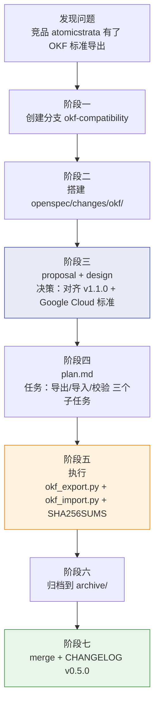

# 知识库也需要 CI/CD──FlowWiki 的 SpecCoding 变更管理体系

> 代码有 CI/CD、有 PR review、有 git blame，但知识库的每一次修改都在裸奔。三个月后没人知道"那段内容是谁加的、当时怎么想的、有没有检查过"。FlowWiki 用 SpecCoding 七阶段把知识库变更变成了可追溯的工程流水线。

---

## 一、深夜的 git blame 时刻

上个月凌晨两点，我盯着 FlowWiki 知识库里一段法律条文解释，陷入了灵魂拷问：

"这段话是 AI 写的还是人改的？为什么这么写？写的时候检查过没有？如果我改它，会不会和其他页面冲突？"

代码项目里，这些问题 git blame 一秒搞定。但知识库项目里，15 个 Markdown 文件的改动混在一次 commit 里，commit message 写着 "update docs"──这就是全部线索。

这还不是最糟的。让我真正警觉的是：**知识库的质量退化是渐进式的**。你不会在第一天就发现有问题，而是三个月后，当某个回答开始频繁出错，你把源头一查──发现早在三个月前的一次"小修正"里，一个 AI 生成的幻觉就已经悄悄渗入了知识库。

Karpathy 的 LLM Wiki 架构解决了"知识怎么编译"的问题，但没有解决"**编译过程的变更怎么管理**"的问题。这正是原始设计中第 5 个致命缺口：**变更不可追溯**。

代码有 CI/CD，有 pull request review，有自动化测试。知识库呢？为什么不能有？

---

## 二、知识库变更的四个死穴

任何一个知识库项目，到中后期都会撞上这四个问题：

| 死穴 | 症状 | 后果 |
|------|------|------|
| **无提案** | 有人（或 AI）直接改了 wiki 文件，没有说明为什么改 | 三个月后没人看得懂这份内容 |
| **无设计** | 改了一个页面，没考虑它和其他页面的引用关系 | Wikilink 断链，交叉引用失效 |
| **无审查** | 新增的内容没有经过验证就入库了 | 幻觉永久化，越积越深 |
| **无归档** | 变更记录散落在 git log 和聊天记录里 | 想回溯"为什么这么设计"时根本拼不起来 |

这四个问题，每一个在代码工程里都有成熟的解决方案。问题只是没人给知识库工程也做一套。

FlowWiki 的答案是 **SpecCoding──把知识库的每一次变更，也当作一个软件工程任务来管理**。

---

## 三、SpecCoding 七阶段：知识库的 CI/CD

SpecCoding 是一套知识库变更治理协议，在 FlowWiki 的 L3（Spec-Driven 层）中运行。每一个变更──无论是新增一个行业适配器、修正一批法律条文引用、还是重构双索引结构──都必须经过七个阶段：


**阶段一：创建分支**

和代码项目一样，每个变更从独立 git 分支开始。这不是形式主义──隔离分支意味着任何时候可以回滚，任何人的修改不会相互污染。

**阶段二：搭建 OpenSpec 目录**

在 `openspec/changes/<change-name>/` 下创建变更目录和一个 `.openspec.yaml` 元数据文件。这个 YAML 文件就是变更的"护照"：

```yaml
name: okf-compatibility
title: "OKF 开放知识格式兼容层"
version: "1.0.0"
status: in_progress
owner: flowwiki-core
priority: P1
scope: ["_scripts/okf_export.py", "_scripts/okf_import.py"]
deliverables: ["OKF export tool", "OKF import tool", "SHA256SUMS validation"]
acceptance_criteria: ["可导出 wiki/ 为 OKF bundle", "可导入外部 OKF bundle 进隔离区"]
dependencies: []
related_specs: ["../../spec/design.md", "../../spec/structure.md"]
```

**阶段三：编写提案与设计**

这是关键的一步：必须有人（或 AI）写清楚"为什么要做这个变更"、"怎么做"、"影响范围是什么"。产物是 `proposal.md`（提案）和 `design.md`（详细设计）。

提案不是走形式。比如 OKF 兼容层的提案里写了："引自 atomicstrata/llm-wiki-compiler v1.1.0 OKF 标准，对齐 Google Cloud 新兴标准，需要导出 wiki/ 为可移植 bundle，支持 SHA256SUMS 完整性校验。"──这段话三个月后回头看，就能知道这个功能是外部驱动还是内部驱动，决策依据是什么。

**阶段四：制定执行计划**

把设计文档拆成具体的任务清单，写入 `plan.md`。每个任务标注预估工时和依赖关系。这步看似枯燥，但它把"灵光一现的想法"变成了"可执行的动作序列"。

**阶段五：执行**

这是实际干活的阶段。FlowWiki 在这里用 `bootstrap.py` 作为自动化引擎，把入仓→设计→入库→一验→自修复→二验→三验→注册这八步串联成一个流水线。每一步只做一件事，失败了会自动回滚到上一步的 git stash 快照。

**阶段六：归档**

变更完成后，整个 `openspec/changes/<change-name>/` 目录被移到 `archive/` 子目录。`.openspec.yaml` 的状态字段更新为 `completed`。**不是删掉，是归档**──这意味着任何时候都可以查回"这个功能当初是怎么设计、怎么执行、谁负责的"。

**阶段七：合并主分支**

最后一步是 git merge。把变更分支合并回 main，CHANGELOG.md 里加上对应的条目。一个完整的变更生命周期结束。

---

## 四、流水线内部的硬核防护：ACE + VERIFY-BEFORE-WRITE

说得热闹，但阶段五"执行"里到底发生了什么？把数据丢给 LLM 生成然后直接写入，不还是裸奔吗？

不是的。FlowWiki 的执行流水线里嵌了三道硬闸门：

### 第一道：ACE 反思循环

每次写入 wiki/ 之前，必须经过 5 个 Agent 接力审查：

```
Generator → Reflector → Verifier → Curator → GapLearner
```

- **Generator** 生成摘要
- **Reflector** 从反面挑刺──找事实错误、断章取义、逻辑矛盾
- **Verifier** 验证引用链路──引用的 raw/ 文件真的存在吗？引用的段落真的在原文里吗？
- **Curator** 做最终裁决：通过 / 标记"待核" / 进入隔离区
- **GapLearner** 分析这次暴露了什么知识缺口，写入 `.memory/gaps/`

不是"生成完了跑个 lint"，而是五道工序环环相扣。

### 第二道：VERIFY-BEFORE-WRITE 六级验证

这是 v0.5.0 刚独立的工具（今天刚提交的 commit！）。单独拎出来是因为它值得：

| 级别 | 检查项 | 失败处理 |
|------|--------|---------|
| L1 | sources 字段引用的 raw/ 文件是否存在 | 拒绝写入，标记缺失来源 |
| L2 | 正文中提到的 raw/ 路径是否真实存在 | 拒绝写入，标记虚构引用 |
| L3 | Frontmatter 必填字段是否完整 | 拒绝写入，反馈缺失字段清单 |
| L4 | Wikilink 目标页面是否存在 | 拒绝写入，列出断链目标 |
| L5 | 引用来源是否超过 365 天未更新 | 告警但不阻止（可配置） |
| L6 | 交叉引用一致性（预留） | 待实现 |

验证失败的页面不会被悄悄写进去，而是直接丢进 `wiki/_quarantine/` 隔离区。隔离区里的文件不会被检索系统索引，直到人工确认或修正后才能"出狱"。

### 第三道：git-stash 防御性快照

写入操作之前，自动 `git stash push` 做一个快照。写入后跑 lint 验证。如果 lint 失败，`git stash pop` 回滚到写入前的状态。这意味着**每一次写入都自带一个可恢复的安全网**。

三层防护叠加在一起，知识库的变更不再是"相信 AI 是对的"，而是"直到验证通过才入库"。

---

## 五、一个真实变更的全生命周期

上面说了很多原理，来看一个具体例子。就在今天（2026-07-23），FlowWiki 发布了 v0.5.0，核心功能是 OKF 兼容层。这个功能从想法到发布，完整走了一遍 SpecCoding：



每一步都有对应产物：

- `openspec/changes/archive/okf-compatibility/proposal.md`──记录了为什么要做 OKF，决策依据是哪个竞品
- `openspec/changes/archive/okf-compatibility/design.md`──定义了 OKF bundle 的结构、SHA256SUMS 格式、隔离区审核流程
- `openspec/changes/archive/okf-compatibility/plan.md`──任务清单，每个子任务的验收标准
- `_scripts/okf_export.py` + `_scripts/okf_import.py`──实际的代码产物
- CHANGELOG.md 中的 v0.5.0 条目──对外发布的变更摘要

三个月后，如果有人在读 `okf_export.py` 的代码，想搞清楚"为什么这么设计"，不需要翻 git log 猜，直接顺着 `.openspec.yaml` 里的 `related_specs` 找到 design.md，完整的设计思路全在那里。

这就是 SpecCoding 的核心价值：**让知识的变更不再是口头决策 + 直接改文件，而是提案→设计→计划→执行→归档的一条完整链路。**

---

## 六、累积的保护层：回顾前面的缺口

到这里，回顾一下这个系列到目前为止的进度：

| 缺口 | 问题 | FlowWiki 解决方案 | 文章 |
|------|------|-------------------|------|
| #1 | 无防幻觉 | ACE 五 Agent 反思循环 | 第二篇 |
| #2 | 无跨会话记忆 | A-MEM Zettelkasten 卡片 | 第三篇 |
| #3 | 无人类入口 | 双索引人机协作架构 | 第五篇 |
| #4 | 知识不复利到能力 | Skill 三元组 | 第四篇 |
| **#5** | **变更不可追溯** | **SpecCoding 七阶段 + OpenSpec** | **本篇** |
| #6 | 单平台绑定 | 多 Agent 兼容架构 | 下一篇 |

这五个缺口不是孤立的──它们共同构成了知识库的"工程质量体系"：

```
ACE 防幻觉 ──→ 保证入库内容正确
    +
A-MEM 记忆 ──→ 保证上下文不丢失
    +
双索引 ──────→ 保证人类也能用
    +
Skill 化 ────→ 保证知识产生能力
    +
SpecCoding ──→ 保证每一次变更都可追溯
    =
一个你敢放心让 AI 维护的长期知识库
```

---

## 七、竞品是怎么做变更管理的

对比一下市面上相关项目的变更管理方案：

| 变更追溯能力 | FlowWiki | llm-wiki-agent | claude-obsidian | atomicstrata |
|------------|:---:|:---:|:---:|:---:|
| 提案文档 | ★ proposal.md | ❌ | 无 | README 覆盖 |
| 设计文档 | ★ design.md | ❌ | 无 | 部分 |
| 执行计划 | ★ plan.md | ❌ | 无 | ❌ |
| 自动化验证 | ★ ACE + VBW 6级 | 基础 lint | 无 | 事后 review |
| 变更归档 | ★ archive/ 目录 | ❌ | 依赖 git log | ❌ |
| 依赖追踪 | ★ .openspec.yaml | ❌ | 无 | ❌ |
| 可移植导出 | ★ OKF bundle | ❌ | 无 | ★ OKF 原生 |

坦白说，**绝大多数 AI 知识库项目根本没有"变更管理"这个概念**。它们的假设是"AI write once, trust forever"──AI 写一次就永远正确。现实世界不是这样的。

llm-wiki-agent 有一个基础 lint 检查，但只是扫格式，不扫内容。claude-obsidian 完全依赖 git，没有额外的结构化记录。atomicstrata 在 OKF 标准上做得很好，但变更治理的环节（提案、设计、计划、归档）是 FlowWiki 独有的深度。

唯一能把变更管理做到这个粒度的，是大型公司的内部知识库系统──但它们用的是 Jira + Confluence + Code Review 的组合，重得像一头大象。FlowWiki 的思路是：**用文件系统和 git 作为基础设施，在上面搭一层轻量的结构化治理协议**，不需要额外工具，不需要数据库，只需要遵守纪律。

---

## 八、总结与预告

知识库工程和代码工程一样，最大的敌人不是 bug，而是**无法追溯的变更**。

一个不知道"为什么这样改、谁改的、当时怎么想的"的知识库，就是一口黑箱。你只能选择继续信任它，或者推倒重来。SpecCoding 七阶段解决的就是这个问题：**把每一次知识库变更，当作一个可追溯的软件工程任务来管理。**

现在六个原始缺口里，我们已经填了五个。但还有一个最根本的问题悬而未决：**这些架构、流程、保护机制，换一个 AI 助手还能用吗？** 如果你的知识库绑死了 Claude Code，你还敢在它上面投入时间吗？

下一篇我们来聊：**换 AI 助手不换知识库──FlowWiki 的多 Agent 兼容架构**。六家 Agent 通吃，从 CLAUDE.md 到 WORKBUDDY.md，同一套知识，七种打开方式。

---

*本文是 FlowWiki 从零到一系列第 6 篇，下一篇：[换 AI 助手不换知识库──FlowWiki 的多 Agent 兼容架构]*
*系列目录：[第一篇：Karpathy 提出了 LLM Wiki 的构想，我把 6 个致命缺口全补上了](#) | [上一篇：AI 看 index.md，人类看 6 板块](#) | [下一篇：换 AI 助手不换知识库](#)*
*GitHub：[xiejianjun000/FlowWiki](https://github.com/xiejianjun000/FlowWiki)*
