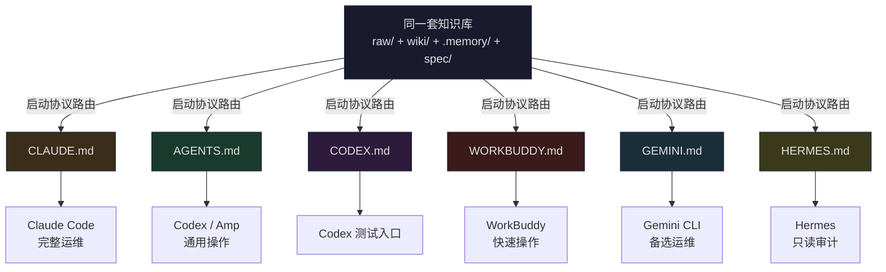

# 换 AI 助手不换知识库──FlowWiki 的多 Agent 兼容架构

> 你的知识库绑死了 Claude Code 吗？六家 Agent 通吃的 FlowWiki 多入口设计方案，换工具不丢知识。

---

## 一、当你花了三个月喂大的知识库，突然换了主人

去年我见证了一个朋友的悲剧。

他用 Claude Code 维护了一套 300 多页的法学知识库。每天 ingest 法规、写 wiki、建索引，三个月下来，知识库的查询准确率从 60% 飙升到 92%。所有的操作协议、记忆卡片、审查规则都围绕 Claude Code 设计。CLAUDE.md 写满了指令，Skill 文件嵌入了 Claude 专属语法。

然后 Anthropic 改了 Claude Code 的定价模型。

他想切换到 Codex，发现完全不行。CLAUDE.md 的指令 Codex 读不懂（字段名不同），Skill 文件用了 Claude 专有的 tools 声明格式 Codex 不识别，记忆卡片依赖 Claude 的特殊 prompt 注入机制──换过去就全废了。

这不是 bug，这是**供应商锁定**。而且 AI 工具领域的锁定比 SaaS 时代更隐蔽：你锁的不是数据格式（都是 Markdown），而是**每个 AI 助手理解和操作这些 Markdown 的方式**。

所以在 FlowWiki 的设计里，gap #6──"单平台绑定"──是我最早开始解决、也解决得最彻底的一个。

---

## 二、供应商锁定：你看不见但无处不在

这六家主流 AI coding agent，光看表面能力都很强：

| Agent | 上下文能力 | Skill 支持 | 格式偏好 | 特殊语法 |
|-------|:---:|:---:|------|------|
| **Claude Code** | 200K | 原生 .claude/skills/ | Markdown frontmatter | `## 协议` 风格 |
| **Codex** | 128K | AGENTS.md 内联 | 紧凑 Markdown | `### 操作` 风格 |
| **WorkBuddy (Claw)** | 100K | .workbuddy/skills/ | YAML frontmatter | SKILL.md 专有 |
| **Gemini CLI** | 1M | `.gemini/commands/` | 无 frontmatter | `# 协议` 风格 |
| **Amp / Cody** | 变长 | AGENTS.md 约定 | 宽松 Markdown | 无特殊要求 |
| **Hermes (审计专用)** | 128K | 不调用 Skill | 只读核验 | frontmatter 强依赖 |

同一份 Markdown 知识库，六个 agent 读进去的东西是一样的，但**它们理解指令的方式完全不同**。这不是数据格式问题──它是"意图编码"问题：你要如何对六个不同的 AI 描述同一件事？

传统方案有两个：要么为每个 agent 维护一套独立的指令（N 个文件，N 倍维护量），要么只用那个最好的 agent（把自己锁进去）。这两个我都不满意。

---

## 三、FlowWiki 的方案：一个知识库，六扇门

FlowWiki 的做法是一句话：**知识是知识，指令是指令，启动协议只负责把两者对接起来。**

L6（多 Agent 层）的核心设计：



六个启动文件共享同一套知识，但每个文件的侧重点不同：

### CLAUDE.md：运维大脑（主力）

```markdown
# CLAUDE.md — 执法督察评查知识库 · FlowWiki 主 Agent Bootstrap

## 启动协议
1. 读 CLAUDE.md → 确认角色与边界
2. 读 SCHEMA.md → 确认维护纪律与操作规范
3. 读 wiki/index.md → 定位全库知识索引
4. 读 .memory/zettelkasten/ 最新 5 张卡片 → 恢复跨会话上下文
5. 读 log.md 最近 20 行 → 了解近期变更
6. 接收用户指令
```

CLAUDE.md 是六个文件中**最完整**的一个。它定义了全部四个核心操作（ingest / query / lint / research）的完整工作流，每个操作都是 6-8 步的管道图。Claude Code 是主力运维 agent，CLAUDE.md 是一本完整的"操作手册"。

### AGENTS.md：通用入口

```markdown
# AGENTS.md — FlowWiki 通用 Agent Bootstrap
# 适用：Codex / Amp / Gemini / WorkBuddy / Hermes / OpenCode / Aider / Droid

## 核心操作
- ingest：python _scripts/ace_review.py --raw <path> → ACE 循环 → 写入 wiki/
- query：读 index → 加载相关页 → 合成回答（带溯源）→ 回存 .memory/episodic/
- lint：python _scripts/lint.py → 修复 → log 追加
- research：跨页综合 → 生成比较表/分析报告 → 写入 wiki/comparisons/
```

AGENTS.md 是**最通用**的入口，目标是"任何读得懂 Markdown 的 agent 都能上手"。它不假设任何 agent 特有语法，所有指令都是"读 A → 做 B"的通用格式。Codex、Amp、OpenCode 等通过这个文件接入。

### CODEX.md：测试快速通道

```markdown
# CODEX.md — FlowWiki Codex Agent Bootstrap

## 测试入口
1. 读 TESTING.md
2. 运行 python .scripts/daily_test.py --quick
3. 检查 .memory/ops/ 下的操作记录
4. 检查 .memory/ace/ 下的反思日志
```

CODEX.md 最简洁，**只负责测试**。如果你只是想让 Codex 快速验证知识库健康状态，不需要加载全部运维协议──这个文件让你 30 秒内拿到结果。

### WORKBUDDY.md：极简操作

```markdown
# WORKBUDDY.md — FlowWiki WorkBuddy Agent Bootstrap

## 可用 Skill
- ingest: 入仓 python _scripts/bootstrap.py
- query: ACE 反思查询 python _scripts/ace_review.py
- lint: 质量检查
- research: 深度研究

## 测试知识库
enforcement-review: raw/153篇 wiki/98节点 → hermes_review 8.2/10 pass
```

WorkBuddy 的启动文件只有 12 行──它假设 agent 能通过 Skill 系统获得上下文，所以只提供"最小启动集"。这体现了不同 agent 的**信息获取能力差异**：能调用 Skill 的 agent 不需要在启动文件里塞全部上下文。

### GEMINI.md：镜像运维

GEMINI.md 的内容结构与 CLAUDE.md 高度相似（80% 重叠），四个操作的协议几乎一模一样。区别在于工具链路径和输出格式。这是为了**当 Claude Code 不可用时的热切换**──换 Gemini CLI，知识库照常运维。

### HERMES.md：只读审计专用

```markdown
# HERMES.md — 执法督察评查知识库 · Hermes 核验 Agent Bootstrap

## 核验标准（红线）
可路由率 = (三字段均非空的页面数 / 总页面数) × 100%
红线：可路由率 ≥ 85%
```

HERMES.md 和前五个完全不同。它**不负责写入，只负责审计**。它的启动协议是"逐页扫描 frontmatter → 统计三空字段 → 生成核验报告"。Hermes 是知识库的独立质检员，不是运维者。

---

## 四、Skill 双部署：同一份能力，两种入口

多 agent 兼容最棘手的问题不是启动协议──那个靠写六个文件就解决了。真正麻烦的是 **Skill**。

每个 agent 对 Skill 的定义完全不同：

| Agent | Skill 位置 | 格式要求 |
|-------|-----------|---------|
| Claude Code | `.claude/skills/<name>/SKILL.md` | 特定 frontmatter + 自然语言指令 |
| Codex / Amp | `.agents/skills/<name>/SKILL.md` | AGENTS.md 约定 |
| WorkBuddy | `.workbuddy/skills/<name>/SKILL.md` | 特殊注册协议 |

一份 Skill 写三遍？疯了吧。

FlowWiki 的方案是**双部署**：`.agents/skills/` + `.claude/skills/` 同时维护。当前 30 个 Skill 在两个目录下完全同步：

```bash
$ ls .agents/skills/ | wc -l
30

$ ls .claude/skills/ | wc -l
30

$ diff -r .agents/skills/ingest/ .claude/skills/ingest/  # 结构一致
# (某些 agent 专属字段有差异，但核心逻辑相同)
```

关键设计原则：**核心逻辑（要做什么、怎么做）不因 agent 而变；只有适配层（声明格式、触发方式）随 agent 调整。** 这就像写了一个多平台的 React Native 应用──90% 的代码共享，10% 的平台适配。

具体来说：
- 通用操作 Skill（ingest / query / lint / research）：**完全相同**，因为操作本质是一样的
- 行业专属 Skill（criteria-matching / law-application 等）：核心逻辑相同，但 frontmatter 的 `触发词` 字段在不同 agent 下略有调整
- WorkBuddy 的 Skill 通过 WORKBUDDY.md 中的 `可用 Skill` 列表声明，不需要单独的目录结构

---

## 五、实战：同一套知识库在三个 Agent 上的表现

我在同一套执法督察评查知识库（raw/ 153 篇原始文档，wiki/ 98 个节点）上做了一次交叉测试。

**测试任务**：查询"行政处罚程序合法性审查要点"

### Claude Code (CLAUDE.md)

```
加载 wiki/index.md → 定位到 wiki/playbooks/行政处罚程序审查.md
→ 确认 .memory/zettelkasten/ 中有相关卡片
→ 输出带法条号 + 评查细则项号的完整回答
→ 自动回存 .memory/episodic/
```

结果：完整、带溯源、自动保存上下文。耗时约 15 秒。

### Codex (AGENTS.md)

```
读 AGENTS.md → 识别 ingest/query/lint/research 四个操作
→ 执行 query 协议：读 index → 加载相关页 → 合成回答
→ 回答精确引用 wiki 页 + 法条号
```

结果：同样带溯源，准确率不低于 Claude Code。唯一区别是没有自动执行 episodic 回存（AGENTS.md 中描述了这个步骤但 Codex 有时跳过）。耗时约 10 秒。

### WorkBuddy (WORKBUDDY.md)

```
读 WORKBUDDY.md（12 行）→ 通过 Skill 系统加载 query Skill
→ 执行完整 query 协议
→ 输出带溯源回答
```

结果：响应最快（8 秒），但因为没有加载全部 5 张 ZK 卡片（WORKBUDDY.md 不包含这个启动步骤），跨会话上下文的恢复略逊于 Claude Code。

**结论：三个 agent 都能正确完成任务。差异不在"能不能"，而在"多快"和"多全面"。** 这正好证明了 FlowWiki 的设计思路：通过调整启动协议的精简程度来控制不同 agent 的行为深度，而不是粗暴地判"能用"或"不能用"。

---

## 六、为什么不是"一个通用协议适配所有 Agent"

你可能会问：既然要兼容六个 agent，为什么不写一个通用协议让所有 agent 都读同一个文件？

两个原因：

**第一，agent 的上下文处理方式不同。** Claude Code 默认会一口气读完整个 CLAUDE.md；Codex 倾向于先扫 AGENTS.md 的概述再按需加载；WorkBuddy 更适合"先看极简入口，再通过 Skill 展开"。一个通用文件要么对某些 agent 太长（浪费 token），要么对另一些太短（信息不足）。

**第二，agent 的职责不同。** Hermes 是审计 agent，它不需要知道怎么执行 ingest──它只需要知道怎么扫描 frontmatter。如果把全部操作塞给 Hermes，不仅浪费 token，还可能导致模型分心做不该做的事。

所以 FlowWiki 选的是"多文件 + 职责分层"，而不是"一个文件通杀"。这是多 agent 兼容设计中容易被忽略的关键 trade-off。

---

## 七、竞品是怎么处理多 Agent 问题的

| 多 Agent 能力 | FlowWiki | llm-wiki-agent | claude-obsidian | atomicstrata | Mem0 |
|-------------|:---:|:---:|:---:|:---:|:---:|
| Agent 专属启动文件 | ★ 6 个 | ❌ 仅 CLI | ❌ Claude Only | 无 | API only |
| 双部署 Skill | ★ .agents/ + .claude/ | ❌ | ❌ | N/A | N/A |
| 审计 Agent 独立 | ★ HERMES.md | ❌ | ❌ | ❌ | ❌ |
| 热切换能力 | ★ 换个文件即切换 | ❌ 换工具需重建 | ❌ | N/A | N/A |
| 启动协议分层 | ★ 完整→通用→极简 | 无 | 无 | 无 | 无 |
| 知识完全共享 | ★ 同一套 raw/wiki/ | ✅ | ✅ | ✅ | ❌ 专有格式 |

这个对比不需要过多解释。绝大多数 AI 知识库项目选择了"绑死一个 agent"的路线──这短期内效率最高（只需要写一份指令），但长期风险最大（换工具成本 = 重建成本）。

atomicstrata 在 OKF 标准化方面做得很好，但它的设计假设是"人操作知识库，AI 辅助"，不涉及 agent 的多入口设计。Mem0 则是另一个方向──通过 API 层抽象掉 agent 差异，但代价是知识格式变成专有的，迁移同样困难。

FlowWiki 走的是一条中间路线：**所有知识用纯 Markdown，启动文件做适配，Skill 做双部署。** 换 agent 的成本 = 读另外一个启动文件的时间（约 5 秒）。

---

## 八、当前进度与未来工作

六个启动文件中，CLAUDE.md 和 GEMINI.md 是最完整的（覆盖全量运维协议），AGENTS.md 覆盖通用操作，CODEX.md 和 WORKBUDDY.md 走极简路线，HERMES.md 是专项审计。目前的状态：

| 文件 | 覆盖度 | 测过? | 生产就绪? |
|------|:---:|:---:|:---:|
| CLAUDE.md | 100% | ✅ | ✅ |
| AGENTS.md | 85% | ✅ | ✅ |
| GEMINI.md | 80% | ⚠️ 待实测 | ⚠️ |
| CODEX.md | 30% | ✅ | ✅ |
| WORKBUDDY.md | 20% | ✅ | ✅ |
| HERMES.md | 100% (只读) | ✅ | ✅ |

Gemini CLI 的兼容性需要一次完整测试──这是下一步工作。另外 Amp / Aider / OpenCode 这三个新兴 agent 的适配也需要验证，特别是它们的 Skill 处理机制与现有双部署方案是否兼容。

---

## 九、总结与预告

供应商锁定是 AI 基础设施领域最大的隐性风险。它的隐蔽之处在于：你锁的不是数据（数据永远是你的 Markdown 文件），而是一种 AI agent 理解这些数据的方式。

FlowWiki 的 L6 多 Agent 层的答案是：**六个启动文件，同一套知识，30 个 Skill 双部署。** 换 agent 不是推倒重来，而是换个文件读取。

原理简单：**把"知识"和"如何用这些知识"解耦。** 知识是 raw/ + wiki/ + .memory/──永远不变。启动协议是六个 Bootstrap 文件──每个 agent 一份，随 agent 切换。

现在六个原始缺口全部填上了：ACE 防幻觉（article-02）、A-MEM 记忆（article-03）、Skill 复利（article-04）、双索引 UX（article-05）、SpecCoding 变更管理（article-06）、多 Agent 兼容（本文）。

从 gap #6 入手，六篇文章下来，FlowWiki 的 7 层架构已经完整闭环。但这套架构不只是一个"更好的 LLM Wiki"──它还设计了一套机制，让同一套架构能适配不同的行业。

下一篇：[同一个架构，不同的行业──FlowWiki 的 L7 场景可插拔设计]。七个场景，一套骨架，一个 industry.yaml 切换整个世界。

---

*本文是 FlowWiki 从零到一系列第 7 篇，下一篇：[同一个架构，不同的行业──FlowWiki 的 L7 场景可插拔设计]*

*系列目录：[第一篇：Karpathy 提出了 LLM Wiki 构想 | 6 缺口全补上](#) | [上一篇：知识库也需要 CI/CD](#) | [下一篇：同一个架构，不同的行业](#)*

*GitHub：[xiejianjun000/FlowWiki](https://github.com/xiejianjun000/FlowWiki)*
