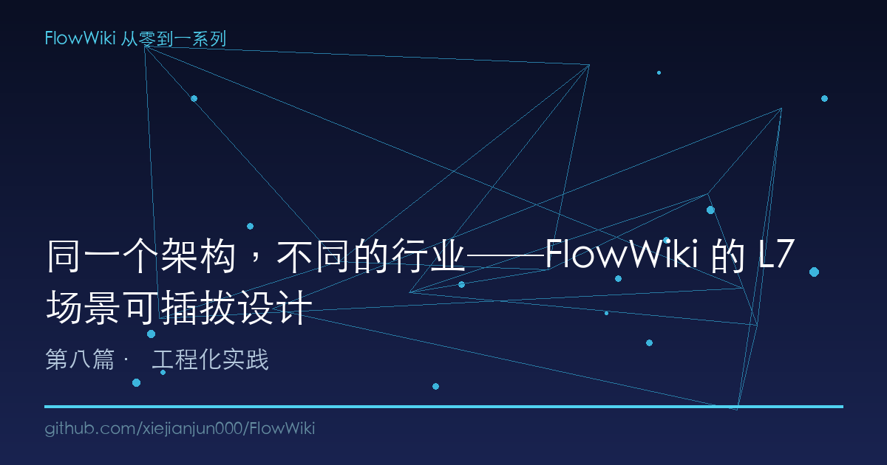
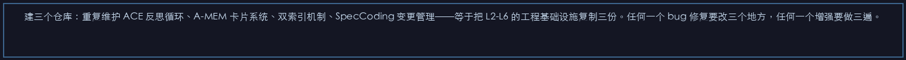
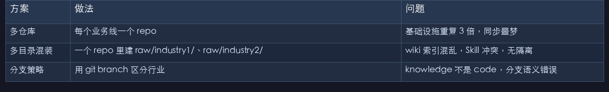
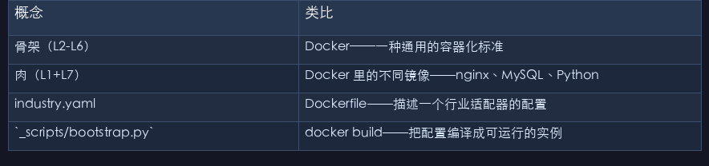

# 同一个架构，不同的行业──FlowWiki 的 L7 场景可插拔设计

> 上一篇文章我们解决了"换 Agent 不换知识库"，这一篇解决更根本的问题：如果一个团队同时做环保执法和财务审计，他们需要维护两套完全不同的知识库架构吗？

---

## 一、一个场景一个架构 = 维护噩梦

上篇讲完多 Agent 兼容后，有人问我一个问题："小谢总，我们公司有三个业务线──环保咨询、工程审计、企业合规。每个业务线的知识结构完全不同。我用 FlowWiki 的话，是建三个仓库还是一个仓库？"

这不是选择题，这是个陷阱。

建三个仓库：重复维护 ACE 反思循环、A-MEM 卡片系统、双索引机制、SpecCoding 变更管理──等于把 L2-L6 的工程基础设施复制三份。任何一个 bug 修复要改三个地方，任何一个增强要做三遍。

建一个仓库：三个完全不相关的业务塞进同一个 raw/ 和 wiki/ 目录？索引混在一起，Skill 互相干扰，ACE 审查时会把环评标准拿去审查财务数据。

根儿上的矛盾是：**业务逻辑变，但基础设施不该变。** Karpathy 的 LLM Wiki 架构把这个难题完全留给了用户──他只给了三层，没告诉你怎么处理不同领域的知识结构差异。

我问了 GitHub 上 30 多个 LLM Wiki 项目，处理"多业务线"的方式无非三种：

| 方案 | 做法 | 问题 |
|------|------|------|
| 多仓库 | 每个业务线一个 repo | 基础设施重复 3 倍，同步噩梦 |
| 多目录混装 | 一个 repo 里建 raw/industry1/、raw/industry2/… | wiki 索引混乱，Skill 冲突，无隔离 |
| 分支策略 | 用 git branch 区分行业 | knowledge 不是 code，分支语义错误 |

没有一个是真正"可插拔"的──没有一个能让你**换场景的时候只换业务内容，不换工具体系**。

所以 FlowWiki 的 L7 场景层，就是在解决这个问题的同时，把"复用"做到了极致。

---

## 二、骨肉分离──知识库架构的"中间件"思维

架构圈有个经典的"操作系统 vs 应用程序"类比。FlowWiki 的 7 层架构在设计之初就想清楚了这个问题：

```
L7 场景层（业务外壳）    ← 每个行业不一样（肉）
L6 多 Agent 层            ← 所有行业完全一样（骨）
L5 Skill 化层             ← 通用 Skill 复用 + 行业专属 Skill（骨+肉）
L4 Agent 记忆层           ← 所有行业完全一样（骨）
L3 Spec-Driven 层         ← 所有行业完全一样（骨）
L2 检索增强层             ← 所有行业完全一样（骨）
L1 知识编译层             ← raw/wiki 内容不同，格式相同（肉）
```

这个设计叫"骨肉分离"──L2 到 L6 这五层是**骨架**，包含检索、变更管理、防幻觉机制、记忆系统、多 Agent 兼容。任何行业都必须有这些能力，而且它们的实现完全通用。

L1 的 raw/（源文件）+ wiki/（编译后的知识）+ 00_首页/（人类浏览入口）和 L7 的场景定义是**肉**──每个行业的具体内容不同，但它们必须填进骨架的规定位置。

类比一下更容易理解：

| 概念 | 类比 |
|------|------|
| 骨架（L2-L6） | Docker——一种通用的容器化标准 |
| 肉（L1+L7） | Docker 里的不同镜像──nginx、MySQL、Python |
| industry.yaml | Dockerfile──描述一个行业适配器的配置 |
| `_scripts/bootstrap.py` | docker build──把配置编译成可运行的实例 |

你不需要给每个应用单独发明容器技术。你只需要写一个 Dockerfile。

同理，你不需要给每个行业重新发明 ACE 反思循环。你只需要写一份 `industry.yaml`。

---

## 三、industry.yaml──一个文件，切换整个知识库

这是整个设计最核心的机制。让我们看两个真实文件。

**场景一：根因分析**

```yaml
name: "根因分析"
slug: "root-cause"
perspective: "analyst"
raw_sources:
  laws: [数据治理管理办法, 信息安全技术 个人信息安全规范]
  standards: [ISO 8000, GB/T 36073]
  datasets: [业务系统日志, 审计追踪记录]
wiki_structure:
  concepts: [数据溯源链路, 趋势分析方法, 异常检测方法]
  playbooks: [根因分析五步法, 跨域分析工作流]
  comparisons: [自上而下 vs 自下而上, 定量 vs 定性]
scenarios:
  - id: trace-root-cause
    name: "根因定位"
    trigger: "用户描述异常现象"
    skills: [判据匹配, 跨域追踪, 模式识别]
industry_skills:
  - name: "判据匹配"
    file: ".agents/skills/criteria-matching/SKILL.md"
  - name: "异常检测"
    file: ".agents/skills/anomaly-detection/SKILL.md"
```

**场景二：审计准备**

```yaml
name: "审计准备"
slug: "audit-prep"
perspective: "enterprise"
raw_sources:
  laws: [审计法, 会计法, 企业内部控制基本规范]
  standards: [ISO 9001, GB/T 19001, 内部审计基本准则]
  datasets: [企业合规自查清单, 审计材料模板库]
wiki_structure:
  concepts: [审计合规要求, 风险排查方法, 材料准备规范]
  playbooks: [审计准备全流程, 合规自查操作指南]
  comparisons: [内审 vs 外审 vs 日常检查]
scenarios:
  - id: compliance-checklist
    name: "合规自查清单生成"
    trigger: "用户询问审计准备事项"
    skills: [清单编制, 法规检索, 标准匹配]
industry_skills:
  - name: "清单编制"
    file: ".agents/skills/checklist-compile/SKILL.md"
  - name: "风险识别"
    file: ".agents/skills/risk-identification/SKILL.md"
```

**结构完全一样，内容完全不同。** 这就是骨肉分离的威力──适配器 schema 统一（name、slug、perspective、raw_sources、wiki_structure、scenarios、industry_skills），但每个行业填充自己的业务内容。

切换场景只需改一行配置：

```toml
# config.toml
[industry]
default = "root-cause"     # 根因分析
switch_enabled = true      # 启用跨行业切换

# 切换到审计场景只需要改一行：
# default = "audit-prep"   # 审计准备
```

然后跑一次验证：

```bash
python _scripts/lint.py --check-routing
```

输出示例：

```
# 行业路由完整性报告

✅ 7 个行业，28 个标准引用全部可路由。
```

这个 `check_routing()` 函数（`_scripts/lint.py` 第 307-419 行）做的事情：遍历 `storage/*/industry.yaml` 中每个行业引用的所有标准，检查 `wiki/criteria/` 下对应的页面是否存在。如果某个标准页缺失──比如你声明了引用 `GB 3095-2012` 但没有写对应的 wiki 页面──它会在报告中亮红，告诉你路由断在哪。

这是"可插拔"的底线保障：**换场景之前，先验证新场景的所有引用链路是通的**。不然用户跟着路由走，走到一半发现页面不存在──那体验就崩了。

---

## 四、7 个场景的横向对比

FlowWiki 当前内置了 7 个开箱即用的行业适配器：

| 场景 | slug | 视角 | 场景数 | 行业 Skill | 场景示例 |
|------|------|------|--------|-----------|----------|
| 根因分析 | root-cause | analyst | 2 | 5 | 溯源定位、趋势分析 |
| 合规审查 | compliance-review | reviewer | 3 | 7 | 案卷程序审查、证据链审核 |
| 证照管理 | license-management | review_agency | 2 | 6 | 证照文件审查、许可证分析 |
| 企业合规 | enterprise-compliance | enterprise | 2 | 6 | 合规清单生成、政策追踪 |
| 现场核查 | audit-onsite | auditor | 3 | 6 | 问题研判、证据固定、整改建议 |
| 案卷评查 | case-review | reviewer | 3 | 7 | 程序审查、证据链审核、法律适用 |
| 审计准备 | audit-prep | enterprise | 3 | 7 | 自查清单、材料准备、风险排查 |

注意几个设计细节：

**1. `perspective` 决定了知识库的"口吻"。** 同样是审查场景，"compliance-review"用的是 `regulatory`（监管视角）、"case-review"用的是 `reviewer`（评查员视角）、"audit-onsite"用的是 `auditor`（现场核查员视角）。同一套骨架，不同视角决定了 ACE 反思循环的判断标准不同。AI 用"监管者"身份审查文档，和用"核查员"身份，输出的侧重点完全不同。

**2. 每个场景的 Industry Skill 是独立开发的。** 根因分析用"判据匹配"和"跨域追踪"，审计准备用"清单编制"和"风险识别"。但这些 Skill 共享 `.agents/skills/` 目录结构，格式完全统一。这意味着你在根因分析场景下测试通过了一个 Skill 的改进，审计准备场景下的同类 Skill 可以直接复用代码。

**3. 结构差异由 industry.yaml 描述，不靠"约定优于配置"。** 你看根因分析有 4 个 concept 和 3 个 playbook，合规审查有 4 个 concept 和 2 个 playbook。不是所有场景"必须填满 N 个 concept"──`wiki_structure` 声明了上限，实际内容由 AI 在 ingest 时按需生成。

**4. `raw_sources` 是 ingest 流水线的输入参数。** 你声明"这个场景的法律依据是审计法+会计法"，inset 流水线会拿着这个清单去 raw/ 找对应的文件，找不到就标记缺失。这是"场景声明式"设计──不是告诉 AI"怎么做"，而是声明"有什么"。

---

## 五、3 步添加一个自定义场景

这是最实用的一节。假设你的业务线是"医疗器械注册"，不在内置的 7 个场景里。三步搞定：

### 第一步：创建 industry.yaml

```bash
mkdir -p storage/medical-device
```

在 `storage/medical-device/industry.yaml` 里填写：

```yaml
name: "医疗器械注册"
slug: "medical-device"
perspective: "manufacturer"

raw_sources:
  laws: [医疗器械监督管理条例, 医疗器械注册管理办法]
  standards: [GB 9706, YY/T 0287, ISO 13485]
  datasets: [注册申报模板, 临床试验数据, 技术审评要点]

wiki_structure:
  concepts: [注册分类, 临床评价, 技术审评, 质量管理体系]
  playbooks: [注册申报全流程, 临床评价指南, 技术文档编制]
  comparisons: [二类 vs 三类注册, 中国 vs FDA 注册路径]

scenarios:
  - id: registration-prep
    name: "注册申报准备"
    trigger: "用户描述产品类型并提出注册需求"
    skills: [分类判定, 标准匹配, 文档编制]
  - id: clinical-eval
    name: "临床评价"
    trigger: "用户询问临床评价路径"
    skills: [等同性论证, 文献综述, 临床试验设计]

industry_skills:
  - name: "分类判定"
    file: ".agents/skills/device-classification/SKILL.md"
  - name: "标准匹配"
    file: ".agents/skills/standard-match/SKILL.md"
  - name: "文档编制"
    file: ".agents/skills/doc-compile/SKILL.md"
```

### 第二步：跑 bootstrap 生成骨架

```bash
python _scripts/bootstrap.py --slug medical-device
```

`bootstrap.py` 的 8 步流水线自动完成：

```
Step 1: 创建 raw/medical-device/ 目录结构
Step 2: LLM 分析 raw/ 源文件 → 补充 industry.yaml 的 wiki_structure
Step 3: LLM 从 raw/ 生成 wiki/medical-device/ 页面
Step 4: 运行 lint.py 检查结构完整性
Step 5: 运行 lint --fix 自动修复格式问题
Step 6: 生成知识图谱关系
Step 7: Hermes 终验（质量评分 + 合规检查）
Step 8: 注册到 00_首页/03_实战场景/medical-device/
```

### 第三步：跑端到端测试验证

```bash
python _scripts/e2e_test.py
```

e2e 测试会验证：

- `storage/medical-device/industry.yaml` 内容完整性（name/scenarios/skills/raw_sources/wiki_structure 五个字段不缺）
- `00_首页/03_实战场景/medical-device/README.md` 已创建
- 场景下的 Skill 文件（`.agents/skills/device-classification/SKILL.md` 等）存在且合法
- L2 检索层能索引到新场景的 wiki 页面
- 双索引同步脚本不会因为新场景报错

**三步走完，你的新场景就接入了 FlowWiki 的全部基础设施**──ACE 防幻觉、A-MEM 记忆卡片、双索引、SpecCoding 变更追溯、多 Agent 兼容──零基础设施代码改动。

这就是"骨肉分离"的真正价值：写 50 行 YAML 就能复用 6000 行基础设施代码。

---

## 六、和同类方案比一比

处理"多业务线知识库"本质上是一个**架构复用**问题，让我们看现有方案怎么做：

| 维度 | FlowWiki L7 场景层 | llm-wiki-agent | claude-obsidian | atomicstrata |
|------|:---:|:---:|:---:|:---:|
| 多行业支持 | ✅ 骨肉分离 + industry.yaml 驱动 | ❌ 一个 repo 一个行业 | ❌ 依赖 Obsidian vault 隔离 | ❌ 目录平铺 |
| 场景切换成本 | 改一行 config.toml | 克隆新仓库 | 新建 vault + 重配置 | 手动建目录 |
| 基础设施复用率 | 100%（5 层骨架不变） | 0%（每个 repo 从头来） | 50%（Obsidian 共享但物流散） | 50%（Markdown 共享但检索重配） |
| 路由验证 | ✅ check_routing() 自动检测断链 | ❌ 无 | ❌ 依赖 Obsidian Dataview | ❌ 无 |
| 新增场景速度 | 3 步（写 YAML + bootstrap + e2e） | 半天（新建 repo + 配置 CI） | 1-2 小时（新建 vault + 重配置） | 1 小时（建目录 + 写配置文件） |
| 行业 Skill 隔离 | ✅ 每个 industry.yaml 独立声明 | ❌（Skill 共享无隔离） | ❌ | ❌ |

**关键差异不在功能多寡，而在于"复用"的设计深度。** llm-wiki-agent 和 claude-obsidian 都支持多场景使用，但它们的方式是"再建一套"而不是"复用骨架"。当你建第三个场景时，前两个场景踩过的坑你得在新仓库里再踩一遍。

FlowWiki 的方式是：**所有工程基础设施写在 L2-L6，所有业务差异收敛到一份 industry.yaml。** 新增场景不会引入任何对核心代码的修改──改动范围严格限制在 `storage/{slug}/` 和 `00_首页/03_实战场景/{slug}/`。

举个例子：如果你在第一个场景（根因分析）开发了一个"异常检测" Skill，后来发现它的 ACE 审查逻辑有 bug。在 FlowWiki 里，你修一次，所有引用这个 Skill 的场景同步受益。在 llm-wiki-agent 的多仓库方案里，你得 cherry-pick commit 到每个仓库。

---

## 七、今天的思考──复用到底复用的是什么？

写这篇文章的时候我回顾了整个设计，发现一个有意思的模式。

传统软件开发中，"复用"复用的是代码。但在知识库场景下，真正值得复用的不是代码，是**质量保障机制**。

ACE 反思循环不是一段代码──它是一种"AI 生成内容的可信度验证流程"。SpecCoding 不是一套模板──它是"人类写知识库的变更治理模型"。A-MEM 卡片系统不是目录结构──它是"跨会话不丢上下文的记忆协议"。

这些机制在不同行业都有效。你换了业务领域，ACE 依然需要判断 AI 生成的内容对不对；你换了法律法规，SpecCoding 依然需要记录"谁改了哪、为什么改"。**好的知识库基础设施应该是行业无关的。**

这也是为什么 FlowWiki 把 L2-L6 做成骨架──不是因为懒，是因为这五层解决的问题是**跨行业普遍存在的**：

- 防幻觉（ACE）── 任何领域 AI 都可能胡说
- 跨会话记忆（A-MEM）── 任何领域都需要上下文连续性
- 检索（BM25→GraphRAG→LightRAG）── 任何领域的知识都需要找得到
- 变更管理（SpecCoding）── 任何领域的内容都会演化
- 多 Agent 兼容（Bootstrap 文件）── 任何领域都可能换工具

而 L1（raw/wiki 内容）和 L7（场景定义）会跟着业务走。这正是"骨肉分离"设计之所以成立的根本原因──不是因为技术上需要分，而是因为**这些问题的通用性是真实存在的**。

---

## 总结

FlowWiki 的 7 层架构里，L1 和 L7 是"长在骨头上的肉"──换了行业，换一换肉就行。L2 到 L6 是所有行业的共同骨架，ACE 反思循环、A-MEM 卡片记忆、双索引、Skill 复利、多 Agent 兼容──这些机制写一次，所有场景复用。

所以回到开篇的问题：你公司有三个业务线怎么办？一个仓库，三份 industry.yaml。跑三次 bootstrap，各自生成知识库。核心基础设施（6000 行）只维护一次，所有场景继承。

**下一篇预告**：场景建好了，但规模上来之后检索怎么办？100 页用 BM25、500 页上图谱检索、2000 页切 LightRAG──FlowWiki 的自适应检索策略如何让知识库在规模增长时自动进化。

---

*本文是 FlowWiki 从零到一系列第 8 篇，下一篇：[100 页用 BM25、500 页上 GraphRAG──FlowWiki 的自适应检索策略]*

*系列目录：[第一篇：Karpathy LLM Wiki 构想 + 6 缺口 + FlowWiki 开源首发](#) | [上一篇：多 Agent 兼容架构](#) | [下一篇：自适应检索策略](#)*

*GitHub：[xiejianjun000/FlowWiki](https://github.com/xiejianjun000/FlowWiki)*

---

## 本文配图










