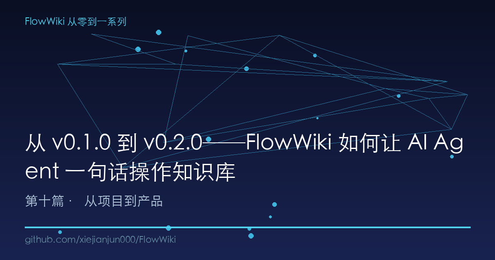
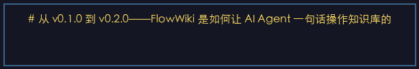
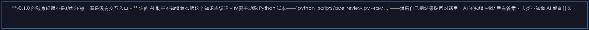
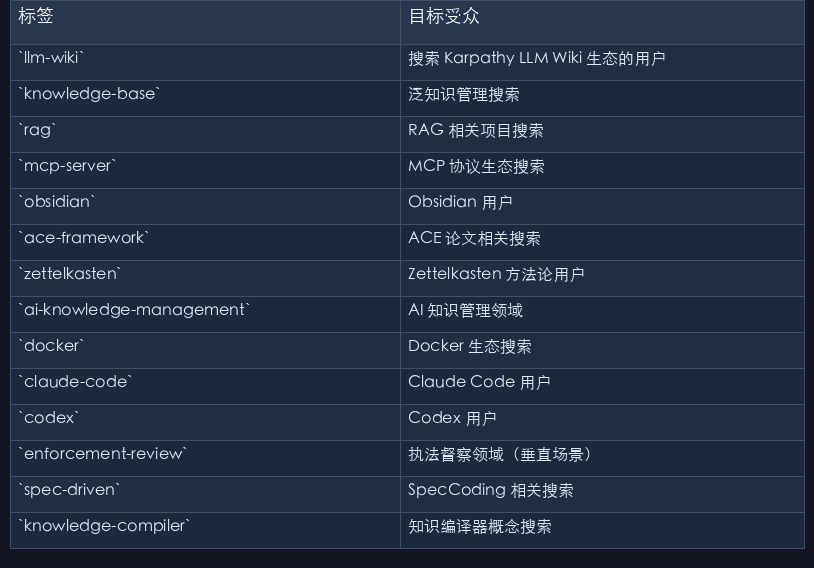
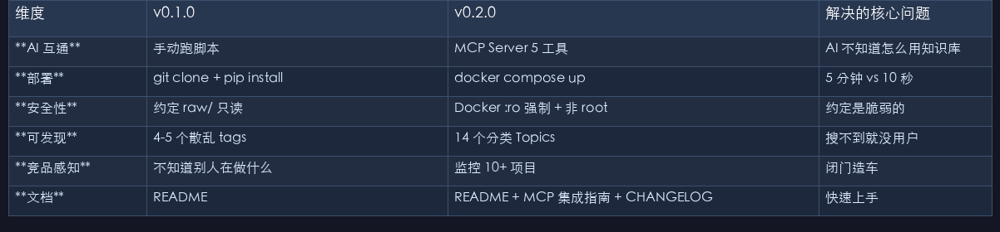

# 从 v0.1.0 到 v0.2.0──FlowWiki 是如何让 AI Agent 一句话操作知识库的

> 架构再好的知识库，如果 AI 不能直接操作它，就是一个装满黄金但没有门把手的保险柜。

---

## 一、好架构 ≠ 好产品：v0.1.0 发布后的 24 小时现实

2026 年 7 月 17 日晚上，我按下了 GitHub Publish 按钮。FlowWiki v0.1.0──7 层架构、27 个 Skill、ACE 防幻觉机制、A-MEM 卡片记忆系统──正式开源。

坦白讲，那一刻的自我感觉相当不错。你看：Karpathy 的 LLM Wiki 构想有 6 个致命缺口，我一个个填上了。三层变七层，裸奔变装甲。

然后第二天早上，现实来了。

一个朋友在 GitHub issue 里问："代码挺好的，怎么让 Claude Code 用它？"

我愣住了。

**v0.1.0 的致命问题不是功能不够，而是没有交互入口。** 你的 AI 助手不知道怎么跟这个知识库说话。你要手动跑 Python 脚本──`python _scripts/ace_review.py --raw ...`──然后自己把结果贴回对话里。AI 不知道 wiki/ 里有答案，人类不知道 AI 能查什么。

你有了一台功能完备的服务器，但没有给它接上网络端口。

这就是 v0.1.0 → v0.2.0 要解决的核心问题：**从「人类手动操作的脚本集合」变成「AI Agent 可直接调用的知识服务」。**

---

## 二、MCP：AI 世界的 HTTP 协议

在讲 FlowWiki 怎么做之前，先花一分钟说清楚 MCP 是什么。

**MCP（Model Context Protocol）是 Anthropic 提出的一个开放协议，作用是把外部工具和数据源暴露给 AI 模型。** 你可以把它理解为 AI 世界的 HTTP──定义了客户端（AI Agent）和服务端（你的工具）之间的通信格式。

它的核心运行方式：

```
┌──────────────┐     JSON-RPC over stdio     ┌──────────────────┐
│              │ ◄─────────────────────────► │                  │
│   AI Agent   │   tools/list → 获得工具清单  │   MCP Server     │
│  (Claude /   │   tools/call → 调用工具     │  (你的知识库)     │
│  Codex / …)  │   返回结构化结果             │                  │
└──────────────┘                             └──────────────────┘
```

举个例子，当你在 Claude Code 里说"查一下 ACE 反思循环的实现细节"，Claude Code 会：

1. 看到你的 MCP 配置里有个叫 `flowwiki` 的服务
2. 向它发送 `tools/list`，得知有 5 个可用工具
3. 调用 `flowwiki_query(query="ACE 反思循环")`，拿到搜索结果
4. 调用 `flowwiki_read(path="wiki/concepts/ace.md")`，读到完整页面
5. 用自己的理解能力综合回答你

整个过程，你不用手动敲任何命令。AI 自己决定调哪个工具、传什么参数、怎么组合结果。

**为什么用 MCP 而不是 REST API？** 两个原因。第一，MCP 用 stdio 通信──不需要网络端口、不需要鉴权、不会有端口冲突。你的 agent 本地拉起一个子进程，pipe 通信，安全且零配置。第二，MCP 已经被 Anthropic、OpenAI、Codex、Cursor 等几乎所有主流 AI 工具支持──一次开发，全网通用。

---

## 三、5 工具设计：不是接口堆砌，是操作语义设计

FlowWiki MCP Server 只暴露 5 个工具。这个数字不是偶然的──**每个工具对应一个 Karpathy LLM Wiki 定义的核心操作**，只是从命令行提升到了 MCP 协议层。

```
Karpathy 原始操作          FlowWiki MCP 工具
─────────────────         ─────────────────
query →           flowwiki_query    关键词搜索（BM25 排序）
read page →       flowwiki_read     读取指定页面
list →            flowwiki_index    读取 wiki 总索引
lint →            flowwiki_lint     健康检查（frontmatter/孤页/断链）
research →        flowwiki_research 跨页面深度研究
(ingest)          (暂不暴露)         ACE 写操作走命令行，防止 AI 越权
```

这里有一个刻意的设计决策：**ingest（写入知识库）不暴露为 MCP 工具。** 原因是 ACE 反思循环的写操作需要三 Agent 交叉审查，这涉及到项目本地脚本和文件系统操作，不适合通过一个简单的 `flowwiki_ingest` 调用就触发。知识库的写入像数据库迁移──应该走受控的 SpecCoding 流程，而不是 AI 随手一句"帮我把这个加到 wiki"。

说回到实现。整个 MCP Server 一共两个文件、约 490 行 Python：

```python
# 核心结构──精简到极致
TOOL_DEFINITIONS = [
    flowwiki_query,    # 关键词搜索，返回按相关性排序的页面列表
    flowwiki_read,     # 按路径读取 wiki 页面全文
    flowwiki_index,    # 读取 wiki 总索引（目录树）
    flowwiki_lint,     # 健康检查：frontmatter/孤页/断链检测
    flowwiki_research, # 跨页面深度研究，返回综合发现
]
```

`flowwiki_lint` 是个有意思的设计。它不是简单的"格式检查"──它输出的是**知识库健康度快照**：

```json
{
  "status": "healthy",
  "stats": {
    "pages": 1247,
    "with_frontmatter": 1201,
    "orphan_pages": 12,
    "broken_links": 3
  },
  "issues": [
    "wiki/concepts/old-method.md: Missing frontmatter",
    "00_首页/README.md: broken link → [[deprecated-page]]"
  ],
  "advice": "Run `python _scripts/lint.py` for detailed report."
}
```

这个工具让 AI 可以在对话中主动检测知识库质量，而不是等人类手动跑 lint。常见场景：用户问"我知识库健康吗？" → AI 调用 `flowwiki_lint` → 返回结构化报告 → AI 解读并给出修复建议。一个原本只在 CI 里默默跑的命令，现在变成了对话里可感知的质量反馈。

**多 Agent 兼容**也在一开始就设计好了。MCP Server 支持两种传输模式：

- **stdio 模式**（默认）：适用于 Claude Code、Codex、Cursor 等本地 Agent──最常用的场景
- **SSE 模式**：`--transport sse --port 8888`──适用于 Web Agent、企业内部系统集成

接入不同 Agent 只需要一行配置：

```json
// Claude Code (~/.mcp.json)
{ "mcpServers": { "flowwiki": { "command": "python", "args": ["_scripts/mcp_server.py"], "cwd": "." } } }

// Codex (~/.codex/mcp.json)
{ "mcpServers": { "flowwiki": { "command": "python3", "args": ["_scripts/mcp_server.py"], "cwd": "." } } }
```

**差异只在 python vs python3──这就是全部的工作量。** 真正实现了 article-07 讲的"换 AI 助手不换知识库"。

---

## 四、Docker 化：让 5 分钟变成 10 秒

MCP Server 解决了"AI 怎么操作知识库"的问题，但还有一个问题："新用户怎么在 5 分钟内跑起来？"

v0.1.0 的启动方式是：`git clone` → `pip install -r requirements.txt` → 阅读 README 找入口 → 手动跑第一个脚本。对一个熟悉 Python 的开发者来说，这不算难。但你想让一个前端同学试用、一个产品经理体验──这门槛就太高了。

**Docker 化的目标很简单：两个命令跑起来。**

```bash
# 构建 + 启动
docker compose up -d

# 启动 MCP 服务（需要 AI Agent 连接）
docker compose --profile mcp up -d
```

来看看 `docker-compose.yml` 的设计：

```yaml
services:
  flowwiki:                    # 知识库主服务：默认跑 lint 检查
    build: .
    volumes:
      - ./raw:/app/raw:ro     # raw/ 只读──ACE 对齐铁律
      - ./wiki:/app/wiki       # wiki/ 可写──ACE 编译产物
      - ./00_首页:/app/00_首页  # 人类入口
      - ./config.toml:/app/config.toml:ro  # 配置只读

  mcp-server:                  # MCP 模式：暴露给 AI Agent
    command: python _scripts/mcp_server.py
    stdin_open: true           # stdio 通信需要 stdin
    profiles:
      - mcp                   # 按需启动，不影响主服务
```

几个细节值得注意：

**raw/ 挂载为只读 (`:ro`)**。这直接体现在 Docker 配置里──不是一句写在 README 里的"约定"，而是容器层面的强制保护。你没法在容器里修改 raw/，即使你想也不可能。这和 ACE 的原文指针铁律（write-back 时必须验证 `raw_source`）、v0.4.1 的 VERIFY-BEFORE-WRITE 形成了三层防护。

**config.toml 只读。** 你可以挂自己的配置进来，但容器不会改它。配置变更走 SpecCoding（见 article-06），不通过运行时篡改。

**多阶段构建**──Dockerfile 用 `python:3.13-slim-bookworm` 做 builder 阶段安装依赖，最终镜像只保留必要的运行时文件。生产镜像不到 200MB。

**非 root 用户运行**──`USER flowwiki`，权限最小化。这是开源项目经常忽略的"无聊但重要"的事。

**Health check 内嵌**──`HEALTHCHECK` 指令检查 `wiki/index.md` 或 `SCHEMA.md` 是否存在。容器编排工具（K8s、Docker Swarm）可以据此自动重启异常容器。

---

## 五、增长工程：14 个 GitHub Topics 和竞品监控的启示

**MCP + Docker 解决了产品化问题，但还有一个问题：怎么让别人找到你？**

GitHub 上每天有成千上万的新仓库。一个刚开源的项目如果不做增长优化，在搜索结果里就像大海里的一粒沙。v0.2.0 我做了两件事：

### 14 个 GitHub Topics

不是随手填的。每个 Topics 标签对应一个精准的搜索关键词：

| 标签 | 目标受众 |
|------|---------|
| `llm-wiki` | 搜索 Karpathy LLM Wiki 生态的用户 |
| `knowledge-base` | 泛知识管理搜索 |
| `rag` | RAG 相关项目搜索 |
| `mcp-server` | MCP 协议生态搜索 |
| `obsidian` | Obsidian 用户 |
| `ace-framework` | ACE 论文相关搜索 |
| `zettelkasten` | Zettelkasten 方法论用户 |
| `ai-knowledge-management` | AI 知识管理领域 |
| `docker` | Docker 生态搜索 |
| `claude-code` | Claude Code 用户 |
| `codex` | Codex 用户 |
| `enforcement-review` | 执法督察领域（垂直场景） |
| `spec-driven` | SpecCoding 相关搜索 |
| `knowledge-compiler` | 知识编译器概念搜索 |

这 14 个标签覆盖了 5 个发现维度：**方法论维度**（llm-wiki, knowledge-compiler）、**技术维度**（rag, mcp-server, docker）、**平台维度**（obsidian, claude-code, codex）、**学术维度**（ace-framework, zettelkasten, spec-driven）、**垂直场景维度**（enforcement-review, ai-knowledge-management）。一个搜索"mcp-server knowledge-base"的开发者、一个搜索"ace-framework rag"的研究者、一个搜索"obsidian llm-wiki"的 Obsidian 用户──三个完全不同的人群，都能在 GitHub 的 Topics 搜索里发现 FlowWiki。

### 竞品监控：nashsu 14.8K Stars 的启示

v0.2.0 的竞品监控脚本 `monitor.py` 跟踪了 GitHub 上 10+ LLM Wiki 相关项目的 Star 增长。其中 nashsu/Free-Slick-RAG 的 14.8K Stars 给了我一个深刻的启示：

**RAG 领域 Star 最高的项目，不是架构最复杂的，而是可视化做得最好的。** nashsu 项目的核心卖点是"不用写一行代码就能构建 RAG 应用"──图形化界面 + 拖拽式流程。相比之下，FlowWiki 虽然有 7 层架构、ACE 防幻觉、A-MEM 记忆系统──但用户要在 Obsidian 里才能看到它的价值，在 GitHub README 里看到的只是一堆 Markdown 文件和 Python 脚本。

这个发现驱动了后续 v0.3.0+ 的一系列方向决策：**把知识库的可视化交给 Obsidian 原生 graph view + Dataview 看板（见 article-05 双索引架构），把 GitHub 的展示交给有结构的 README + CHANGELOG + 图表。** 不自己造可视化引擎──这反而让我们在"谁来实现可视化"这个问题上没有走上歪路。

---

## 六、v0.1.0 → v0.2.0 的完整变迁

用一个表来总结这个版本的进化：

| 维度 | v0.1.0 | v0.2.0 | 解决的核心问题 |
|------|--------|--------|---------------|
| **AI 互通** | 手动跑脚本 | MCP Server 5 工具 | AI 不知道怎么用知识库 |
| **部署** | git clone + pip install | docker compose up | 5 分钟 vs 10 秒 |
| **安全性** | 约定 raw/ 只读 | Docker :ro 强制 + 非 root | 约定是脆弱的 |
| **可发现** | 4-5 个散乱 tags | 14 个分类 Topics | 搜不到就没用户 |
| **竞品感知** | 不知道别人在做什么 | 监控 10+ 项目 | 闭门造车 |
| **文档** | README | README + MCP 集成指南 + CHANGELOG | 快速上手 |

这个版本没有增加任何新功能──ACE 没变、A-MEM 没变、Skill 没变、7 层架构没变。但它让已有的功能**可被 AI 使用、可被任何人部署、可被搜索到**。

这其实是一个开源项目从 0 到 1 最被低估的阶段：**不是功能不够，而是功能不可达。**

---

## 七、总结

v0.1.0 证明了这个架构可行。v0.2.0 证明了它可用。

MCP Server 让任何支持 MCP 协议的 AI Agent 都能操作 FlowWiki 知识库──不是你教 AI 怎么用脚本，而是 AI 自己发现并调用工具。Docker 让新用户的两个命令替代了五步手动配置。GitHub Topics 让项目在 5 个维度的搜索里能被发现。

这三个改进共享一个底层逻辑：**降低摩擦力。** 开发的摩擦力、部署的摩擦力、发现的摩擦力。摩擦力每低一分，能接触到你的知识库的人就多十倍。

**下一篇预告**：FlowWiki 的 v0.3.0 质量工程转型──三层门控体系、12 维质量审计、D1-D14 健康度仪表盘。知识库不是建完就完了，真正的挑战是从"能跑"到"跑不坏"。我们将看到 FlowWiki 如何从 74% 健康度一路拉到 87.3%──以及为什么「删任何一页都不会让图谱裂开」不是一个口号，而是一套可以实测的工程指标。

---

*本文是 FlowWiki 从零到一系列第 10 篇，下一篇：[v0.3.0 质量工程：三层门控体系 + 12 维审计 + 反断裂度验证]*

*系列目录：[第一篇：Karpathy LLM Wiki 构想 + 6 缺口 + FlowWiki 开源首发](#) | [上一篇：自适应检索策略](#) | [下一篇：v0.3.0 质量工程](#)*

*GitHub：[xiejianjun000/FlowWiki](https://github.com/xiejianjun000/FlowWiki)*

---

## 本文配图












