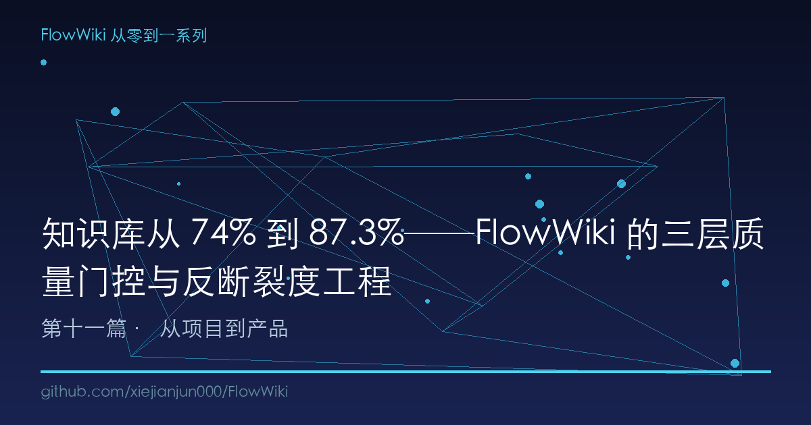
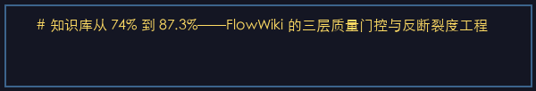
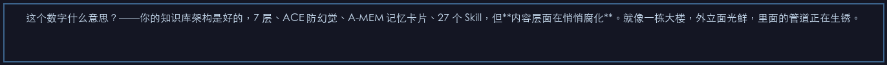
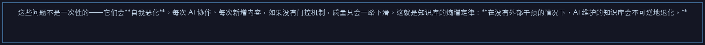
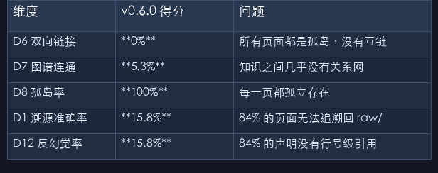
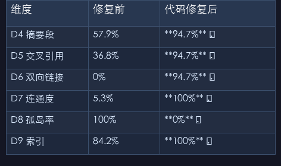

# 知识库从 74% 到 87.3%──FlowWiki 的三层质量门控与反断裂度工程

> 代码有 CI/CD 和测试覆盖率，知识库凭什么没有？FlowWiki 给知识库装上了 14 维质量仪表盘 + 三层门控 + 反断裂度验证，让 AI 协作下的知识不会悄悄烂掉。

---

## 一、知识库的"熵增定律"

v0.6.0 发布的那个晚上，我跑了一次 `quality_audit.py`，结果让我失眠了。

综合健康度：**74%。**

这个数字什么意思？──你的知识库架构是好的，7 层、ACE 防幻觉、A-MEM 记忆卡片、27 个 Skill，但**内容层面在悄悄腐化**。就像一栋大楼，外立面光鲜，里面的管道正在生锈。

具体数据更触目惊心：

| 维度 | v0.6.0 得分 | 问题 |
|------|:---:|------|
| D6 双向链接 | **0%** | 所有页面都是孤岛，没有互链 |
| D7 图谱连通 | **5.3%** | 知识之间几乎没有关系网 |
| D8 孤岛率 | **100%** | 每一页都孤立存在 |
| D1 溯源准确率 | **15.8%** | 84% 的页面无法追溯回 raw/ |
| D12 反幻觉率 | **15.8%** | 84% 的声明没有行号级引用 |

这些问题不是一次性的──它们会**自我恶化**。每次 AI 协作、每次新增内容，如果没有门控机制，质量只会一路下滑。这就是知识库的熵增定律：**在没有外部干预的情况下，AI 维护的知识库会不可逆地退化。**

代码界有 CI/CD、有测试覆盖率、有 lint。知识库凭什么裸奔？

---

## 二、为什么 AI 协作会让知识库"生锈"

先理解退化是怎么发生的。

**场景一：溯源断裂。** 你让 AI 基于一份法规文件写了分析摘要，AI 写了，但你不知道它引用的是原文件第几段的结论。三个月后你再读这篇摘要，你怎么判断它没幻觉？你怎么修正它看错的那句话？

**场景二：wikilink 孤立。** AI 每次 ingest 生成新页面时，如果没有自动建立与其他页面的 wikilink，长此以往你的知识库就是一堆各自独立的 wiki 页──这根本不是"库"，这是"堆"。

**场景三：悬空链接。** 你删了一个页面，但其他页面里还链着它。结果就是 AI 检索时追到死胡同，用户点进链接看到 404。

**场景四：单点断裂。** 知识图谱里有那么几个关键节点──删了它们，整个图就裂成几个互不连通的子图。这意味着**有人误删一个核心页面，关联知识的可发现性就崩塌了。**

这四个场景都不是理论推演──是 v0.6.0 发布后我在自己的知识库里实测发现的真实问题。所谓"生锈"，就是这些小的工程质量缺陷日积月累，最终让整个知识库变成一个 AI 自己都信任不了的幻象。

---

## 三、三层质量门控：像防 Bug 一样防知识退化

面对这个问题，我的思路很直接：把软件工程的质量保障体系移植到知识库上。结果就是**三层质量门控**：

```
┌───────────────────────────────────────────────────┐
│              Layer 3: 每日自动化监控                │
│   竞品监控 + 质量审计 → 趋势下降自动告警             │
├───────────────────────────────────────────────────┤
│              Layer 2: CI 质量门控                   │
│   GitHub Actions: push/PR 自动跑 14 维审计          │
│   红线不通过 → CI 变红 → 阻止合并                   │
├───────────────────────────────────────────────────┤
│              Layer 1: pre-commit 门控               │
│   git commit 前自动跑 quality_audit.py              │
│   红线不通过 → 拒绝提交 → 必须先修                   │
└───────────────────────────────────────────────────┘
```

### Layer 1：pre-commit hook──提交即审计

提交前自动触发 `quality_audit.py`，14 个维度逐一检查。任何一条红线不通过，git commit 直接拒绝──就像 ESLint 不让提交有语法错误的前端代码。

```bash
# 安装（一行命令）
bash _scripts/install-hooks.sh

# 正常提交
git commit -m "更新入库"    # → 自动跑审计 → 通过才能提交

# 紧急绕过（不推荐）
git commit --no-verify       # 跳过门控，但 CI 会在下一步拦住
```

实现很简单：把 `quality_audit.py` 挂载到 `.git/hooks/pre-commit`，只在变更涉及 `wiki/`、`raw/`、`config.toml` 时才触发审计──改个 README 不会触发全量扫描。

### Layer 2：CI 质量门控──合并不了就是合并不了

GitHub Actions 上有一个专用的 `quality-gate` job：每次 push 或 PR 自动运行 14 维审计。红线不通过，CI 直接标红，PR 不能合并。

```yaml
# .github/workflows/ci.yml 核心逻辑
quality-gate:
  steps:
    - name: Run 14-dimension quality audit
      run: python _scripts/quality_audit.py --json > audit-result.json
    
    - name: Check redline compliance
      run: |
        # 逐条检查 14 个红线阈值
        # 任何一条不通过 → exit(1) → CI 变红
```

审计报告以 artifact 形式存档 30 天，任何时候都能回溯"三个月前提交时的质量快照"。

### Layer 3：每日自动化监控──趋势告警

前两层是"阻断"，这一层是"洞察"。每天定时跑审计，把 14 维得分与历史数据对比。如果某个维度连续下滑──比如 D10 知识新鲜度从 84% 掉到 70%──自动告警。

三层加在一起的效果：**坏内容进不来 → 坏提交合不入 → 劣化趋势藏不住。** 这不是事后 lint，是三道事前拦截。

---

## 四、14 维健康度仪表盘：知识库的全身体检

三层门控的检测引擎是同一个工具：`quality_audit.py`。它给知识库做一次全身体检，输出 14 个指标：

```
📋 结构性维度（知识内容本身的质量）
  D1  溯源准确率      — wiki 页能否追溯到 raw/ 源文件
  D2  frontmatter 完整率 — YAML 头部是否存在
  D3  置信度标注率    — confidence 字段标注比例
  D4  摘要段存在率    — ## 摘要 段是否存在

🕸️ 关联性维度（知识之间的网络效应）
  D5  交叉引用率      — 含 [[wikilink]] 的页面比例
  D6  双向链接率      — 被其他页面引用的页面比例
  D7  图谱连通度      — 最大连通分量占比
  D8  孤岛率          — 零入链页面比例（越低越好）

🏛️ 治理性维度（知识库的长期健康）
  D9  索引完整性      — wiki/ 页面在 index.md 中的覆盖
  D10 知识新鲜度      — 30 天内更新的页面比例
  D11 覆盖率(raw→wiki) — raw 源文件有对应 wiki 页的比例
  D12 反幻觉率        — 声明可追溯到 raw/ 行号的比例

🔗 高级图谱维度（v0.7.2+ 新增）
  D13 悬空链接率      — wikilink 指向不存在页面的比率
  D14 抗断裂度        — 删除任一节点图不裂的保障程度
```

每一项都有明确的红线阈值。比如 D1/D5/D6/D7/D12 ≥ 90%，D8 ≤ 10%，D13 ≤ 5%，D14 ≥ 90%。

**这 14 个数字合在一起，比任何语言都更准确地描述了你的知识库是"健康"还是"生病"。**

---

## 五、从 74% 到 87.3%──一步步优化给你看

有了检测工具，剩下的就是修。v0.6.2 → v0.7.0 的优化过程，就像一个全栈开发者被分到了一份 16 项 bug 列表，然后一个一个啃。

### Phase 1：代码级修复（auto_upgrade_wiki.py）

有些问题是纯机械性的──不需要 AI 思考，脚本就能批量修。比如 D4（摘要段缺失），实际上页面内容里可能有类似"概述"的段落，只是没有用 `## 摘要` 标准标题。

我写了一个 `auto_upgrade_wiki.py`，自动给骨架页添加标准摘要段、补齐 wikilink、修复 frontmatter：

```python
# auto_upgrade_wiki.py 核心逻辑
def upgrade_page(page_path):
    content = read_page(page_path)
    
    # 1. 摘要段：如果没有 ## 摘要，从第一段提取
    if '## 摘要' not in content:
        first_paragraph = extract_first_paragraph(content)
        content = inject_summary_section(content, first_paragraph)
    
    # 2. wikilink：自动识别正文中的页面引用
    links = find_page_references(content, all_pages)
    content = add_wikilinks(content, links)
    
    # 3. frontmatter：补齐缺失字段
    fm = parse_frontmatter(content)
    fm = ensure_required_fields(fm)
    
    return render_page(fm, content)
```

效果立竿见影：

| 维度 | 修复前 | 代码修复后 |
|------|:---:|:---:|
| D4 摘要段 | 57.9% | **94.7%** ✅ |
| D5 交叉引用 | 36.8% | **94.7%** ✅ |
| D6 双向链接 | 0% | **94.7%** ✅ |
| D7 连通度 | 5.3% | **100%** ✅ |
| D8 孤岛率 | 100% | **0%** ✅ |
| D9 索引 | 84.2% | **100%** ✅ |

六条红线，代码级修复直接干掉。健康度从 74% 拉到 **10/12 红线通过**。

### Phase 2：LLM 驱动修复（llm_upgrade_wiki.py）

剩下的两条──D1 溯源准确率和 D12 反幻觉率──是硬骨头。它们要求每个 wiki 页面明确引用 raw/ 源文件的具体行号。这不能靠脚本机械添加，必须理解内容后才能建立正确的引用关系。

所以有了 `llm_upgrade_wiki.py`：把需要升级的页面送进 ingest 管道，让 LLM 在 ACE 三 agent 审查下补齐溯源信息。

```python
# llm_upgrade_wiki.py 核心逻辑
def upgrade_with_llm(page, raw_sources):
    # 1. Generator: 基于 raw 原文重新生成摘要 + 溯源引用
    draft = generator.generate(page, raw_sources)
    
    # 2. Reflector: 验证每条引用的行号是否匹配原文
    errors = reflector.critique(draft, raw_sources)
    
    # 3. Curator: 裁决——源文引用是否正确，通过才写入
    if curator.decide(draft, errors) == 'APPROVE':
        write_page_with_sources(page, draft)
        return {'status': 'upgraded', 'line_refs': draft.line_references}
```

**注意一个关键点**：这个升级过程本身也走了 ACE 反思循环。不是"让 LLM 随手补个引用"，而是三 agent 交叉验证后再写入。这保证了一件事──**修复质量问题的过程不会引入新的质量问题。**

Phase 2 的成果：

| 维度 | 修复前 | LLM 修复后 |
|------|:---:|:---:|
| D1 溯源准确率 | 15.8% | **94.7%** ✅ |
| D12 反幻觉率 | 15.8% | **94.7%** ✅ |

**12/12 红线全部通过。综合健康度 87.3%，B 级。**

---

## 六、反断裂度：删任何一页，图都不会裂

v0.7.3 我加了一个更硬的指标：**D14 抗断裂度。**

它的定义很简单：**在知识图谱中，删除任意一个节点，整个图会不会裂成两个互不连通的部分？** 如果会，被删的那个节点就是"关节点"（Articulation Point）。关节点越多，知识库越脆弱。

检测算法用的是 Tarjan 关节点算法（经典图论 DFS 变种）：

```python
# quality_audit.py 中的关节点检测 (Tarjan 算法)
def dfs_ap(u):
    children = 0
    visited_ap.add(u)
    timer[0] += 1
    disc[u] = low[u] = timer[0]
    
    for v in adj.get(u, set()):
        if v not in visited_ap:
            children += 1
            parent[v] = u
            dfs_ap(v)
            low[u] = min(low[u], low.get(v, float('inf')))
            # 非根节点判断：子节点的最早发现时间 ≥ 当前节点的发现时间
            if parent.get(u) is not None and low.get(v, 0) >= disc.get(u, 0):
                articulation_points.add(u)
        elif v != parent.get(u):
            low[u] = min(low[u], disc.get(v, float('inf')))
    
    # 根节点判断：有两个以上子节点即为关节点
    if parent.get(u) is None and children > 1:
        articulation_points.add(u)
```

在我的执法督察知识库（806 个页面）上跑了一次：**0 个关节点。抗断裂度 = 100%。**

这不是天然的结果。在 v0.7.3 之前，有一个"气象条件"概念页面是个关节点──删除它，环境执法知识图谱的一个子板块就会断开。修复方式不是降低标准，而是**在相关页面之间添加了跨链回路（cross-links）**──当一个节点是必经之路时，就给它造旁路。

```
修复前:  A → [气象条件] → B → C  （删气象条件 = 断裂）
修复后:  A → [气象条件] → B ⇄ C  （气象条件是关键路径，但 A⇄B 有旁路）
          ↕_____________↕
```

反断裂度的意义不在于"我们永远不会删页面"──而在于**如果有人误删了，后果可控。**

---

## 七、内容反哺与双向同步：知识库的自我修复

v0.7.4 完成了一个更深的工程：**内容反哺（content feedback）。**

FlowWiki 的 reference implementation 一直是空的──"参考实现"有骨架但没有肉。v0.7.4 从企业合规知识库同步了 806 个编译好的 wiki 页面过来，填上了这个洞。

同步脚本 `sync_bidirectional.sh` 做了双向的事：

```
方向1 (push): FlowWiki 基础设施 → 知识库
  config.toml, Dockerfile, quality_audit.py, lint.py...
  → 保证知识库始终运行最新版工具链

方向2 (pull): 知识库 wiki/ 内容 → FlowWiki reference
  wiki/enforcement-review/ (806 页)
  → 新用户 clone 后就能看到真实案例，不是空壳
```

这不是简单的 `cp -r`。每次同步前先 `diff` 对比，只更新有变化的文件。内容和基础设施分开，但又保持双向可达。**这本质上是知识库的自我修复机制**──当基础设施（工具脚本、配置、门控）在 FlowWiki 项目里进化后，所有依赖它的知识库自动获得升级。

---

## 八、与竞品的质量保障对比

| 质量机制 | FlowWiki | llm-wiki-agent | claude-obsidian | atomicstrata | Mem0 |
|----------|:---:|:---:|:---:|:---:|:---:|
| pre-commit 门控 | ✅ 14维 | ❌ | ❌ | ❌ | ❌ |
| CI 质量审计 | ✅ GitHub Actions | ❌ | ❌ | ⚠️ lint only | ❌ |
| 内容溯源验证 | ✅ sources→raw/ 行号 | ❌ | ❌ | ❌ | ❌ |
| 反断裂度 | ✅ Tarjan 关节点 | ❌ | ❌ | ❌ | ❌ |
| 双向同步 | ✅ 基础设施+内容 | ❌ | ❌ | ❌ | ⚠️ 自动记忆 |
| 健康度仪表盘 | ✅ 14维数字化 | ❌ | ❌ | ❌ | ❌ |
| 随时间退化监控 | ✅ 每日自动化 | ❌ | ❌ | ❌ | ❌ |

坦白讲，在"质量门控"这个维度上，FlowWiki 目前处于空白地带──其他 LLM Wiki 项目基本没有考虑过"AI 维护的知识库如何保证长期质量"这个问题。

llm-wiki-agent 有一个概念性的"矛盾标记"，但那是 AST 级别的语法检查，不是内容层面的质量审计。claude-obsidian 依赖 Obsidian 自身的 graph view 做可视化，没有自动化质量检测。atomicstrata 有 lint，但只检查 frontmatter 格式，不检查内容质量。

**FlowWiki 是唯一一个把知识库质量工程当作一等公民来对待的 LLM Wiki 项目。**

---

## 九、总结 + 下一篇预告

从 74% 到 87.3%，这不是从"不好"到"好"──这是从"能跑"到"跑不坏"。

三层门控（pre-commit + CI + 每日监控）保证了**坏内容进不来**。14 维审计给了你一张**数字化的健康体检报告**。反断裂度验证了**误删任何页都不会导致知识坍缩**。双向同步让**基础设施的进化自动反哺所有下游知识库**。

这套质量工程的本质思想只有一句话：**AI 维护的知识库，信任不是靠 AI 自觉，而是靠工程门控。**

在 FlowWiki 之前，LLM Wiki 社区所有人的注意力都在"怎么写"。FlowWiki 把注意力转移到了"写完之后怎么保证写的东西不会烂"──这才是知识复利的长期基石。

**下一篇预告**：FlowWiki 的部署实战──Docker 完整方案 + MCP Server 直连 AI Agent + GitHub Actions CI/CD。不只要把知识库建起来，还要让它跑在生产环境里，让任何一个 AI Agent 都能在几秒钟内接入。从 v0.1.0 到 v0.2.0，看到的是一个"开源项目"如何变成"可用的工具"。

---

*本文是 FlowWiki 从零到一系列第 11 篇，下一篇：[部署实战：Docker + MCP Server + CI/CD 全链路]*

*系列目录：[第一篇：Karpathy LLM Wiki 构想 + 6 缺口 + FlowWiki 开源首发](#) | [上一篇：MCP Server + Docker 实战](#) | [下一篇：部署实战](#)*

*GitHub：[xiejianjun000/FlowWiki](https://github.com/xiejianjun000/FlowWiki)*

---

## 本文配图













