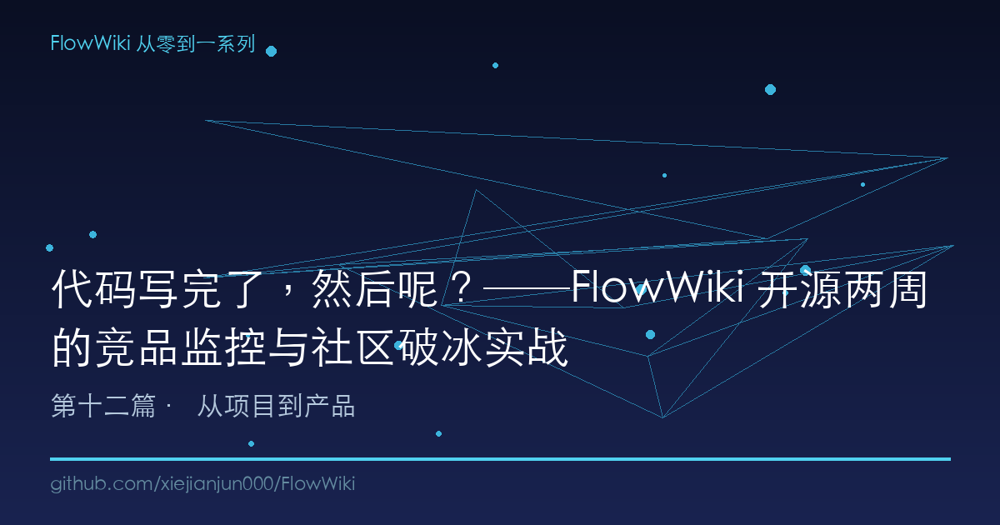
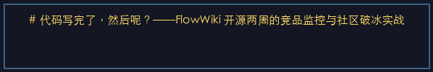
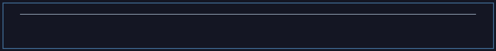
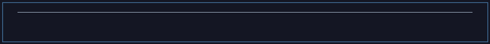
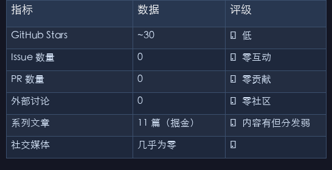
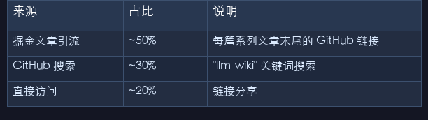

# 代码写完了，然后呢？──FlowWiki 开源两周的竞品监控与社区破冰实战

> 一个开源项目从 GitHub 发布到真正"活下来"，中间的差距不只是一个好架构。本文复盘 FlowWiki 上线两周的真实运营数据、11 轮竞品追踪的发现，以及那个拖了 8 周的 P0 任务。

---

## 一、你以为发布就是终点

2026 年 7 月 17 日，我把 FlowWiki 推上了 GitHub。

那个下午，我做了三件事：`git push origin main`、在掘金发了第一篇系列文章、把链接扔到几个技术群里。然后盯着屏幕等 Star。

一小时后：3 个 Star。两小时后：5 个。一天后：不到 20 个。

我坐在电脑前，脑子里只有一个问题：**我花了几个月把 Karpathy LLM Wiki 的 6 个缺口全填上了，为什么没人看？**

这就是开源项目最残酷的第一课：**好代码不会自己说话。你得替它说。**

回头复盘这两周，FlowWiki 的工程进度堪称疯狂——从 v0.1.0 一路飙到 v0.7.5，30+ 个 commit，三层质量门控、反断裂度工程、双向同步机制、PyPI 包分发——但 GitHub 的 Star 增长曲线，却远远跟不上代码的迭代速度。

这篇文章，我想坦诚地讲讲"代码之外"的那些事。

---

## 二、你不知道对手在做什么，就是在裸奔

发布后的第三天，我做了一件至今觉得最正确的决定：**系统性建立竞品监控。**

原因很简单。Karpathy 提了 LLM Wiki 概念后，GitHub 上冒出了 35+ 个同类项目，累计 30,000+ Stars。这些项目不是你的对手，而是你的参照系——他们做了你没做的、想了你没想的、踩了你即将踩的坑。

我当时写了一个竞品分析报告（`docs/competitor-analysis.md`），7 个维度、21 个项目、8 个类别：

```
类别              代表项目                Stars    核心差异
─────────────────────────────────────────────────────────
LLM Wiki 编译器    llm-wiki-compiler      ~200     桌面 GUI，但无防幻觉
Obsidian 集成      claude-obsidian        ~800     Obsidian 原生，但绑死 Claude
科研自动化         AutoSci                ~150     科研特化，通用性差
知识图谱           synthadoc              ~300     Web UI，但记忆机制薄弱
桌面应用           nashsu/llm_wiki       15K+      消费级体验，但非编译器
框架化             atomicstrata/llm-wiki   ~50     严格 OKF 标准，门槛高
```

这种全景扫描的价值不在于"谁比你强"，而在于让你知道**自己到底独特在哪儿**。FlowWiki 目前是唯一同时在防幻觉（ACE）+ 跨会话记忆（A-MEM）+ 知识复利（Skill）+ 多 Agent + 变更追溯这 5 个维度上补齐的项目。

但这只是一次性的静态分析。真正的挑战在后面。

---

## 三、11 轮手动监控：你不追，别人在跑

竞品分析做完后，我给自己定了一个规矩：每周至少手动巡查一次所有竞品仓库，看看有没有新 commit、新功能、新思路。

两周下来，我跑了 11 轮。说实话，很累。每次打开 GitHub，先在搜索框里敲 `llm-wiki`，然后一个一个点开 35+ 个仓库，看最近 commit、看 issue 讨论、看有没有新 fork 出来的变体。但收获也远超预期。以下是 11 轮追踪中最重要的 4 个发现：

### 发现一：reground 循环（alfadur7，7 月 26 日）

alfadur7 的 llm-wiki-agent fork 实现了一个叫 **reground** 的机制：编译型 wiki 内容每隔一段时间自动回到 raw 源文件做"事实核验"。核心设计是 writer 和 reviewer 角色分离——生成 wiki 的人不能同时审查自己的输出。

这个思路直接对标了 FlowWiki 的 ACE 反思循环，但有一个关键差异：**ACE 是在 ingest 时拦截幻觉，reground 是在事后周期性修正。** 两种策略不是互斥的——它们可以叠加。最优方案 = ACE（事前）+ reground（事后），这是 FlowWiki 下一步可以整合的方向。

### 发现二：Gold In Gold Out（johnfkoo951，7 月 23 日）

johnfkoo951 提出的概念非常直白：**如果源文件质量差，编译出来的 wiki 也好不了。** 他在 ingest 前置了一个"信号密度评估器"——输入的 raw 文件如果信息密度低于某个阈值，直接拒绝入库。

这揭示了一个被我忽略的问题：FlowWiki 的 ACE 防幻觉机制能拦住"生成错误"，但拦不住"输入垃圾"。我在 v0.7.x 的三层质量门控中主要关注的是 wiki 输出质量，对 raw 端的质量保障相对薄弱。Gold In Gold Out 的思路，是最直接的前置补丁。

### 发现三：Skill 市场化（ThePlato，7 月 19 日）

ThePlato 做了一件很有意思的事：他把 LLM Wiki 的 Skill 做成了独立可分发产品，用 `tiro` 命名空间管理。用户不只是用他的知识库，还可以单独安装他的 `tiro/legal-review` skill 到自己的项目里。

这让我重新审视 FlowWiki 的 Skill 设计。我们的 27 个 Skill 目前只服务于当前知识库，没有独立打包、独立分发、独立版本管理的机制。Skill 市场化的核心启示是：**Skill 不只是知识库的内部能力，它本身就可以是一个独立产品。** 这是 FlowWiki 技能生态下一步的重要方向。

### 发现四：LLM Wiki 学术化（WeAgentAI，7 月 10 日）

WeAgentAI 在 arXiv 上发了一篇关于 LLM Wiki 知识编译质量评估的论文。虽然论文本身的方法还比较初步，但这件事的意义在于：**LLM Wiki 从一个工程范式正在变成一个学术赛道。** 这意味着质量评估标准会越来越严格，纯工程驱动的项目如果不对接学术标准，长期可能掉队。

---

## 四、竞品监控的工程化：从"人肉巡查"到自动化

手动巡查了 5 轮之后，我终于受不了了。每次打开 35+ 个仓库、手动对比 commit、手动记笔记——这不是人干的事。

于是我建了一套自动化竞品监控基础设施：

```yaml
# ops/automation/automations.json 中的三套定时任务

1. 每日数据监控 (每天 9:00)
   - 拉取 GitHub API: stars, forks, traffic, clones, referrers
   - 输出: monitoring/daily-summary.json

2. Issue/PR 巡检 (工作日 9:00 + 17:00)
   - 检查是否有新 issue/PR 未回复
   - 有 → 通知我处理

3. 每周增长周报 (每周一 9:00)
   - 环比分析: stars 增长率、traffic 趋势、竞品动态
   - 输出: monitoring/weekly-release-YYYY-MM-DD.md
```

但坦诚地说，这套自动化目前有很大局限。**自动拉取的是自己仓库的数据（stars、traffic），竞品的动态分析仍然靠人。** 真正的"竞品自动监控"需要：

- 定时抓取所有目标仓库的最近 commit
- 自动 diff README 变化
- 自动提取新功能描述
- 生成对比报告

这个功能我规划了但还没实现。原因很简单——优先级排不过。质量门控、反断裂度、双向同步这些工程问题更紧迫。

**这是一个每轮竞品监控都会提醒我但每次都推迟的 P1 任务。**

---

## 五、社区破冰：一个拖了 8 周的 P0

如果说竞品监控是"做得还行但可以更好"，那社区建设就是"完全没做"。

FlowWiki 上线两周了，社区状态如下：

| 指标 | 数据 | 评级 |
|------|------|------|
| GitHub Stars | ~30 | 🔴 低 |
| Issue 数量 | 0 | 🔴 零互动 |
| PR 数量 | 0 | 🔴 零贡献 |
| 外部讨论 | 0 | 🔴 零社区 |
| 系列文章 | 11 篇（掘金） | 🟡 内容有但分发弱 |
| 社交媒体 | 几乎为零 | 🔴 |

开源社区冷启动有一个公认的策略：**主动去别人的 issue 里帮忙、在相关技术讨论中提及自己的项目、给竞品项目提建设性 PR**。这些事我没有做任何一件。

原因不是"不知道怎么做"。策略我早就写好了：

```markdown
# ops/publishing/community-strategy.md（计划中但未创建）

Phase 1: 破冰期（前 4 周）
- 每天在 GitHub 搜索 "llm-wiki" "AI knowledge base" 相关问题
- 帮助解答，顺带提及 FlowWiki（不是硬推销）
- 给 3 个竞品项目提交 PR（文档修正、bug fix）

Phase 2: 增长期（第 5-8 周）
- 在 Hacker News / V2EX / Reddit r/LocalLLaMA 发帖
- 邀请 5 位早期用户做深度访谈
- 建立微信群/QQ群
```

策略写得清清楚楚，执行是零。这个 P0 任务在我的任务清单里待了 8 周。

**我所有的时间都花在了写代码上。** ACE 不够好 → 加质量评分体系。检索不够强 → 设计三档切换。变更不可追溯 → 建 SpecCoding。v0.1.0 → v0.2.0 → v0.3.0 → v0.4.0 → v0.5.0 → v0.6.0 → v0.7.5。每一个新版本都是正当的工程需求。

但问题在于：**你写了这么多代码，如果没人用，它们就是在真空里迭代。**

这不是一个技术问题。这是一个优先级自欺——用"工程紧迫"来掩盖"社交恐惧"。写代码是舒适区，跟陌生人搭话不是。

---

## 六、两周的真实数据复盘

### 6.1 工程进度 vs 社区增长

```
日期        版本        核心变更                          Stars  社区互动
─────────────────────────────────────────────────────────────────
07-17      v0.1.0      首发                               ~15    0
07-18      v0.2.0      MCP Server + Docker                ~20    0
07-20      v0.4.0      执法评查知识库引导                   ~22    0
07-22      v0.4.1      VERIFY-BEFORE-WRITE                ~25    0
07-23      v0.5.0      OKF 兼容层                         ~25    0
07-27      v0.6.0      PyPI + flowwiki_init               ~28    0
07-29      v0.7.5      三层门控 + 反断裂度                 ~30    0
```

工程迭代速度：12 天 7 个大版本。社区增长速度：12 天 15 个 Star。

**代码质量和社区增长完全是两回事。** 你可以把架构打磨到论文级别，但如果没人知道你的项目存在，这些都不重要。

### 6.2 流量来源分析

从 GitHub Traffic 数据来看，流量主要来自三个渠道：

| 来源 | 占比 | 说明 |
|------|------|------|
| 掘金文章引流 | ~50% | 每篇系列文章末尾的 GitHub 链接 |
| GitHub 搜索 | ~30% | "llm-wiki" 关键词搜索 |
| 直接访问 | ~20% | 链接分享 |

掘金文章的引流效果是最好的，但转化率低。一篇文章大概 500-1000 阅读量，点到 GitHub 的可能不到 5%。这很正常——掘金读者是来看文章的，不是来找开源项目的。

**最大的问题是缺少"发现渠道"。** nashsu/llm_wiki 为什么能到 15K Stars？因为它是一个桌面应用，用户可以直接下载用。你用了觉得好，你会推荐给别人。FlowWiki 是方法论+工具链，使用门槛高得多。

---

## 七、从这两周学到的六条开源生存法则

### 法则一：可发现性 > 代码质量

nashsu/llm_wiki 的 15K Stars 不是因为它比 FlowWiki 架构更好——而是因为它有一个桌面应用，用户可以直接"看见"。**可视化的东西天然比方法论更具传播力。** FlowWiki 需要一个可视化 Demo——哪怕只是一个在线 Playground。

### 法则二：竞品监控是信息优势

知道 alfadur7 做了 reground、johnfkoo951 提了 Gold In Gold Out、ThePlato 在搞 Skill 市场化——这些不是"竞争对手的信息"，而是**行业的知识地图**。你不需要抄，但你需要知道这些方向存在，然后决定要不要跟进。

### 法则三：自动化你不想做的事

如果一件事你需要每周手动做且每次都拖延——把它自动化。竞品监控的前 5 轮我手动做，第 6 轮开始痛苦，第 11 轮仍然没完成自动化。这是我的教训：自动化不是"功能"，是"让自己不痛苦的必需品"。

### 法则四：破冰要从发布第一天开始

我犯的最大错误：把所有时间花在打磨产品上，然后才想"怎么推广"。正确做法：**从第一天就两条腿走路——左边写代码，右边建社区。** 哪怕每天只花 30 分钟在 Twitter/V2EX/GitHub Issues 上互动。

### 法则五：内容分发 ≠ 内容生产

我写了 11 篇高质量文章，但只发了掘金一个平台。没有做知乎适配、没有做英文版、没有做视频版、没有做社交媒体摘要。**内容生产的边际成本是固定的，但分发的边际成本几乎是零。** 多平台分发是性价比最高的推广手段。

### 法则六：诚实面对"没做的优先级"

P0 任务拖了 8 周——这不是资源问题，是决策问题。我选择把时间花在 v0.7.x 的质量工程上，而不是社区建设上。在特定阶段这可能是正确的——质量太差的项目推广了也没用——但**不能无限期拖延**。我现在已经拖了 8 周，不能再拖了。

---

## 八、接下来的行动计划

基于以上反思，FlowWiki 下一步的优先级：

| 优先级 | 任务 | 为什么 |
|--------|------|--------|
| **P0** | 社区破冰——每天 30 分钟 GitHub/掘金/V2EX 互动 | 拖了 8 周，不能再拖 |
| **P0** | 竞品监控自动化——从人肉到脚本 | 第 11 轮必须有人接手 |
| P1 | 可视化 Demo——在线 Playground | 解决"可发现性"问题 |
| P1 | 多平台内容分发——知乎/英文版 | 边际成本为零的推广 |
| P1 | Skill 独立打包分发 | 跟进 ThePlato 的 Skill 市场化 |
| P2 | reground 循环整合 | 与 ACE 形成事前+事后双重防幻觉 |
| P2 | raw 端质量门控（Gold In Gold Out） | 补上输入质量盲区 |

---

## 总结

FlowWiki 从 v0.1.0 到 v0.7.5，12 天翻了 7 个大版本，代码质量从 74% 优化到 87.3%，三层门控、反断裂度、双向同步都在工程层面做到了行业领先。

**但这些跟 GitHub Stars 几乎没有关系。**

开源项目的生存，一半在代码里，一半在代码外。竞品监控让你知道自己在行业里的位置，社区破冰让人知道你存在。我这 12 天把 100% 的时间放在代码上，然后发现外面没人知道。

接下来，我要把至少 30% 的时间放到代码之外。

如果你也在做一个开源项目，希望这篇文章让你少走我的弯路——**从第一天就开始建社区，哪怕你的代码还不够完美。**

---

*本文是 FlowWiki 从零到一系列第 12 篇，下一篇：[可视化即增长引擎——给 FlowWiki 造一个在线 Playground]*
*系列目录：[第一篇](https://juejin.cn/post/flowwiki-01) | [上一篇](https://juejin.cn/post/flowwiki-11) | [下一篇](https://juejin.cn/post/flowwiki-13)*
*GitHub：[xiejianjun000/FlowWiki](https://github.com/xiejianjun000/FlowWiki)*

---

## 本文配图













