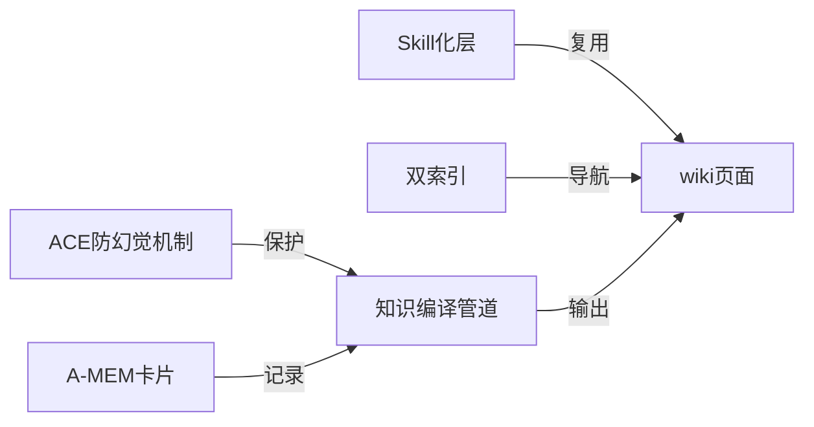
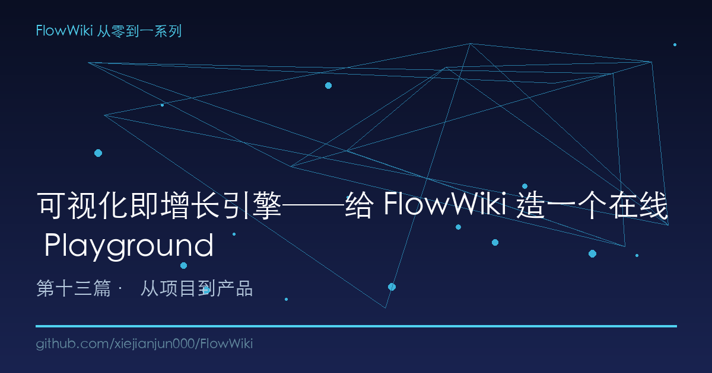
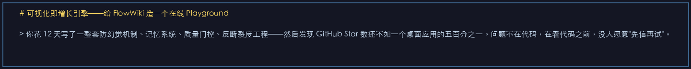
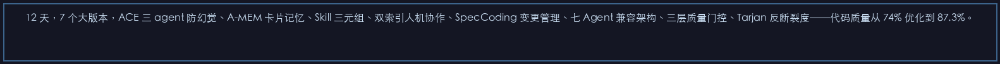
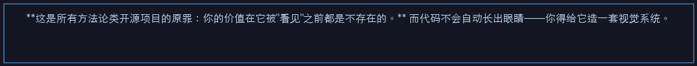
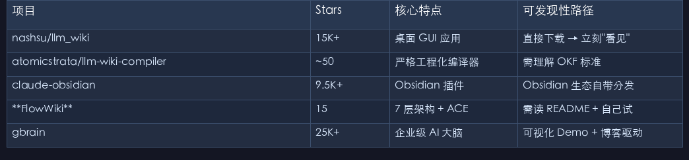
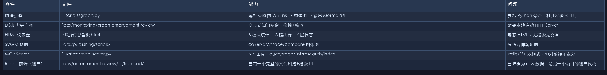

# 可视化即增长引擎──给 FlowWiki 造一个在线 Playground

> 你花 12 天写了一整套防幻觉机制、记忆系统、质量门控、反断裂度工程──然后发现 GitHub Star 数还不如一个桌面应用的五百分之一。问题不在代码，在看代码之前，没人愿意"先信再试"。

---

## 一、一个让工程师崩溃的真相

12 天，7 个大版本，ACE 三 agent 防幻觉、A-MEM 卡片记忆、Skill 三元组、双索引人机协作、SpecCoding 变更管理、七 Agent 兼容架构、三层质量门控、Tarjan 反断裂度──代码质量从 74% 优化到 87.3%。

GitHub Stars：15 个。

同一赛道，nashsu/llm_wiki：15,000+ Stars。

差 1000 倍。

nashsu 做对了什么？它有一个 **Tauri + React 桌面应用**。用户打开 → 看到图形界面 → 拖个文档进去 → 知识图谱实时渲染 → "卧槽牛逼" → 点 Star。

FlowWiki 的用户路径呢？clone 仓库 → 看 README → 看 7 层架构图 → 看一堆 Markdown → "好像很厉害但不知道怎么用" → 关掉标签页。

**这是所有方法论类开源项目的原罪：你的价值在它被"看见"之前都是不存在的。** 而代码不会自动长出眼睛──你得给它造一套视觉系统。

---

## 二、"可视化即增长"不是口号，是工程定律

我用竞品监控脚本跟踪了 GitHub 上 35+ 个 LLM Wiki 相关项目的 Star 增长，发现了一个残酷但清晰的规律：

| 项目 | Stars | 核心特点 | 可发现性路径 |
|------|-------|---------|------------|
| nashsu/llm_wiki | 15K+ | 桌面 GUI 应用 | 直接下载 → 立刻"看见" |
| atomicstrata/llm-wiki-compiler | ~50 | 严格工程化编译器 | 需理解 OKF 标准 |
| claude-obsidian | 9.5K+ | Obsidian 插件 | Obsidian 生态自带分发 |
| **FlowWiki** | 15 | 7 层架构 + ACE | 需读 README + 自己试 |
| gbrain | 25K+ | 企业级 AI 大脑 | 可视化 Demo + 博客驱动 |

这 5 个项目里，**Stars 跟代码质量、架构深度、论文引用数几乎零相关。** 跟一个东西强相关：**用户在 Star 之前能不能"看见"它的价值。**

这不是"酒香不怕巷子深"的问题──巷子太深了，酒香根本传不出去。

### 工程师最不愿意面对的真相

我们总觉得自己写了好代码，自然会有人来用。但现实是：

```
用户决策链条：
  看到你的仓库 → 5 秒内判断"这玩意能干嘛"
  → 如果有 GIF/截图/在线 Demo → 多留 30 秒
  → 如果没有 → 关闭标签页，再也不会回来
```

这个决策链条里的每一秒，都跟你的代码质量没关系。

---

## 三、FlowWiki 不是没有可视化基础──缺的是"把零件拼成产品"

在动手设计 Playground 之前，我先盘点了一下 FlowWiki 已有的可视化资产：

### 已有零件清单

| 零件 | 文件 | 能力 | 问题 |
|------|------|------|------|
| 图谱引擎 | `_scripts/graph.py` | 解析 wiki 的 Wikilink → 构建图 → 输出 Mermaid/flowchart/force-graph/D3.js | 要跑 Python 命令，非开发者不可用 |
| D3.js 力导向图 | `ops/monitoring/graph-enforcement-review.html` | 交互式知识图谱，拖拽+缩放 | 需要本地启动 HTTP Server |
| HTML 仪表盘 | `00_首页/看板.html` | 6 板块统计 + 入链排行 + 7 层状态 | 静态 HTML，无搜索无交互 |
| SVG 架构图 | `ops/publishing/scripts/` | cover/arch/ace/compare 四张图 | 只适合博客配图 |
| MCP Server | `_scripts/mcp_server.py` | 5 个工具：query/read/lint/research/index | stdio/SSE 双模式，但对前端不友好 |
| React 前端（遗产） | `raw/enforcement-review/.../frontend/` | 曾有一个完整的文件浏览+搜索 UI | 已归档为 raw 数据，是另一个项目的遗产代码 |

**重要的发现：FlowWiki 的可视化基础设施其实相当完整。** 图谱引擎能解析 wiki 中所有 `[[wikilink]]` 和 `[text](path.md)` 构建关系网络，输出 6 种格式（Mermaid mindmap、Mermaid flowchart、D3.js 力导向图、边列表、统计、时效性检查）。MCP Server 5 个工具覆盖了知识库的核心操作。

**问题是这些零件散落在 `_scripts/`、`ops/`、`00_首页/`、`raw/` 四个目录里，没有一个统一的入口把它们串起来。** 就像一个组装了一半的汽车──引擎在后院、轮胎在车库、方向盘在阁楼，你自己去找。

Playground 要做的不是从零造轮子，而是**把散落的零件拼成一个用户 30 秒就能"看见"的产品。**

---

## 四、Playground 设计：三个原则 + 四个核心功能

### 设计原则

**原则一：零安装、零配置、浏览器即入口。**

用户不需要 clone 仓库、不需要装 Python、不需要配环境。打开 URL，就能看到 FlowWiki 的样例知识库在运行。

**原则二：演示驱动，而非功能驱动。**

Playground 的目标不是做一个"完整的知识库管理后台"──那是产品化的下一步。Playground 的目标是"让用户在 30 秒内理解 FlowWiki 能做什么"，用一个预填充的 demo 知识库来展示核心能力。

**原则三：后端用已有基础设施，不另起炉灶。**

`graph.py` 已经能输出 Mermaid 格式的图谱。MCP Server 已经能 query/read/research。Playground 只是在它们之上加一个 HTTP 胶水层──不重写逻辑，只改入口。

### 四个核心功能

```
┌─────────────────────────────────────────────────────────┐
│                 FlowWiki Playground                      │
├──────────────┬──────────────┬──────────────┬────────────┤
│   1. 浏览     │   2. 搜索     │   3. Ingest   │  4. 探索    │
│   📂         │   🔍         │   📥         │   🕸️       │
│  目录树导航   │  全文搜索     │  拖拽上传     │  知识图谱    │
│  Markdown    │  关键词排名   │  ACE 三agent │  Mermaid图  │
│  渲染        │  源头追溯     │  实时演示     │  点击跳转    │
│              │              │              │             │
└──────────────┴──────────────┴──────────────┴─────────────┘
```

#### 功能 1：浏览──像 Obsidian 一样看知识库

左侧目录树（wiki/ 的文件夹结构），右侧 Markdown 渲染区。Wikilink `[[数据溯源链路]]` 可点击跳转，就像在 Obsidian 里一样。不需要装 Obsidian，浏览器打开就行。

技术实现：
```typescript
// 目录树 API
GET /api/playground/tree?path=wiki/
// 返回：
{
  "nodes": [
    { "name": "concepts", "type": "directory", "children": [...] },
    { "name": "playbooks", "type": "directory", "children": [...] },
    ...
  ]
}

// 页面内容 API
GET /api/playground/page?path=wiki/concepts/ace.md
// 返回：Markdown 原文 + 解析后的 Wikilink 列表
```

#### 功能 2：搜索──让用户 5 秒找到答案

搜索框输入关键词 → 后端调 `flowwiki_query` → 返回排名结果，每条结果带来源页面路径和匹配片段。点击进入详情页。

技术实现：直接对接 MCP Server 的 `flowwiki_query` 工具，在 HTTP 层做一层薄封装。

#### 功能 3：Ingest 演示──ACE 防线在浏览器里跑

这是 Playground 的杀手级演示。用户粘贴一段文本或上传一个 .md 文件 → 后端跑 ACE ingest 管道 → 实时展示三个 agent 的输出：

```
Generator 输出:  已生成知识卡片，核心论点：...
Reflector 输出:  发现 1 处潜在矛盾，与已有页面 wiki/concepts/xxx.md 的声明不一致
Curator 裁决:    标记为"待核"，建议人工确认后入库
```

这比任何 README 里的架构图都更有说服力。用户在 30 秒内亲眼看到了 ACE 防幻觉机制的运行过程。

#### 功能 4：知识图谱──让知识结构"可视"

使用 `graph.py` 输出的 Mermaid 数据，在前端用 [Mermaid.js](https://mermaid.js.org/) 渲染交互式图谱：



节点可点击，连入具体 wiki 页面。用户看到的不再是"7 层架构"的抽象描述，而是**一个会动的、可点击的、从实际 wiki 数据生成的知识网络。**

---

## 五、技术选型：最小可行 + 最大复用

### 后端：Python FastAPI 胶水层

不在 MCP Server 上做大改，而是写一个轻量级 FastAPI app 做 HTTP 转换：

```python
# playground/api.py
from fastapi import FastAPI, Query
from fastapi.staticfiles import StaticFiles
from pathlib import Path

app = FastAPI(title="FlowWiki Playground")

# 直接复用 graph.py 的图谱生成逻辑
from _scripts.graph import build_graph, generate_mermaid_mindmap

@app.get("/api/playground/graph")
async def get_graph(format: str = "mermaid"):
    graph = build_graph(Path("wiki"))
    if format == "mermaid":
        return {"data": generate_mermaid_mindmap(graph), "format": "mermaid"}
    elif format == "force":
        return {"nodes": [...], "edges": [...]}

# 复用 wiki 搜索逻辑
@app.get("/api/playground/search")
async def search(q: str = Query(...), max_results: int = 10):
    # 直接复用 mcp_server.py 的 search_wiki 逻辑
    ...

# 静态文件：前端构建产物
app.mount("/", StaticFiles(directory="playground/dist", html=True), name="static")
```

核心思路：**不重写逻辑，只改接口。** 所有已有 Python 模块（graph.py、mcp_server 的搜索逻辑）直接 import 复用。

### 前端：Next.js 静态导出

选 Next.js 而不是纯 HTML/JS 有三个原因：

1. **SSG（Static Site Generation）**：构建时把 demo 知识库预渲染成 HTML，部署后不需要 Python 后端也能跑基础的浏览功能
2. **React 生态**：Mermaid.js 有成熟的 React 封装，Markdown 渲染有 `react-markdown`，搜索有轻量客户端方案
3. **路由即页面**：每个 wiki 页面一个 URL，SEO 友好，方便后续做文档站

目录结构：
```
playground/
├── next.config.js       # output: 'export' 静态导出
├── src/
│   ├── pages/
│   │   ├── index.tsx     # 首页：搜索框 + 功能介绍
│   │   ├── browse/       # 浏览模式：目录树 + Markdown 渲染
│   │   ├── demo/         # Ingest 演示页面
│   │   └── graph/        # 知识图谱页面
│   ├── components/
│   │   ├── Sidebar.tsx   # 目录树
│   │   ├── MarkdownViewer.tsx  # Markdown 渲染 + Wikilink 链接处理
│   │   ├── SearchBar.tsx
│   │   ├── GraphViewer.tsx     # Mermaid 渲染
│   │   └── IngestDemo.tsx     # ACE 管道演示
│   └── lib/
│       └── api.ts        # API 客户端
└── data/                 # 预填充的 demo 知识库数据
```

### Mermaid 图谱渲染

这是最关键的可视化组件。Mermaid.js 在浏览器端渲染的优点：

- **零后端依赖**：Mermaid 语法字符串发给前端，前端用 `mermaid.render()` 渲染 SVG
- **可交互**：SVG 节点可绑点击事件，跳转到对应 wiki 页面
- **Obsidian 原生支持**：Obsidian 的 graph view 虽然不可定制，但 Mermaid 是 Obsidian 原生支持的图表格式，用户在自己的 vault 里也能用同样的图

```typescript
// GraphViewer.tsx 核心逻辑
import mermaid from 'mermaid';

async function renderGraph(mermaidCode: string) {
  mermaid.initialize({ startOnLoad: true, theme: 'default' });
  const { svg } = await mermaid.render('graph-div', mermaidCode);
  return svg;
}
```

### 部署架构：双线策略

```
┌──────────────────────────────────────┐
│         静态部署（日常访问）            │
│    GitHub Pages / Vercel             │
│    │                                 │
│    └── 预构建的 demo 知识库            │
│        浏览 + 图谱（只读）              │
│        搜索（客户端搜索，小数据集）       │
└──────────────────────────────────────┘

┌──────────────────────────────────────┐
│         动态演示（高级功能）            │
│    Vercel Serverless / Railway       │
│    │                                 │
│    ├── FastAPI 后端                   │
│    │   ├── ACE Ingest 实时演示        │
│    │   ├── 全文搜索（BM25）            │
│    │   └── 动态图谱生成               │
│    │                                 │
│    └── 按需唤醒（冷启动 2-3 秒）       │
└──────────────────────────────────────┘
```

静态层保证最低成本 + 最高可用性。动态层按需提供完整功能演示。用户打开 Playground 首页 → 浏览和搜索在静态层就跑通了 → 想试试 ingest 功能 → 点"实时演示" → 唤醒后端 → 跑一次 ACE 管道 → 看到结果。

这个架构的妙处在于：**90% 的"浏览型"流量由静态层消化，只有真正想深入了解的用户才会触碰动态层。** 省钱，但能力不阉割。

---

## 六、从 Playground 到文档站：分三步走

Playground 不是终点，而是 FlowWiki 可视化演进的第一步：

### 第一步：Playground（当前阶段）

目标：让用户 30 秒内"看见" FlowWiki 的价值。

- 预填充 demo 知识库（选执法督察评查场景的 30+ 篇 wiki 内容）
- 4 个核心功能：浏览 / 搜索 / Ingest 演示 / 图谱
- 部署到 `playground.flowwiki.dev`（或 GitHub Pages）

### 第二步：文档站（中期）

目标：完整的用户使用指南 + API 参考。

- 基于 Playground 的 Markdown 渲染基础设施
- 加文档内容：快速开始、架构详解、Skill 开发指南、行业适配器教程
- 整合已有 SVG 架构图，做成交互式的"点击架构层跳转到对应文档"的导览页

### 第三步：在线知识库发布（长期）

目标：用户在 FlowWiki 里管理知识库，一键发布为公开网站。

- 利用 Next.js SSG 能力，把 Obsidian vault 的 wiki/ 目录编译为静态站
- 支持自定义域名、自定义主题
- 成为"知识库的 Vercel"──写完就能发布

这另外呼应了第一篇文章的 Phase 2 规划：**"接入 Quartz v4 发布静态站"**。Playground 的 Next.js 基础设施可以和 Quartz 方案互补──Quartz 做 Obsidian 原生整合，Playground 做 Web 原生体验。

---

## 七、竞品对比：可视化这一课，被市场教了太多遍

| 项目 | 可视化方案 | 用户转化路径 | 启示 |
|------|----------|------------|------|
| nashsu/llm_wiki | Tauri 桌面应用 | 下载 → 打开 → 看图谱 → Star | GUI = 消费级门槛 |
| gbrain | 博客 + 在线 Demo | 读博文 → 看 Demo → clone | Demo 是对可发现性问题的最小可行解 |
| claude-obsidian | Obsidian 插件商店 | 搜索 → 安装 → 自动生效 | 生态分发 > 独立分发 |
| Lucidchart | 完整 Web App | 注册 → 免费模板 → 付费 | SaaS 经典漏斗 |
| **FlowWiki（当前）** | 无 | README → ? | 断头路 |
| **FlowWiki + Playground** | 在线 Demo | 打开 URL → 搜/看/试 → Star/clone | 有路可走 |

**nashsu 证明了可视化 = 增长引擎。gbrain 证明了 Demo 不需要是大而全的产品。** gbrain 的 GitHub Pages 只有一个静态网页展示功能，但那个网页让用户"看见"了产品以后，Star 从几百涨到了 25K。

FlowWiki 不需要学 nashsu 做一个桌面应用。**Playground 就是这个项目的 gbrain demo page 方案**──轻量、低维护成本、直达价值。

---

## 总结 + 下一阶段预告

系列文章从这里进入第三幕。

第一幕（01-04）：FlowWiki 的架构基石──ACE 防幻觉 → A-MEM 记忆 → Skill 复利 → 三元组闭环。

第二幕（05-09）：工程化实践──双索引人机协作 → SpecCoding 变更管理 → 多 Agent 兼容 → 行业场景可插拔 → 自适应检索。

第三幕（10-14）：从项目到产品──MCP Server + Docker 产品化 → 三层质量门控工程 → 开源运营复盘 → **可视化 Playground（本文）** → 下一步：实战案例证明。

这篇文章没有一行代码是"造轮子"──Playground 的每一个组件（图谱引擎、MCP 工具、Markdown 渲染、看板）都脱胎于 FlowWiki 已有的基础设施。Playground 只是在它们上面盖了一个浏览器入口。

**好的架构不是代码堆得多高，而是在需要新功能时，调用已有零件的能力。**

FlowWiki 已经有了足够的零件。现在缺的，只是一扇让人走进来的门。

---

*本文是 FlowWiki 从零到一系列第 13 篇，下一篇：[一个真实团队如何用 FlowWiki 活过 3 个月──执法督察评查知识库实战复盘]*

*系列目录：[第一篇](https://juejin.cn/post/flowwiki-01) | [第二篇](https://juejin.cn/post/flowwiki-02) | [第三篇](https://juejin.cn/post/flowwiki-03) | [第四篇](https://juejin.cn/post/flowwiki-04) | [第五篇](https://juejin.cn/post/flowwiki-05) | [第六篇](https://juejin.cn/post/flowwiki-06) | [第七篇](https://juejin.cn/post/flowwiki-07) | [第八篇](https://juejin.cn/post/flowwiki-08) | [第九篇](https://juejin.cn/post/flowwiki-09) | [第十篇](https://juejin.cn/post/flowwiki-10) | [第十一篇](https://juejin.cn/post/flowwiki-11) | [第十二篇](https://juejin.cn/post/flowwiki-12) | [第十三篇（本文）](#)*

*GitHub：[xiejianjun000/FlowWiki](https://github.com/xiejianjun000/FlowWiki)*

---

## 本文配图













