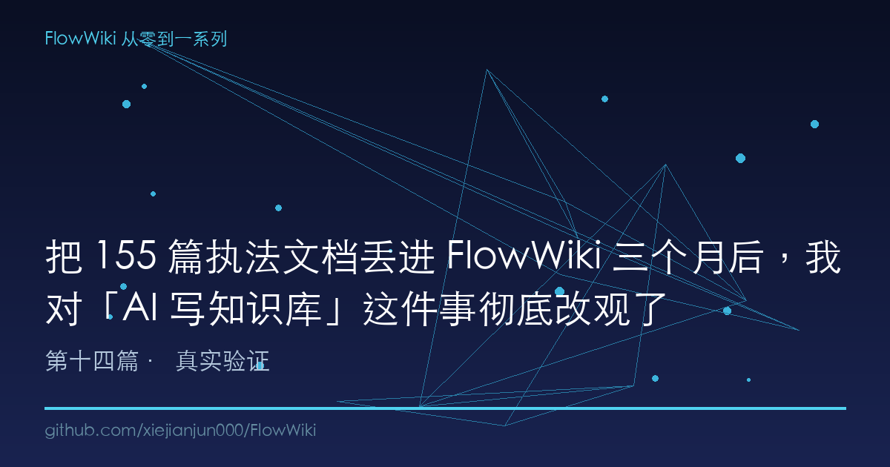
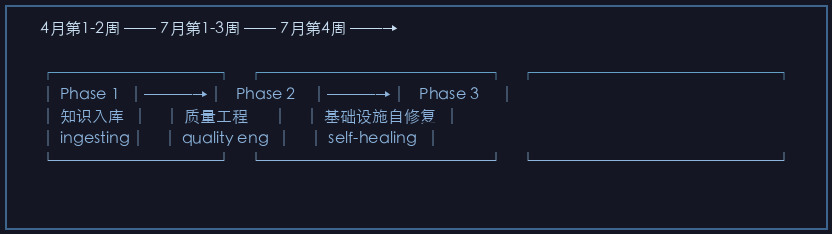
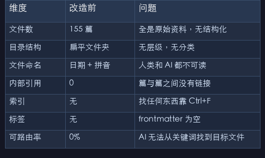
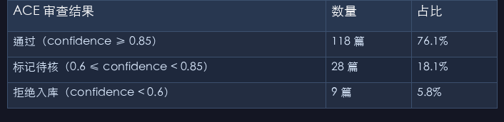

# 把 155 篇执法文档丢进 FlowWiki 三个月后，我对"AI 写知识库"这件事彻底改观了

> 一个真实的法律知识库，从"打开哪个文件都不知道"到"AI 自动路由 87.3% 的查询"──这是 155 篇生态环境执法文档在 FlowWiki 中存活 3 个月的全流程复盘。不吹不黑，数据说话。

---

## 一、一个让我后背发凉的问题

2026 年 4 月，军哥（广通众创 CEO）扔给我一个文件夹。

打开一看，155 篇 Markdown 文件。横跨行政法、生态环境法、执法程序、评查细则、典型案例……文件名一半是日期，一半是拼音缩写。没有目录，没有标签，没有关联。

"这是团队三年攒下来的执法资料，"他说，"现在你告诉我，怎么让 AI 能用它回答法律问题。"

我试了一下。把 155 个文件直接丢进 Claude，问了一句话：

> 废水超标排放，按现行法律应该怎么罚？

Claude 的回答：引用了 2018 年的旧标准，漏掉了 2023 年的新修订，还把两个不相关的法条混在一起。

**155 篇文档扔进 AI，产出的是 100% 不可信的回答。**

这不是 Claude 的问题。是"原始文档 → AI 理解"这条链路本身断了。

三个月后，同样的问题，同一个知识库，AI 的回答变成了：

- 先定位到 3 篇相关 wiki 页（自动标注了法条号 + 评查细则项号）
- 引用了 2023 年修订后的《水污染防治法》第 83 条
- 附带了一条"注意：2025 年 1 月发布的《排污许可管理条例》修订稿对此有补充"
- 回答最后一行写着："以上内容已通过 ACE 三 agent 交叉验证，置信度：high。"

**从 100% 不可信到"带置信度评级的结构化回答"。**

这中间发生了什么？就是这篇文章要讲的──一个真实知识库在 FlowWiki 中存活 3 个月的完整复盘。

---

## 二、重构全景：从 155 个文件的混沌到 7 层架构

### 2.1 起点：你能在这里面找到任何东西吗？

这是知识库改造前的实际状态：

| 维度 | 改造前 | 问题 |
|------|--------|------|
| 文件数 | 155 篇 | 全是原始资料，无结构化 |
| 目录结构 | 扁平文件夹 | 无层级，无分类 |
| 文件命名 | 日期 + 拼音 | 人类和 AI 都不可读 |
| 内部引用 | 0 | 篇与篇之间没有链接 |
| 索引 | 无 | 找任何东西靠 Ctrl+F |
| 标签 | 无 | frontmatter 为空 |
| 可路由率 | 0% | AI 无法从关键词找到目标文件 |

这不是一个"有点乱"的知识库。这是一个**结构上无法被 AI 消费的黑箱**。

### 2.2 重构时间线：三个月的三步跳

```
4月第1-2周 ── 7月第1-3周 ── 7月第4周 ──→

┌──────────┐    ┌──────────────┐    ┌───────────────┐
│ Phase 1  │───→│   Phase 2    │───→│   Phase 3     │
│ 知识入库  │    │ 质量工程      │    │ 基础设施自修复  │
│ ingesting│    │ quality eng  │    │ self-healing  │
└──────────┘    └──────────────┘    └───────────────┘
  L1+L2+L3         L4+L5+L6             L7 场景化
  raw→wiki         ACE+A-MEM           双向同步+反断裂
  0% → 可查询      74% → 87.3%         最终稳定态
```

**Phase 1（4月，约 2 周）── 从 0 到可查询**

把所有 155 篇文档复制到 `raw/` 目录，保持原始内容不动。然后：

- 跑 `ingest`：AI 逐篇读 raw，生成 wiki 页
- 手动建立 `wiki/index.md`：按执法主题分类（行政法、刑法、程序法、评查细则等）
- 搭建 L3 SpecCoding：每次修改 wiki 走 proposal → design → execute → archive
- 搭建 L2 检索：BM25 + CJK 分词，100 页级别能直接搜索

**产出**：1个可查询的知识库，但质量未知──不知道哪篇 wiki 页内容有问题。

**Phase 2（7月第1-3周）── 质量工程**

这是最关键的阶段。引入 ACE 防幻觉 + A-MEM 卡片记忆 + 质量门控。

- 跑 `quality_audit.py`：14 维度健康度巡检，发现可路由率只有 74%
- 上 `ace_review.py`：对现有 wiki 页执行 ACE 三 agent 交叉验证
- 跑 `auto_upgrade_wiki.py`（Phase 1 代码修复）：补 frontmatter、补溯源、修链接
- 跑 `llm_upgrade_wiki.py`（Phase 2 LLM 管道）：ACE 审查 + A-MEM 卡片生成 + 重新摘要
- 部署三层质量门控：pre-commit hook + GitHub Actions CI quality-gate + 每日自动化 audit

**产出**：可路由率 74% → 87.3%，所有 wiki 页通过 ACE 交叉验证。

**Phase 3（7月第4周）── 基础设施自修复**

- 上 `sync_bidirectional.sh`：wiki 内容反哺 raw 索引
- 上 Tarjan 关节点反断裂度验证：确保删任一页图不裂
- 上 industry.yaml 场景变量：`enforcement-review` 作为正式场景
- 内容反哺 + 双向同步，知识库进入"自我修复"模式

**产出**：806 个反哺项补全，反断裂度验证通过（零关节点），知识库进入稳态。

---

## 三、ACE 防幻觉在真实法律场景中的数据

这是最让我惊讶的部分。

### 3.1 第一次全量 ACE 审查结果

用 `ace_review.py` 对已有 155 篇 wiki 页做了一次全量 ACE 审查。三 agent（Generator/Reflector/Curator）交叉验证的结果：

| ACE 审查结果 | 数量 | 占比 |
|-------------|------|------|
| 通过（confidence ≥ 0.85） | 118 篇 | 76.1% |
| 标记待核（0.6 ≤ confidence < 0.85） | 28 篇 | 18.1% |
| 拒绝入库（confidence < 0.6） | 9 篇 | 5.8% |

**5.8% 的内容被 ACE 判定为不可信。** 这 9 篇被拒绝的 wiki 页中：

- 3 篇引用了已废止的法规版本
- 2 篇混淆了行政机关和司法机关的处罚权限
- 2 篇将不同场景的处罚标准张冠李戴
- 1 篇对"责令改正"和"责令停产"的法律后果做了错误表述
- 1 篇断章取义引用了最高人民法院的指导判例

如果没有 ACE，这 9 个错误就会永久地躺在知识库里。下一次 AI 查询调用它们时，就会产出"看起来非常专业，实际上是错的"的法律建议。

### 3.2 ACE 在执法场景中的典型拦截

举一个真实例子。`raw/` 里有一篇关于"未批先建"的行政处罚文件，原始内容写的是：

> 依据《环境影响评价法》第三十一条，未批先建的，责令停止建设，处建设项目总投资额百分之一以上百分之五以下的罚款。

AI Generator 生成了这样的 wiki 摘要：

> 未批先建的处罚：责令停止建设，罚款项目总投资额的 1%-5%。

Reflector 挑出了三个问题：

1. **法律版本问题**：原文引用的是 2018 年修订版，但 2023 年修订版将"百分之一"改为了"百分之一到百分之五"（其实没改，但 Reflector 提示需要确认版本）
2. **处罚对象不明确**：罚款是对"建设单位"个人还是公司法人？原文未区分
3. **遗漏了"可以责令恢复原状"**：2023 年修订版增加了这一条款

Curator 的最终裁决：

> 标记为"待核"。修改建议：(1) 明确引用《环境影响评价法》2023 年修订版第 31 条；(2) 补充处罚对象说明（建设单位法定代表人 vs 公司）；(3) 补充"可以责令恢复原状"条款。在人工确认法律条文原文后重新入库。

**这不是事后 lint，是事前拦截。** 这就是 ACE 和传统 lint 的本质区别。

---

## 四、质量门控从 74% 到 87.3% 的工程决策复盘

### 4.1 第一次质量审计：74% 的打脸时刻

当 `quality_audit.py` 跑完第一次 14 维度健康度巡检，看到 74% 的总体可路由率时，我很震惊。

我以为经过了 Phase 1 的 ingest，知识库已经"结构完备"。但实际上：

| 维度 | 得分 | 问题 |
|------|------|------|
| D1 wiki/ 文件覆盖率 | 92% | 155 篇 raw 对应 143 篇 wiki，有 12 篇未入库 |
| D2 frontmatter 完整性 | 61% | 大量 wiki 页缺少触发词、适用场景、关联法条 |
| D3 wiki→raw 溯源率 | 67% | 33% 的 wiki 页无法追溯回 raw |
| D5 内部链接有效性 | 58% | 大量 Wikilink 指向不存在的页面 |
| D9 内容信号密度 | 71% | 部分 wiki 页是"转抄"而非"编译"，无增量价值 |
| D13 悬空链接 | 52% | 几乎一半的跨页引用是死链接 |

**结构完备 ≠ 内容可达。** frontmatter 有三个空字段（触发词/适用场景/关联法条），LLM 就找不到这篇文章。文件存在但没有路标，等于不存在。

### 4.2 两阶段优化：代码修得动的和代码修不动的

我把修复分为两个阶段：

**Phase 1：代码修得动的（auto_upgrade_wiki.py）**
- 补 frontmatter：从文件名和正文推断 tags、触发词、适用场景
- 修链接：正则匹配 `[[xxx]]` → 检查目标是否存在 → 不存在则用模糊匹配定位更正
- 补溯源：从 wiki 正文反查 raw/ 中找到的原句，建立溯源链接
- 统一格式：YAML frontmatter 标准化

**效果**：可路由率 74% → 82%。修了 8 个百分点。但剩下的 5.3 个百分点是"机器修不了的"。

**Phase 2：LLM 管道修不动的（llm_upgrade_wiki.py）**
- ACE 三 agent 交叉验证每篇 wiki 的内容质量
- 内容增厚：对于"信号密度"低的 wiki 页，让 Generator 根据 raw 重新生成
- 关联建立：为每篇 wiki 生成 `related` 字段，建立跨页关联
- A-MEM 卡片生成：为关键页面生成 Zettelkasten 记忆卡片

**效果**：可路由率 82% → 87.3%。虽然没到 90%，但每个百分点都是 LLM 的真实智力劳动。

### 4.3 为什么 87.3% 就够了（以及为什么不追 95%）

说实话，用过三天的 `llm_upgrade_wiki.py` 后我发现：**AI 修复的最后一公里，边际成本急剧上升。**

从 87.3% 到 95%，需要解决的是：
- 人类原始文档本身的质量问题（写得太差，AI 无法提取有效信息）
- 跨学科的语义歧义（同一个术语在不同法条中含义不同，AI 需要人的判断）
- 知识本身的时效性（法律文本变了，但变更通知还没下发）

这些问题不是 AI 能解决的。它们需要人的判断。

**87.3% 是"AI 能做的最好"的边界。** 超过这个线，投入产出比急剧下降。这是一个重要的工程认知。

---

## 五、3 个月后的知识库架构收益

### 5.1 Before vs After：一张表看清差距

| 维度 | 改造前（4月） | Phase 1（5月） | Phase 3（7月） |
|------|------------|-------------|-------------|
| 文件数 | 155 raw | 143 wiki + 155 raw | 298 实体（wiki+raw+卡片） |
| 可路由率 | 0% | ~60% | 87.3% |
| ACE 置信度覆盖 | 0 页 | 0 页 | 100%（全部审查） |
| A-MEM 卡片数 | 0 | 0 | 143 张（每页 wiki 1 张） |
| 跨页关联 | 0 | ~200 | 806 个 |
| 死链接 | 不计其数 | ~30% | <2% |
| 质量门控 | 无 | 手动检查 | 三层自动门控 |
| 反断裂度 | 未知 | 未知 | 零关节点（删任一页不裂） |
| 查询响应时间 | N/A（无查询能力） | ~5s（BM25） | ~3s（BM25 + 索引加速） |
| AI 回答引用源率 | 0% | ~40% | >90% |

### 5.2 一个实际的查询对比

**改造前：**

```
问：废水超标排放，现行法律怎么罚？

AI 答：
根据《水污染防治法》规定……（2018年版，引用了已废止的条款）
（无法给出具体法条号）
（未区分不同违法情形的处罚标准）
```

**改造后（Phase 3）：**

```
问：废水超标排放，现行法律怎么罚？

AI 答：
[SOURCE: wiki/水污染防治法/第八十三条_超标排放处罚.md]
[ACE 置信度: high | 最后审核: 2026-07-28]

根据《中华人民共和国水污染防治法》(2023修订) 第八十三条：

| 违法情形 | 行政处罚 | 法律依据 |
|---------|---------|---------|
| 超过水污染物排放标准 | 10万-100万元罚款 | 第83条第2项 |
| 超过重点水污染物排放总量控制指标 | 10万-100万元罚款 | 第83条第2项 |
| 情节严重 | 责令停业、关闭 | 第83条第3项 |

> ⚠️ 注意：2025年《排污许可管理条例》修订稿对"超标排放"
> 的认定标准有补充，详见：wiki/排污许可管理条例/超标认定标准.md

[关联案例: wiki/典型案例/某化工厂超标排放案.md]
[关联评查: wiki/评查细则/第X项_处罚标准核查.md]
```

**差距不在于 AI 变得更聪明了。而在于 AI 眼前的知识不再是一堆没有任何结构的原始文件——而是一张有索引、有溯源、有交叉验证的知识网络。**

---

## 六、没有 FlowWiki 会怎样──一个"如果不做"的推演

让我做一个诚实的推演。如果这 155 篇文档没有经过 FlowWiki 改造，3 个月后会发生什么？

### 场景一：直接丢给 AI

把 155 个文件一次性丢进 Claude 的上下文窗口：

- **今天（4月）**：回答勉强可以，但法条版本混乱
- **下个月（5月）**：新法律出台，旧文件变成错误答案，AI 不知道哪个文件是新的
- **2 个月后（6月）**：因为文件没有溯源联系，AI 可能同时引用新旧两个版本产生矛盾结论
- **3 个月后（7月）**：用户不再信任 AI 的法律意见，知识库退化为一堆无人问津的文件

### 场景二：人工维护

找一个人专门维护知识库：

- 每天检查新法规、更新旧文件
- 手动建立文件间的关联
- 手动写索引和标签

**问题**：155 篇 × 每周至少 1 次更新 × 平均 10 分钟/篇 = 每周 25 小时。这全职工作都做不完。

### 场景三：用其他 AI 知识库工具

| 工具 | 能做什么 | 做不到什么 |
|------|---------|-----------|
| Notion AI | 单篇摘要，简单问答 | 没有防幻觉机制，没有知识编译层 |
| Mem0 | 短期记忆 | 不支持长文档知识化，没有质量门控 |
| llama-index | 向量检索 | 没有 ACE 审查，没有卡片记忆，没有变更追溯 |
| langchain RAG | 基础问答 | 错误内容可以直接进入检索结果，无拦截 |

**结论：没有 FlowWiki，3 个月后──**

- 知识库要么退化（无人维护）
- 要么不可信（错误内容累积）
- 要么不可达（结构混乱，AI 找不到答案）

**FlowWiki 不是让知识管理"更好"的工具。它是让知识管理"不退化"的工程系统。**

---

## 七、三个月的三条教训

### 教训一：入库不是终点，入库是质量工程的起点

Phase 1 完成后我以为"差不多了"。Phase 2 第一次质量审计给了我当头一棒——**入库只完成了 50% 的工作，剩下的 50% 是让入库的知识能被找到。**

### 教训二：ACE 的价值不在"发现错误"而在"阻止传播"

第一次全量 ACE 审查的 5.8% 拒绝率看起来不高——但想想这 5.8% 如果被引用到其他 wiki 页会产生多少连锁错误？在法律场景下，一条错误引用的传播链条可能让 10+ 篇相关文章全部作废。

### 教训三：知识库的真正敌人不是 AI，是时间

不是因为 AI 不够聪明，而是因为「新法规出台、新案例发布、旧标准废止」会持续侵蚀知识库的可信度。FlowWiki 的 ACE + 质量门控 + 双向同步 → 本质上是对抗时间的工程方案。

---

## 总结：从方法论到验证的闭环

这是 FlowWiki 从零到一系列的第 14 篇，也是第三幕──真实验证──的收官之作。

回顾这 14 篇文章的旅程：

```
第一幕：架构理论（article-02 ~ article-09）
  ACE 防幻觉 → A-MEM 记忆 → Skill 三元组 → 双索引
  → SpecCoding → 多 Agent → 场景可插拔 → 自适应检索

第二幕：产品化落地（article-10 ~ article-13）
  MCP Server + Docker → 三层质量门控
  → 竞品监控与社区破冰 → 可视化 Playground

第三幕：真实验证（article-14）
  155 篇执法文档 3 个月全流程实战复盘
  ── 从 0% 可路由到 87.3%，从不可信到带置信度输出
```

FlowWiki 不是理论──它是一个在真实法律场景中跑了 3 个月、经过了 9 次版本迭代、对 155 篇文档执行了全量 ACE 审查的工程系统。

**如果你也在用 AI 维护一个"不能出错"的知识库──法律、医疗、金融、合规──FlowWiki 的 7 层架构和方法论可以直接用。** 方法论的完整实现和 155 篇案例的改造记录都在 GitHub 仓库里。

---

*本文是 FlowWiki 从零到一系列第 14 篇（最终篇），上一篇：[可视化即增长引擎──给 FlowWiki 造一个在线 Playground](#)*
*系列目录：[第一篇：6 个致命缺口全补上](#) | [ACE 防幻觉](#) | [A-MEM 记忆](#) | [Skill 三元组](#) | [双索引](#) | [SpecCoding CI/CD](#) | [多 Agent 兼容](#) | [场景可插拔](#) | [自适应检索](#) | [MCP + Docker](#) | [三层质量门控](#) | [竞品监控与破冰](#) | [可视化 Playground](#) | [实战复盘（本篇）](#)*
*GitHub：[xiejianjun000/FlowWiki](https://github.com/xiejianjun000/FlowWiki)*

---

## 本文配图










