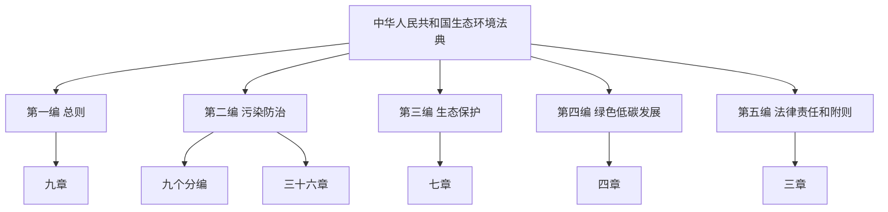

# 中华人民共和国生态环境法典

> （2026年3月12日第十四届全国人民代表大会第四次会议通过）

> 本法自2026年8月15日起施行。共五编，一千二百四十二条。

## 基本信息

| 项目 | 内容 |
| --- | --- |
| 通过日期 | 2026年3月12日 |
| 通过机关 | 第十四届全国人民代表大会第四次会议 |
| 生效日期 | 2026年8月15日 |
| 总条数 | 一千二百四十二条 |
| 编数 | 五编 |
| 总条数（统计） | 1242 条 |

### 同时废止的法律

| 序号 | 法律名称 | 原通过日期 | 原施行日期 | 废止日期 | 详情 |
|:---:|---------|:---:|:---:|:---:|:---:|
| 1 | 《中华人民共和国环境保护法》 | 1989-12-26 | 2015-01-01 | 2026-08-15 | [[法律法规汇编/01-中华人民共和国环境保护法\|详情]] |
| 2 | 《中华人民共和国大气污染防治法》 | 1987-09-05 | 2016-01-01 | 2026-08-15 | [[法律法规汇编/02-中华人民共和国大气污染防治法\|详情]] |
| 3 | 《中华人民共和国水污染防治法》 | 1984-05-11 | 2018-01-01 | 2026-08-15 | [[法律法规汇编/03-中华人民共和国水污染防治法\|详情]] |
| 4 | 《中华人民共和国土壤污染防治法》 | 2018-08-31 | 2019-01-01 | 2026-08-15 | [[法律法规汇编/04-中华人民共和国土壤污染防治法\|详情]] |
| 5 | 《中华人民共和国固体废物污染环境防治法》 | 1995-10-30 | 2020-09-01 | 2026-08-15 | [[法律法规汇编/05-中华人民共和国固体废物污染环境防治法\|详情]] |
| 6 | 《中华人民共和国噪声污染防治法》 | 2021-12-24 | 2022-06-05 | 2026-08-15 | [[法律法规汇编/06-中华人民共和国噪声污染防治法\|详情]] |
| 7 | 《中华人民共和国海洋环境保护法》 | 1982-08-23 | 2024-01-01 | 2026-08-15 | [[法律法规汇编/07-中华人民共和国海洋环境保护法\|详情]] |
| 8 | 《中华人民共和国放射性污染防治法》 | 2003-06-28 | 2003-10-01 | 2026-08-15 | [[法律法规汇编/08-中华人民共和国放射性污染防治法\|详情]] |
| 9 | 《中华人民共和国清洁生产促进法》 | 2002-06-29 | 2012-07-01 | 2026-08-15 | [[法律法规汇编/09-中华人民共和国清洁生产促进法\|详情]] |
| 10 | 《中华人民共和国环境影响评价法》 | 2002-10-28 | 2003-09-01 | 2026-08-15 | [[法律法规汇编/10-中华人民共和国环境影响评价法\|详情]] |

> ⚠️ 以上10部法律均于**2026年8月15日**《中华人民共和国生态环境法典》施行之日起同时废止。各法律详细资料见 [[法律法规汇编/|法律法规汇编]]。

## 法典结构概览

## 完整目录

- [[第一编-总则|第一编　总则]]
    - [[第一编-总则|第一章　基本规定]]
    - [[第一编-总则|第二章　监督管理]]
      - [[第一编-总则|第一节　监督管理体制和工作机制]]
      - [[第一编-总则|第二节　监督管理制度]]
    - [[第一编-总则|第三章　规划和生态环境分区管控]]
    - [[第一编-总则|第四章　标准和监测]]
    - [[第一编-总则|第五章　生态环境影响评价]]
      - [[第一编-总则|第一节　一般规定]]
      - [[第一编-总则|第二节　规划的生态环境影响评价]]
      - [[第一编-总则|第三节　建设项目的生态环境影响评价]]
    - [[第一编-总则|第六章　生态保护补偿]]
    - [[第一编-总则|第七章　突发生态环境事件应对]]
    - [[第一编-总则|第八章　保障措施]]
    - [[第一编-总则|第九章　信息公开与公众参与]]
- [[第二编-污染防治|第二编　污染防治]]
  - 第一分编　通则
    - [[第二编-污染防治|第一章　一般规定]]
    - [[第二编-污染防治|第二章　排污许可管理]]
  - 第二分编　大气污染防治
    - [[第二编-污染防治|第三章　一般规定]]
    - [[第二编-污染防治|第四章　大气污染防治措施]]
      - [[第二编-污染防治|第一节　燃煤和其他能源大气污染防治]]
      - [[第二编-污染防治|第二节　工业大气污染防治]]
      - [[第二编-污染防治|第三节　机动车船等大气污染防治]]
      - [[第二编-污染防治|第四节　扬尘大气污染防治]]
      - [[第二编-污染防治|第五节　农业和其他大气污染防治]]
    - [[第二编-污染防治|第五章　重点区域大气污染联合防治]]
    - [[第二编-污染防治|第六章　重污染天气应对]]
  - 第三分编　水污染防治
    - [[第二编-污染防治|第七章　一般规定]]
    - [[第二编-污染防治|第八章　水污染防治措施]]
      - [[第二编-污染防治|第一节　工业水污染防治]]
      - [[第二编-污染防治|第二节　城镇水污染防治]]
      - [[第二编-污染防治|第三节　农业和农村水污染防治]]
      - [[第二编-污染防治|第四节　船舶水污染防治]]
    - [[第二编-污染防治|第九章　饮用水水源和其他特殊水体保护]]
    - [[第二编-污染防治|第十章　重点流域水污染防治]]
  - 第四分编　海洋污染防治
    - [[第二编-污染防治|第十一章　一般规定]]
    - [[第二编-污染防治|第十二章　陆源污染物海洋污染防治]]
    - [[第二编-污染防治|第十三章　工程建设项目海洋污染防治]]
    - [[第二编-污染防治|第十四章　废弃物倾倒海洋污染防治]]
    - [[第二编-污染防治|第十五章　船舶海洋污染防治]]
  - 第五分编　土壤污染防治
    - [[第二编-污染防治|第十六章　一般规定]]
    - [[第二编-污染防治|第十七章　土壤污染预防]]
    - [[第二编-污染防治|第十八章　土壤污染风险管控和修复]]
      - [[第二编-污染防治|第一节　总体要求]]
      - [[第二编-污染防治|第二节　农用地土壤污染风险管控和修复]]
      - [[第二编-污染防治|第三节　建设用地土壤污染风险管控和修复]]
  - 第六分编　固体废物污染防治
    - [[第二编-污染防治|第十九章　一般规定]]
    - [[第二编-污染防治|第二十章　工业固体废物污染防治]]
    - [[第二编-污染防治|第二十一章　生活垃圾污染防治]]
    - [[第二编-污染防治|第二十二章　建筑垃圾、农业固体废物等污染防治]]
    - [[第二编-污染防治|第二十三章　危险废物污染防治]]
  - 第七分编　噪声污染防治
    - [[第二编-污染防治|第二十四章　一般规定]]
    - [[第二编-污染防治|第二十五章　工业噪声污染防治]]
    - [[第二编-污染防治|第二十六章　建筑施工噪声污染防治]]
    - [[第二编-污染防治|第二十七章　交通运输噪声污染防治]]
    - [[第二编-污染防治|第二十八章　社会生活噪声污染防治]]
  - 第八分编　放射性污染防治
    - [[第二编-污染防治|第二十九章　一般规定]]
    - [[第二编-污染防治|第三十章　核设施放射性污染防治]]
    - [[第二编-污染防治|第三十一章　核技术利用放射性污染防治]]
    - [[第二编-污染防治|第三十二章　铀（钍）矿和伴生放射性矿开发利用放射性污染防治]]
    - [[第二编-污染防治|第三十三章　放射性废物污染防治]]
  - 第九分编　化学物质污染风险管控、电磁辐射和光污染防治
    - [[第二编-污染防治|第三十四章　化学物质污染风险管控]]
    - [[第二编-污染防治|第三十五章　电磁辐射污染防治]]
    - [[第二编-污染防治|第三十六章　光污染防治]]
- [[第三编-生态保护|第三编　生态保护]]
    - [[第三编-生态保护|第一章　一般规定]]
    - [[第三编-生态保护|第二章　生态系统保护]]
      - [[第三编-生态保护|第一节　森林]]
      - [[第三编-生态保护|第二节　草原]]
      - [[第三编-生态保护|第三节　湿地]]
      - [[第三编-生态保护|第四节　海洋、海岛]]
      - [[第三编-生态保护|第五节　江河湖泊]]
      - [[第三编-生态保护|第六节　荒漠]]
    - [[第三编-生态保护|第三章　自然资源保护与可持续利用]]
      - [[第三编-生态保护|第一节　土地资源]]
      - [[第三编-生态保护|第二节　矿产资源]]
      - [[第三编-生态保护|第三节　水资源]]
      - [[第三编-生态保护|第四节　渔业资源]]
      - [[第三编-生态保护|第五节　其他自然资源]]
    - [[第三编-生态保护|第四章　物种保护]]
      - [[第三编-生态保护|第一节　野生动物保护]]
      - [[第三编-生态保护|第二节　野生植物保护]]
      - [[第三编-生态保护|第三节　外来入侵物种防控]]
    - [[第三编-生态保护|第五章　重要地理单元保护]]
      - [[第三编-生态保护|第一节　自然保护地]]
      - [[第三编-生态保护|第二节　长江、黄河、青藏高原等重要流域、区域]]
    - [[第三编-生态保护|第六章　生态退化的预防和治理]]
      - [[第三编-生态保护|第一节　水土保持]]
      - [[第三编-生态保护|第二节　防沙治沙]]
    - [[第三编-生态保护|第七章　生态修复]]
- [[第四编-绿色低碳发展|第四编　绿色低碳发展]]
    - [[第四编-绿色低碳发展|第一章　一般规定]]
    - [[第四编-绿色低碳发展|第二章　发展循环经济]]
      - [[第四编-绿色低碳发展|第一节　一般规定]]
      - [[第四编-绿色低碳发展|第二节　清洁生产]]
      - [[第四编-绿色低碳发展|第三节　废弃物循环利用]]
      - [[第四编-绿色低碳发展|第四节　绿色消费]]
    - [[第四编-绿色低碳发展|第三章　能源节约与绿色低碳转型]]
      - [[第四编-绿色低碳发展|第一节　一般规定]]
      - [[第四编-绿色低碳发展|第二节　能源节约]]
      - [[第四编-绿色低碳发展|第三节　能源绿色低碳转型]]
    - [[第四编-绿色低碳发展|第四章　应对气候变化]]
      - [[第四编-绿色低碳发展|第一节　一般规定]]
      - [[第四编-绿色低碳发展|第二节　减缓气候变化与碳达峰碳中和]]
      - [[第四编-绿色低碳发展|第三节　适应气候变化]]
      - [[第四编-绿色低碳发展|第四节　国际合作]]
- [[第五编-法律责任和附则|第五编　法律责任和附则]]
    - [[第五编-法律责任和附则|第一章　法律责任通则]]
      - [[第五编-法律责任和附则|第一节　一般规定]]
      - [[第五编-法律责任和附则|第二节　责任主体]]
      - [[第五编-法律责任和附则|第三节　责任追究]]
    - [[第五编-法律责任和附则|第二章　法律责任分则]]
      - [[第五编-法律责任和附则|第一节　违反生态环境监测管理规定]]
      - [[第五编-法律责任和附则|第二节　违反生态环境影响评价管理规定]]
      - [[第五编-法律责任和附则|第三节　违反排污许可管理规定]]
      - [[第五编-法律责任和附则|第四节　违反大气污染防治规定]]
      - [[第五编-法律责任和附则|第五节　违反水污染防治规定]]
      - [[第五编-法律责任和附则|第六节　违反海洋污染防治规定]]
      - [[第五编-法律责任和附则|第七节　违反土壤污染防治规定]]
      - [[第五编-法律责任和附则|第八节　违反固体废物污染防治规定]]
      - [[第五编-法律责任和附则|第九节　违反噪声污染防治规定]]
      - [[第五编-法律责任和附则|第十节　违反放射性污染防治规定]]
      - [[第五编-法律责任和附则|第十一节　违反化学物质污染风险管控、电磁辐射和光污染防治规定]]
      - [[第五编-法律责任和附则|第十二节　违反生态保护管理规定]]
      - [[第五编-法律责任和附则|第十三节　违反绿色低碳发展管理规定]]
      - [[第五编-法律责任和附则|第十四节　其他违法行为]]
    - [[第五编-法律责任和附则|第三章　附则]]

## 各编统计

| 编 | 文件名 | 条数 |
| --- | --- | --- |
| 第一编 总则 | 第一编-总则.md | 147 |
| 第二编 污染防治 | 第二编-污染防治.md | 526 |
| 第三编 生态保护 | 第三编-生态保护.md | 264 |
| 第四编 绿色低碳发展 | 第四编-绿色低碳发展.md | 114 |
| 第五编 法律责任和附则 | 第五编-法律责任和附则.md | 191 |

