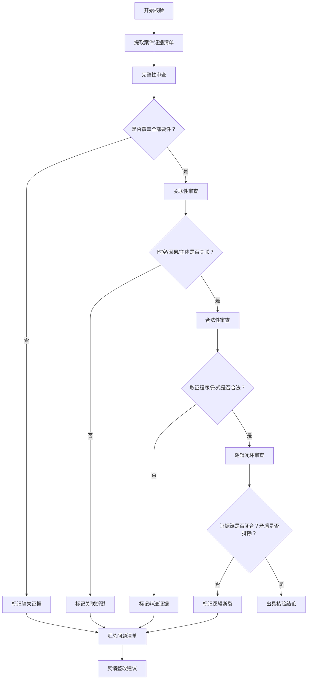

# 证据链闭环核验

## 概念定义

**证据链闭环核验** 是指在生态环境执法案卷评查中，对案件所收集的全部证据进行系统性审查，判断其是否形成从违法事实发生、调查取证、认定结论到处罚决定的**逻辑闭环**。核验的核心在于：证据之间是否存在断裂、矛盾或依赖单一证据定案的情形，以及是否达到“排除合理怀疑”的证明标准。

## 核验维度

### 1. 完整性核验
- **要素覆盖**：检查证据是否覆盖违法行为的全部构成要件（主体、行为、后果、因果关系、主观状态等）。
- **环节覆盖**：从线索来源、现场检查、采样监测、询问笔录、责令改正、处罚告知到决定送达，每个环节是否有对应证据支撑。
- **补强规则**：对于关键事实（如超标排放、非法处置危废），是否存在至少两份相互印证的证据（如监测报告+现场照片+当事人承认）。

### 2. 关联性核验
- **时空关联**：证据所指向的时间、地点是否与案发事实一致。例如：采样时间与排污时间是否匹配；监测点位是否与排污口对应。
- **因果关联**：证据能否证明违法行为与危害后果之间的因果关系。例如：超标排放与水体污染之间的关联性是否通过扩散模型或上下游监测数据佐证。
- **主体关联**：证据能否锁定违法主体。例如：现场检查记录中的当事人签名、营业执照复印件、授权委托书是否一致。

### 3. 合法性核验
- **取证程序**：检查证据收集是否符合法定程序（如双人执法、出示证件、告知权利、采样规范、监测资质）。
- **证据形式**：检查证据是否符合法定形式（如笔录是否签名、监测报告是否加盖CMA章、电子数据是否提取固定）。
- **排除规则**：是否存在非法证据（如未告知陈述申辩权取得的当事人陈述、未依法送达的文书）需要排除。

### 4. 逻辑闭环核验
- **证据链闭合**：从违法线索到最终处罚决定，证据之间是否形成无断裂的链条。例如：线索→现场检查→采样→监测报告→超标认定→当事人承认→处罚决定，每个环节均有证据衔接。
- **矛盾排除**：是否存在相互矛盾的证据（如当事人陈述与监测数据冲突），是否已通过补充调查或合理解释排除矛盾。
- **合理怀疑排除**：是否存在其他合理可能性（如设备故障、自然因素导致超标），证据是否足以排除这些可能性。

## 常见问题与扣分点

| 问题类型 | 具体表现 | 扣分参考（《案卷评查细则》） |
|----------|----------|-----------------------------|
| 证据断裂 | 缺少关键环节证据（如未附采样记录、监测报告缺失） | 2-5分 |
| 证据矛盾 | 当事人陈述与监测数据不一致，未作说明 | 3-6分 |
| 证据单一 | 仅凭当事人承认定案，无其他证据印证 | 5-8分 |
| 程序违法 | 采样未按规范、监测机构无资质 | 5-10分 |
| 逻辑跳跃 | 从超标直接认定“故意违法”，无主观证据 | 3-5分 |

## 核验流程（推荐）

## 典型案例

### 案例1：证据断裂——缺少采样记录
- **案情**：某企业涉嫌超标排放废水，案卷中有监测报告显示超标，但无现场采样记录、无采样照片、无样品流转记录。
- **核验结论**：证据链断裂，监测报告无法与现场采样行为对应，不能作为定案依据

## 相关概念
- [[证据链闭环]]
- [[合法性评查零分项]]

## 相关引用
- [[index]]
