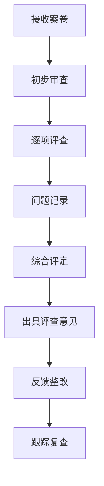

# 评查实务要点

> 本文系统梳理生态环境执法案卷评查的核心实务要点，涵盖评查原则、评查方法、常见问题及典型案例，为评查人员提供操作指引。

---

## 一、评查基本原则

### 1.1 依法评查原则
- 评查依据：《生态环境行政执法案卷评查细则（2024年版）》为核心标准
- 法律依据：《行政处罚法》《行政强制法》《生态环境行政处罚办法》等
- 评查标准：程序合法性、事实认定准确性、法律适用正确性、文书规范性

### 1.2 全面评查原则
- 全流程覆盖：立案→调查取证→告知→听证→决定→送达→执行→结案
- 全要素审查：主体、事实、证据、程序、法律适用、文书格式
- 全案卷审查：正卷、副卷、内部审批文书、外部送达文书

### 1.3 客观公正原则
- 统一标准：同一评查事项适用同一评查标准
- 独立判断：不受外部因素干扰，依据事实和法律作出判断
- 可追溯性：评查意见应注明依据条款和案卷页码

### 1.4 问题导向原则
- 聚焦突出问题：程序违法、证据不足、法律适用错误等
- 注重整改落实：评查结果应反馈并督促整改
- 推动制度完善：通过评查发现制度漏洞，提出完善建议

---

## 二、评查方法体系

### 2.1 案卷评查基本方法

| 方法 | 适用场景 | 操作要点 |
|------|----------|----------|
| 逐项对照法 | 基础评查 | 对照评查标准逐项核查，适用于初次评查 |
| 流程回溯法 | 程序评查 | 按执法流程回溯检查，适用于程序合法性审查 |
| 要素分析法 | 实体评查 | 分解案件要素（主体、事实、证据、法律适用）逐一分析 |
| 比较评查法 | 同类案件 | 对比同类案件处理结果，发现裁量偏差 |
| 专家会诊法 | 疑难案件 | 组织多名专家共同评查，适用于重大复杂案件 |

### 2.2 评查流程

### 2.3 评查重点领域

#### 2.3.1 立案环节
- **立案条件**：是否有明确违法线索、是否属于本机关管辖、是否在追诉时效内
- **立案程序**：是否经负责人批准、立案审批表是否规范、立案时间是否合规
- **常见问题**：立案前调查取证不规范、立案条件把握不严、立案审批程序缺失

#### 2.3.2 调查取证环节
- **证据合法性**：取证主体是否适格、取证程序是否合法、证据形式是否规范
- **证据充分性**：是否形成完整证据链、是否排除合理怀疑、是否达到证明标准
- **证据关联性**：证据与待证事实之间是否存在逻辑关联
- **常见问题**：证据链断裂、取证程序违法、证据形式不规范

#### 2.3.3 告知与听证环节
- **告知义务**：是否依法告知当事人陈述申辩权、听证权
- **告知内容**：告知书是否载明违法事实、法律依据、拟处罚内容
- **告知时限**：是否在法定期限内告知（一般不少于3日，听证不少于7日）
- **听证程序**：听证是否依法组织、听证笔录是否规范、听证报告是否完整
- **常见问题**：告知程序缺失、听证权利未保障、告知内容不完整

#### 2.3.4 处罚决定环节
- **决定主体**：是否经集体讨论、是否经负责人批准、是否超越权限
- **法律适用**：适用法律是否正确、引用条款是否准确、是否适用从轻减轻情形
- **裁量基准**：是否适用裁量基准、裁量理由是否充分、处罚幅度是否适当
- **决定内容**：处罚决定书是否载明法定事项、是否告知救济途径
- **常见问题**：法律适用错误、裁量不当、决定书内容缺失

#### 2.3.5 送达与执行环节
- **送达程序**：送达方式是否合法、送达回证是否规范

## 相关概念
- [[证据链闭环]]
- [[合法性评查零分项]]

## 相关引用
- [[index]]
