## 中国生态环境管理行政区划体系总目录

本文档汇总了中国34个省级行政区的生态环境管理行政区划体系，涵盖省、自治区、直辖市和特别行政区。

## 一、省级行政区概览

中国共有34个省级行政区，包括：
- **23个省**
- **5个自治区**
- **4个直辖市**
- **2个特别行政区**

---

## 二、按区域督察局分类

### 华北督察局（驻北京）

| 省级行政区 | 行政区划代码 | 类型 |
|-----------|------------|------|
| [[北京/index\|北京]] | 110000 | 直辖市 |
| [[天津/index\|天津]] | 120000 | 直辖市 |
| [[河北/index\|河北]] | 130000 | 省 |
| [[山西/index\|山西]] | 140000 | 省 |
| [[内蒙古/index\|内蒙古]] | 150000 | 自治区 |

### 华东督察局（驻上海）

| 省级行政区 | 行政区划代码 | 类型 |
|-----------|------------|------|
| [[上海/index\|上海]] | 310000 | 直辖市 |
| [[江苏/index\|江苏]] | 320000 | 省 |
| [[浙江/index\|浙江]] | 330000 | 省 |
| [[安徽/index\|安徽]] | 340000 | 省 |
| [[福建/index\|福建]] | 350000 | 省 |
| [[江西/index\|江西]] | 360000 | 省 |
| [[山东/index\|山东]] | 370000 | 省 |
| [[台湾/index\|台湾]] | 710000 | 省 |

### 华南督察局（驻广州）

| 省级行政区 | 行政区划代码 | 类型 |
|-----------|------------|------|
| [[河南/index\|河南]] | 410000 | 省 |
| [[湖北/index\|湖北]] | 420000 | 省 |
| [[湖南/index\|湖南]] | 430000 | 省 |
| [[广东/index\|广东]] | 440000 | 省 |
| [[广西/index\|广西]] | 450000 | 自治区 |
| [[海南/index\|海南]] | 460000 | 省 |
| [[香港/index\|香港]] | 810000 | 特别行政区 |
| [[澳门/index\|澳门]] | 820000 | 特别行政区 |

### 西南督察局（驻重庆）

| 省级行政区 | 行政区划代码 | 类型 |
|-----------|------------|------|
| [[重庆/index\|重庆]] | 500000 | 直辖市 |
| [[四川/index\|四川]] | 510000 | 省 |
| [[贵州/index\|贵州]] | 520000 | 省 |
| [[云南/index\|云南]] | 530000 | 省 |
| [[西藏/index\|西藏]] | 540000 | 自治区 |

### 东北督察局（驻沈阳）

| 省级行政区 | 行政区划代码 | 类型 |
|-----------|------------|------|
| [[辽宁/index\|辽宁]] | 210000 | 省 |
| [[吉林/index\|吉林]] | 220000 | 省 |
| [[黑龙江/index\|黑龙江]] | 230000 | 省 |

### 西北督察局（驻西安）

| 省级行政区 | 行政区划代码 | 类型 |
|-----------|------------|------|
| [[陕西/index\|陕西]] | 610000 | 省 |
| [[甘肃/index\|甘肃]] | 620000 | 省 |
| [[青海/index\|青海]] | 630000 | 省 |
| [[宁夏/index\|宁夏]] | 640000 | 自治区 |
| [[新疆/index\|新疆]] | 650000 | 自治区 |

---

## 三、按行政区类型分类

### 省（23个）

1. [[河北/index\|河北]]
2. [[山西/index\|山西]]
3. [[辽宁/index\|辽宁]]
4. [[吉林/index\|吉林]]
5. [[黑龙江/index\|黑龙江]]
6. [[江苏/index\|江苏]]
7. [[浙江/index\|浙江]]
8. [[安徽/index\|安徽]]
9. [[福建/index\|福建]]
10. [[江西/index\|江西]]
11. [[山东/index\|山东]]
12. [[河南/index\|河南]]
13. [[湖北/index\|湖北]]
14. [[湖南/index\|湖南]]
15. [[广东/index\|广东]]
16. [[海南/index\|海南]]
17. [[四川/index\|四川]]
18. [[贵州/index\|贵州]]
19. [[云南/index\|云南]]
20. [[陕西/index\|陕西]]
21. [[甘肃/index\|甘肃]]
22. [[青海/index\|青海]]
23. [[台湾/index\|台湾]]

### 自治区（5个）

1. [[内蒙古/index\|内蒙古]]
2. [[广西/index\|广西]]
3. [[西藏/index\|西藏]]
4. [[宁夏/index\|宁夏]]
5. [[新疆/index\|新疆]]

### 直辖市（4个）

1. [[北京/index\|北京]]
2. [[天津/index\|天津]]
3. [[上海/index\|上海]]
4. [[重庆/index\|重庆]]

### 特别行政区（2个）

1. [[香港/index\|香港]]
2. [[澳门/index\|澳门]]

---

## 四、生态环境部区域督察局体系图

```mermaid
graph TD
    MEE[生态环境部] --> HB[华北督察局]
    MEE --> HD[华东督察局]
    MEE --> HN[华南督察局]
    MEE --> XN[西南督察局]
    MEE --> DB[东北督察局]
    MEE --> XB[西北督察局]

    HB --> HB1[北京]
    HB --> HB2[天津]
    HB --> HB3[河北]
    HB --> HB4[山西]
    HB --> HB5[内蒙古]

    HD --> HD1[上海]
    HD --> HD2[江苏]
    HD --> HD3[浙江]
    HD --> HD4[安徽]
    HD --> HD5[福建]
    HD --> HD6[江西]
    HD --> HD7[山东]
    HD --> HD8[台湾]

    HN --> HN1[广东]
    HN --> HN2[广西]
    HN --> HN3[海南]
    HN --> HN4[河南]
    HN --> HN5[湖北]
    HN --> HN6[湖南]
    HN --> HN7[香港]
    HN --> HN8[澳门]

    XN --> XN1[重庆]
    XN --> XN2[四川]
    XN --> XN3[贵州]
    XN --> XN4[云南]
    XN --> XN5[西藏]

    DB --> DB1[辽宁]
    DB --> DB2[吉林]
    DB --> DB3[黑龙江]

    XB --> XB1[陕西]
    XB --> XB2[甘肃]
    XB --> XB3[青海]
    XB --> XB4[宁夏]
    XB --> XB5[新疆]
```

---

## 五、相关文件

- [[MEE区域督察局\|生态环境部区域督察局详细信息]]
