## 生态环境管理工具箱

## 概述

生态环境管理工具箱是为生态环境管理人员、执法人员、环评审批人员、监测技术人员等提供的实用性工具集合。本工具箱围绕[[../09-生态环境法典/总目录.md|生态环境法典]]、[[../10-生态环境管理要素/|18个生态环境管理要素]]、[[../11-MEE司局体系/|生态环境部各司局]]以及[[../07-省级行政区/|34个省级行政区]]的管理实践需求，提供可直接使用的工作方法、检查清单、分析模板和操作指南。

本工具箱强调**可操作性**和**实用性**，所有内容均面向实际工作场景设计，帮助管理人员规范工作流程、提升工作效率、降低履职风险。

## 工具清单

| 序号 | 工具名称 | 核心用途 | 适用对象 | 关联管理要素 |
|------|---------|---------|---------|------------|
| 1 | [[工具-法规检索查询.md\|法规检索查询工具]] | 系统化检索和查询生态环境法规 | 全体管理人员 | 02-法规标准, 14-环评与排放管理, 16-生态环境执法 |
| 2 | [[工具-政策文件分析.md\|政策文件分析模板]] | 结构化分析政策文件的内容和影响 | 政策研究人员、管理人员 | 01-综合规划与政策, 全部要素 |
| 3 | [[工具-执法辅助决策.md\|执法决策支持工具]] | 规范执法决策流程，提供检查清单 | 执法人员、督察人员 | 16-生态环境执法, 03-督察 |
| 4 | [[工具-环境监测预警.md\|监测预警工作指南]] | 指导监测网络建设和预警响应 | 监测技术人员 | 15-生态环境监测, 04-水, 06-大气, 08-土壤 |
| 5 | [[工具-环评审查清单.md\|环评审查工作清单]] | 系统化环评文件审查流程 | 环评审批人员 | 14-环境影响评价与排放管理 |
| 6 | [[工具-知识图谱导航.md\|知识关联导航图]] | 可视化展示要素、法规、司局间关系 | 全体管理人员 | 全部18个要素 |
| 7 | [[工具-大模型应用指南.md\|大模型辅助应用指南]] | 指导如何合理将AI作为工作辅助 | 全体管理人员 | 全部18个要素 |

## 工具与管理要素关联图

```mermaid
graph TB
    subgraph 工具箱["生态环境管理工具箱"]
        T1["法规检索查询工具"]
        T2["政策文件分析模板"]
        T3["执法决策支持工具"]
        T4["监测预警工作指南"]
        T5["环评审查工作清单"]
        T6["知识关联导航图"]
        T7["大模型辅助应用指南"]
    end

    subgraph 法规体系["法规体系"]
        CODE["生态环境法典"]
        STD["生态环境标准"]
    end

    subgraph 管理要素["18个管理要素"]
        E01["01-综合规划与政策"]
        E02["02-生态环境分区管控"]
        E03["03-生态环境保护督察"]
        E04["04-生态环境标准"]
        E05["05-应对气候变化"]
        E06["06-自然生态保护"]
        E07["07-水生态环境"]
        E08["08-海洋生态环境"]
        E09["09-大气环境"]
        E10["10-土壤地下水农村"]
        E11["11-固废化学品"]
        E12["12-噪声振动"]
        E13["13-核与辐射"]
        E14["14-环评与排放管理"]
        E15["15-生态环境监测"]
        E16["16-生态环境执法"]
        E17["17-生态环境应急"]
        E18["18-生态环境科技"]
    end

    subgraph 组织架构["组织架构"]
        BUREAUS["MEE各司局"]
        PROVINCES["34省级行政区"]
    end

    T1 --> CODE
    T1 --> STD
    T1 --> E04
    T1 --> E14
    T1 --> E16

    T2 --> E01
    T2 --> E04
    T2 --> E05
    T2 --> E14
    T2 --> E16

    T3 --> E03
    T3 --> E14
    T3 --> E15
    T3 --> E16
    T3 --> E17

    T4 --> E07
    T4 --> E08
    T4 --> E09
    T4 --> E10
    T4 --> E15

    T5 --> E02
    T5 --> E04
    T5 --> E14

    T6 --> E01
    T6 --> E02
    T6 --> E03
    T6 --> E04
    T6 --> E05
    T6 --> E06
    T6 --> E07
    T6 --> E08
    T6 --> E09
    T6 --> E10
    T6 --> E11
    T6 --> E12
    T6 --> E13
    T6 --> E14
    T6 --> E15
    T6 --> E16
    T6 --> E17
    T6 --> E18

    T7 --> E01
    T7 --> E02
    T7 --> E03
    T7 --> E04
    T7 --> E05
    T7 --> E06
    T7 --> E07
    T7 --> E08
    T7 --> E09
    T7 --> E10
    T7 --> E11
    T7 --> E12
    T7 --> E13
    T7 --> E14
    T7 --> E15
    T7 --> E16
    T7 --> E17
    T7 --> E18

    BUREAUS --> E01
    BUREAUS --> E02
    BUREAUS --> E03
    BUREAUS --> E04
    BUREAUS --> E05
    BUREAUS --> E06
    BUREAUS --> E07
    BUREAUS --> E08
    BUREAUS --> E09
    BUREAUS --> E10
    BUREAUS --> E11
    BUREAUS --> E12
    BUREAUS --> E13
    BUREAUS --> E14
    BUREAUS --> E15
    BUREAUS --> E16
    BUREAUS --> E17
    BUREAUS --> E18

    PROVINCES --> E01
    PROVINCES --> E15
    PROVINCES --> E16
```

## 使用指南

### 如何选择合适的工具

| 工作场景 | 推荐工具 | 使用方式 |
|---------|---------|---------|
| 需要查找某部法规的具体条款 | 法规检索查询工具 | 按要素或关键词检索 |
| 收到新的政策文件需要解读 | 政策文件分析模板 | 套用分析框架逐项填写 |
| 准备开展现场执法检查 | 执法决策支持工具 | 使用检查清单逐项核查 |
| 发现监测数据异常 | 监测预警工作指南 | 按预警等级启动响应程序 |
| 收到环评文件需要审查 | 环评审查工作清单 | 按审查要点逐项核对 |
| 需要了解某要素与其他要素的关系 | 知识关联导航图 | 查阅关联矩阵和映射表 |
| 想用AI辅助完成某项工作 | 大模型辅助应用指南 | 参考适用场景和提示词模板 |

### 工具使用原则

1. **规范先行**：工具箱提供的是标准化工作方法，使用时应结合本单位实际细化
2. **记录留痕**：使用检查清单和模板时应做好记录，便于追溯和复盘
3. **持续更新**：法规政策变化时，及时更新工具箱中的引用依据
4. **组合使用**：复杂工作可组合使用多个工具，形成完整工作闭环
5. **人工审核**：工具输出结果需经专业人员审核确认，不可直接作为最终决策依据

## 与管理要素的连接

| 管理要素 | 适用工具 | 典型应用场景 |
|---------|---------|------------|
| [[../10-生态环境管理要素/01/index.md\|综合规划与政策]] | 政策文件分析模板、知识关联导航图 | 政策解读、规划评估 |
| [[../10-生态环境管理要素/02/index.md\|生态环境分区管控]] | 法规检索查询工具、环评审查工作清单 | 准入判断、分区查询 |
| [[../10-生态环境管理要素/03/index.md\|生态环境保护督察]] | 执法决策支持工具 | 督察问题整改核查 |
| [[../10-生态环境管理要素/04/index.md\|生态环境标准]] | 法规检索查询工具 | 标准检索、适用判断 |
| [[../10-生态环境管理要素/05/index.md\|应对气候变化]] | 政策文件分析模板 | 碳达峰政策分析 |
| [[../10-生态环境管理要素/06/index.md\|自然生态保护与生物多样性]] | 监测预警工作指南 | 生态监测预警 |
| [[../10-生态环境管理要素/07/index.md\|水生态环境]] | 监测预警工作指南、法规检索查询工具 | 水质预警、水法规查询 |
| [[../10-生态环境管理要素/08/index.md\|海洋生态环境]] | 监测预警工作指南 | 海洋监测预警 |
| [[../10-生态环境管理要素/09/index.md\|大气环境]] | 监测预警工作指南、法规检索查询工具 | 空气质量预警、大气法规查询 |
| [[../10-生态环境管理要素/10/index.md\|土壤、地下水与农村生态环境]] | 监测预警工作指南、环评审查工作清单 | 土壤监测、农环评审查 |
| [[../10-生态环境管理要素/11/index.md\|固体废物与化学品]] | 法规检索查询工具、执法决策支持工具 | 危废法规查询、执法 checklist |
| [[../10-生态环境管理要素/12/index.md\|噪声与振动]] | 法规检索查询工具、环评审查工作清单 | 噪声法规查询、噪声环评审查 |
| [[../10-生态环境管理要素/13/index.md\|核与辐射安全]] | 法规检索查询工具、监测预警工作指南 | 核安全法规、辐射监测预警 |
| [[../10-生态环境管理要素/14/index.md\|环境影响评价与排放管理]] | 环评审查工作清单、法规检索查询工具 | 环评审批、排污许可法规查询 |
| [[../10-生态环境管理要素/15/index.md\|生态环境监测]] | 监测预警工作指南 | 监测网络建设、预警响应 |
| [[../10-生态环境管理要素/16/index.md\|生态环境执法]] | 执法决策支持工具、法规检索查询工具 | 执法 checklist、法规依据查询 |
| [[../10-生态环境管理要素/17/index.md\|生态环境应急]] | 执法决策支持工具、监测预警工作指南 | 应急响应、应急监测 |
| [[../10-生态环境管理要素/18/index.md\|生态环境科技]] | 政策文件分析模板、知识关联导航图 | 科技政策分析、技术路线导航 |

## 与省级行政区的连接

工具箱为[[../07-省级行政区/|34个省级行政区]]提供统一的工作方法框架，同时预留地方适配空间：

- **地方标准补充**：各省可在工具基础上补充地方标准和技术规范
- **地方政策适配**：政策分析模板可纳入地方性政策文件
- **区域特色调整**：监测预警指南可结合区域环境特征调整阈值
- **跨省协同支持**：知识关联导航图支持跨省管理要素关联分析

## 与MEE司局的连接

| 司局 | 主要适用工具 | 典型应用 |
|-----|------------|---------|
| 综合司 | 政策文件分析模板 | 综合性政策文件分析 |
| 法规与标准司 | 法规检索查询工具 | 法规体系梳理、标准检索 |
| 自然生态保护司 | 监测预警工作指南 | 生态保护监测预警 |
| 水生态环境司 | 监测预警工作指南、法规检索查询工具 | 水质预警、水法规查询 |
| 海洋生态环境司 | 监测预警工作指南 | 海洋监测预警 |
| 大气环境司 | 监测预警工作指南 | 空气质量预警预报 |
| 土壤生态环境司 | 监测预警工作指南、环评审查工作清单 | 土壤监测、土壤环评审查 |
| 固体废物与化学品司 | 法规检索查询工具、执法决策支持工具 | 危废法规查询、执法 checklist |
| 核设施安全监管司 | 法规检索查询工具、监测预警工作指南 | 核安全法规、辐射监测 |
| 环境影响评价与排放管理司 | 环评审查工作清单 | 环评审批工作 |
| 生态环境监测司 | 监测预警工作指南 | 监测网络管理、预警响应 |
| 生态环境执法局 | 执法决策支持工具、法规检索查询工具 | 执法工作规范化 |
| 生态环境应急与事故调查中心 | 执法决策支持工具、监测预警工作指南 | 应急执法、应急监测 |

## 相关链接

- [[../09-生态环境法典/总目录.md|生态环境法典]]
- [[../10-生态环境管理要素/|生态环境管理要素]]
- [[../11-MEE司局体系/|MEE司局体系]]
- [[../07-省级行政区/|省级行政区]]
- [[../08-MEE政策文件库-修复版/|MEE政策文件库]]
- [[工具-法规检索查询.md|法规检索查询工具]]
- [[工具-政策文件分析.md|政策文件分析模板]]
- [[工具-执法辅助决策.md|执法决策支持工具]]
- [[工具-环境监测预警.md|监测预警工作指南]]
- [[工具-环评审查清单.md|环评审查工作清单]]
- [[工具-知识图谱导航.md|知识关联导航图]]
- [[工具-大模型应用指南.md|大模型辅助应用指南]]
