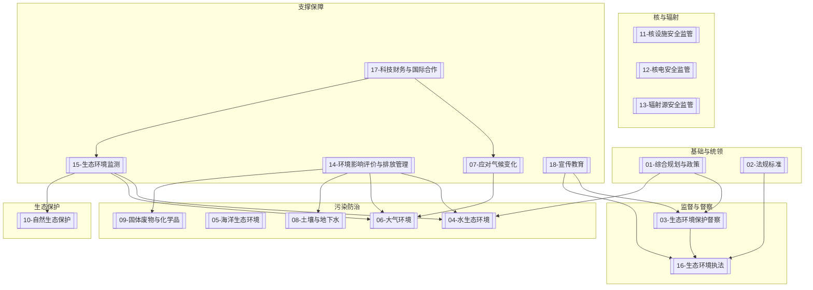

## 生态环境管理要素总目录

本知识库基于**生态环境部（MEE）组织架构**与**《生态环境法典》**结构，系统构建18个生态环境管理要素，覆盖生态环境保护工作的主要领域。

## 总体架构

---

## 18个管理要素一览

### 一、基础与统领要素

| 编号 | 要素名称 | 对应MEE司局 | 相关法典编章 |
|:---:|:---|:---|:---|
| 01 | [[01/index\|综合规划与政策]] | 综合司 | [[第一编-总则]] |
| 02 | [[02/index\|法规标准]] | 法规与标准司 | [[第一编-总则]] |

### 二、监督与督察要素

| 编号 | 要素名称 | 对应MEE司局 | 相关法典编章 |
|:---:|:---|:---|:---|
| 03 | [[03/index\|生态环境保护督察]] | 中央生态环境保护督察协调局 | [[第一编-总则]] |
| 16 | [[16/index\|生态环境执法]] | 生态环境执法局 | [[第五编-生态环境责任]] |

### 三、污染防治要素

| 编号 | 要素名称 | 对应MEE司局 | 相关法典编章 |
|:---:|:---|:---|:---|
| 04 | [[04/index\|水生态环境]] | 水生态环境司 | [[第二编-污染防治]] |
| 05 | [[05/index\|海洋生态环境]] | 海洋生态环境司 | [[第二编-污染防治]] |
| 06 | [[06/index\|大气环境]] | 大气环境司 | [[第二编-污染防治]] |
| 08 | [[08/index\|土壤与地下水]] | 土壤生态环境司 | [[第二编-污染防治]] |
| 09 | [[09/index\|固体废物与化学品]] | 固体废物与化学品司 | [[第二编-污染防治]] |

### 四、生态保护要素

| 编号 | 要素名称 | 对应MEE司局 | 相关法典编章 |
|:---:|:---|:---|:---|
| 10 | [[10/index\|自然生态保护]] | 自然生态保护司 | [[第三编-生态保护]] |

### 五、核与辐射安全要素

| 编号 | 要素名称 | 对应MEE司局 | 相关法典编章 |
|:---:|:---|:---|:---|
| 11 | [[11/index\|核设施安全监管]] | 核设施安全监管司 | [[第五编-生态环境责任]] |
| 12 | [[12/index\|核电安全监管]] | 核电安全监管司 | [[第五编-生态环境责任]] |
| 13 | [[13/index\|辐射源安全监管]] | 辐射源安全监管司 | [[第五编-生态环境责任]] |

### 六、支撑保障要素

| 编号 | 要素名称 | 对应MEE司局 | 相关法典编章 |
|:---:|:---|:---|:---|
| 07 | [[07/index\|应对气候变化]] | 应对气候变化司 | [[第四编-绿色低碳发展]] |
| 14 | [[14/index\|环境影响评价与排放管理]] | 环境影响评价与排放管理司 | [[第一编-总则]] |
| 15 | [[15/index\|生态环境监测]] | 生态环境监测司 | [[第一编-总则]] |
| 17 | [[17/index\|科技财务与国际合作]] | 科技与财务司+国际合作司 | [[第一编-总则]] |
| 18 | [[18/index\|宣传教育]] | 宣传教育司 | [[第一编-总则]] |

---

## 各要素子目录结构

每个管理要素目录下均包含以下5个子目录：

- **法律法规** - 相关法律法规文件
- **政策文件** - 国家及地方政策文件
- **标准规范** - 环境质量与排放标准
- **技术指南** - 技术方法与操作指南
- **典型案例** - 典型案例与经验总结

---

## 法典编章对应关系

| 法典编章 | 对应管理要素 |
|:---|:---|
| [[第一编-总则]] | 01、02、03、14、15、17、18 |
| [[第二编-污染防治]] | 04、05、06、08、09 |
| [[第三编-生态保护]] | 10 |
| [[第四编-绿色低碳发展]] | 07、17 |
| [[第五编-生态环境责任]] | 11、12、13、16、18 |

---

## 使用说明

1. 点击各要素名称可进入对应要素的详细页面
2. 各要素页面包含要素概述、主要职责、相关政策文件、关系图谱及子目录说明
3. 使用Obsidian wikilink语法 `[[ ]]` 实现要素间相互链接
4. 建议配合生态环境法典各编章内容同步学习

---

*本知识库基于生态环境部现行组织架构及《生态环境法典（草案）》结构编制，仅供参考学习使用。*
