## 生态环境部区域督察局

生态环境部设立6个区域督察局，代表生态环境部对地方政府及相关部门履行生态环境保护职责情况进行督察。

## 一、华北督察局

- **督察区域**: 北京、天津、河北、山西、内蒙古
- **驻地**: 北京市
- **主要职责**:
  - 监督地方政府执行国家生态环境法律法规和政策
  - 开展中央生态环境保护督察相关工作
  - 调查处理重大生态环境问题
  - 协调解决跨区域生态环境纠纷

## 二、华东督察局

- **督察区域**: 上海、江苏、浙江、安徽、福建、江西、山东、台湾
- **驻地**: 上海市
- **主要职责**:
  - 监督地方政府执行国家生态环境法律法规和政策
  - 开展中央生态环境保护督察相关工作
  - 调查处理重大生态环境问题
  - 协调解决跨区域生态环境纠纷

## 三、华南督察局

- **督察区域**: 广东、广西、海南、河南、湖北、湖南、香港、澳门
- **驻地**: 广东省广州市
- **主要职责**:
  - 监督地方政府执行国家生态环境法律法规和政策
  - 开展中央生态环境保护督察相关工作
  - 调查处理重大生态环境问题
  - 协调解决跨区域生态环境纠纷

## 四、西南督察局

- **督察区域**: 重庆、四川、贵州、云南、西藏
- **驻地**: 重庆市
- **主要职责**:
  - 监督地方政府执行国家生态环境法律法规和政策
  - 开展中央生态环境保护督察相关工作
  - 调查处理重大生态环境问题
  - 协调解决跨区域生态环境纠纷

## 五、东北督察局

- **督察区域**: 辽宁、吉林、黑龙江
- **驻地**: 辽宁省沈阳市
- **主要职责**:
  - 监督地方政府执行国家生态环境法律法规和政策
  - 开展中央生态环境保护督察相关工作
  - 调查处理重大生态环境问题
  - 协调解决跨区域生态环境纠纷

## 六、西北督察局

- **督察区域**: 陕西、甘肃、青海、宁夏、新疆
- **驻地**: 陕西省西安市
- **主要职责**:
  - 监督地方政府执行国家生态环境法律法规和政策
  - 开展中央生态环境保护督察相关工作
  - 调查处理重大生态环境问题
  - 协调解决跨区域生态环境纠纷

## 区域督察局分布图

```mermaid
graph TD
    MEE[生态环境部] --> HB[华北督察局
北京]
    MEE --> HD[华东督察局
上海]
    MEE --> HN[华南督察局
广州]
    MEE --> XN[西南督察局
重庆]
    MEE --> DB[东北督察局
沈阳]
    MEE --> XB[西北督察局
西安]

    HB --> BJ[北京]
    HB --> TJ[天津]
    HB --> HE[河北]
    HB --> SX[山西]
    HB --> NM[内蒙古]

    HD --> SH[上海]
    HD --> JS[江苏]
    HD --> ZJ[浙江]
    HD --> AH[安徽]
    HD --> FJ[福建]
    HD --> JX[江西]
    HD --> SD[山东]
    HD --> TW[台湾]

    HN --> GD[广东]
    HN --> GX[广西]
    HN --> HI[海南]
    HN --> HA[河南]
    HN --> HB2[湖北]
    HN --> HN2[湖南]
    HN --> HK[香港]
    HN --> MO[澳门]

    XN --> CQ[重庆]
    XN --> SC[四川]
    XN --> GZ[贵州]
    XN --> YN[云南]
    XN --> XZ[西藏]

    DB --> LN[辽宁]
    DB --> JL[吉林]
    DB --> HL[黑龙江]

    XB --> SN[陕西]
    XB --> GS[甘肃]
    XB --> QH[青海]
    XB --> NX[宁夏]
    XB --> XJ[新疆]
```

