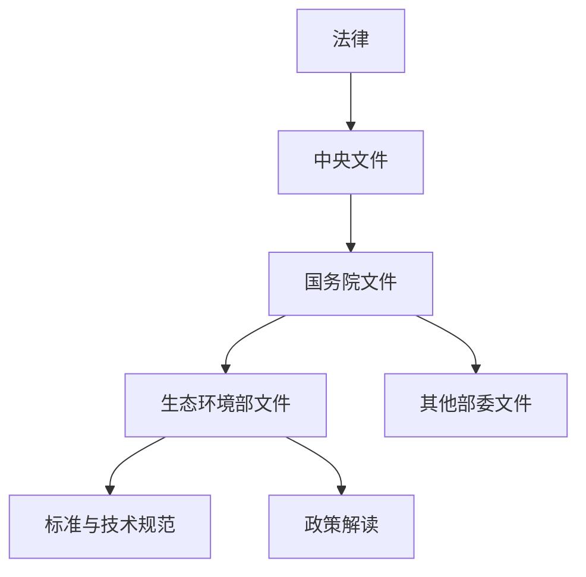

## 📜 生态环境政策文件库

> 来源：生态环境部 (mee.gov.cn) | 1987—2026
> 层级：法律 → 中央文件 → 国务院文件 → 部委文件 → 标准规范

---

## 🏛️ 文件层级



---

## 📊 文件总览

```dataview
TABLE 
  length(rows) AS "文件数"
FROM "08-MEE政策文件库"
WHERE file.name != "📜MEE政策文件库-总索引"
FLATTEN file.folder AS 分类
GROUP BY 分类
SORT 分类 ASC
```

---

## 📂 层级浏览

### ⚖️ 法律
```dataview
LIST
FROM "08-MEE政策文件库/法律"
SORT file.name DESC
```

### 📋 中央文件
> 中共中央 / 中共中央办公厅 / 国务院办公厅

```dataview
LIST
FROM "08-MEE政策文件库/中央文件"
SORT file.name DESC
LIMIT 15
```

### 🏛️ 国务院文件
> 国务院 / 国务院办公厅

```dataview
LIST
FROM "08-MEE政策文件库/国务院文件"
SORT file.name DESC
LIMIT 15
```

### 🌿 生态环境部文件

```dataview
LIST
FROM "08-MEE政策文件库/生态环境部文件"
SORT file.name DESC
LIMIT 30
```

### 📏 标准与技术规范
> 国家生态环境标准 / 技术导则 / 监测规范 / 排放标准

```dataview
LIST
FROM "08-MEE政策文件库/标准与技术规范"
SORT file.name DESC
LIMIT 20
```

### 💡 政策解读
> 一图读懂 / 答记者问 / 政策吹风会

```dataview
LIST
FROM "08-MEE政策文件库/政策解读"
SORT file.name DESC
LIMIT 15
```

---

## 🔗 关联图谱

```dataview
TABLE 
  file.tags AS "标签",
  file.mtime AS "更新时间"
FROM "08-MEE政策文件库"
WHERE file.name != "📜MEE政策文件库-总索引"
SORT file.mtime DESC
LIMIT 50
```

---

## 📥 待入库

```dataview
LIST
FROM "00-Inbox"
WHERE contains(tags, "MEE") OR contains(tags, "政策文件")
SORT file.ctime DESC
```

---

*数据来源: https://www.mee.gov.cn/wjk/
*采集方式: govsearch API (v3) + Stype多路径采集 (v4) + 旧版手动分页列表页采集 (旧版) · 全量年份 1987-2026
*本次更新: 2026-06-11 | 总采集URL: 6131 | 知识库文件: 6545篇
