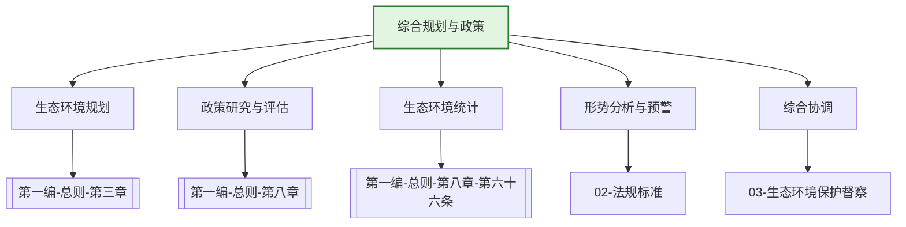

---
ace_review:
  curator: auto
  generator: auto
  reflector: auto
category: 技术规范
confidence: medium
created: '2026-07-23'
source_path: ''
source_type: regulatory
status: draft
subcategory: ''
tags:
- 管理要素
- 综合规划
- 政策
- 统计
title: 01管理要素 - 综合规划与政策
updated: '2026-07-23'
---

# 01 综合规划与政策

## 要素概述

综合规划与政策是生态环境管理的基础性、统领性要素，涵盖生态环境战略规划、政策研究、综合协调、统计调查、形势分析、政务管理等内容。该要素为生态环境保护的各项工作提供顶层设计、宏观指导和统筹协调。

## 主要职责

组织起草生态环境政策、规划，协调和审核生态环境专项规划，组织生态环境统计、污染源普查和生态环境形势分析，承担污染物排放总量控制综合协调和管理工作，拟订生态环境保护年度目标和考核计划。

## 内设机构

综合处、生态环境政策处（生态安全协调处）、规划区划处、统计与形势分析处、计划调度处

## 法典对应条款

- **第一编 总则 第三章 规划和生态环境分区管控**
  - 第28条：国家建立健全生态环境规划体系
  - 第29条：生态环境规划编制要求
  - 第30条：生态环境分区管控
  - 第31条：分区管控方案实施与调整
  - 第32条：生态环境准入清单
- **第一编 总则 第八章 保障措施**
  - 第62条：财政保障
  - 第63条：税收、价格、金融政策
  - 第64条：生态环境产业发展
  - 第65条：生态环境科技创新
  - 第66条：生态环境统计
  - 第67条：生态环境信息化建设
- **第一编 总则 第二章 监督管理 第二节 监督管理制度**
  - 第14条：生态环境保护目标责任制和考核评价制度
  - 第15条：生态环境保护督察制度
  - 第16条：生态环境统计制度

## 相关法典编章

- [[第一编-总则]]（第三章 规划和生态环境分区管控、第八章 保障措施）
- [[第二编-污染防治]]（各要素污染防治规划要求）

## 相关政策文件

- [["十四五"生态环境保护规划]]
- [[关于深入打好污染防治攻坚战的意见]]
- [[生态环境统计管理办法]]

## 关系图谱

## 子目录说明

- [[法律法规]] - 综合规划与政策相关法律法规
- [[政策文件]] - 国家及地方政策文件
- [[标准规范]] - 统计、规划相关标准
- [[技术指南]] - 规划编制、统计调查技术指南
- [[典型案例]] - 规划实施、政策评估典型案例
