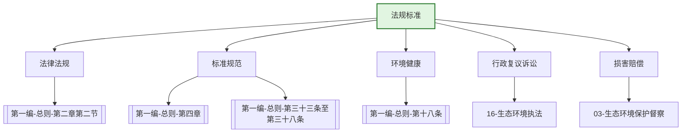

---
ace_review:
  curator: auto
  generator: auto
  reflector: auto
category: 技术规范
confidence: medium
created: '2026-07-24'
source_path: ''
source_type: regulatory
status: draft
subcategory: ''
tags:
- 管理要素
- 法规
- 标准
- 立法
title: 02管理要素 - 法规标准
updated: '2026-07-24'
---

# 02 法规标准

## 要素概述

法规标准是生态环境管理的制度基础和技术准则，涵盖生态环境法律法规起草、合法性审查、标准制修订、基准研究、环境健康管理、行政复议诉讼等内容。该要素为生态环境保护提供法律依据和技术规范。

## 主要职责

起草法律法规草案和规章，承担机关有关规范性文件的合法性审查工作，承担机关行政复议、行政应诉等工作，承担国家生态环境标准、基准和技术规范管理工作。

## 内设机构

综合处、法规处、标准管理处（环境健康处）、损害赔偿指导处（行政复议处）

## 法典对应条款

- **第一编 总则 第四章 标准和监测**
  - 第33条：生态环境标准体系
  - 第34条：国家生态环境质量标准
  - 第35条：国家生态环境风险管控标准
  - 第36条：国家污染物排放标准
  - 第37条：国家生态环境基础标准、监测标准、管理技术规范
  - 第38条：地方生态环境标准
  - 第39条：生态环境标准实施评估
- **第一编 总则 第二章 监督管理 第二节 监督管理制度**
  - 第17条：生态环境基准制度
  - 第18条：环境与健康监测、调查和风险评估制度
- **第一编 总则 第九章 信息公开与公众参与**
  - 第72条：标准制定中的公众参与

## 相关法典编章

- [[第一编-总则]]（第二章第二节 监督管理制度、第四章 标准和监测）
- [[生态环境法典]]（全部编章均涉及标准适用）

## 相关政策文件

- [[国家生态环境标准管理办法]]
- [[生态环境标准制修订工作管理办法]]
- [[生态环境损害赔偿制度改革方案]]

## 关系图谱

## 子目录说明

- [[法律法规]] - 生态环境法律法规体系
- [[政策文件]] - 法规标准管理政策
- [[标准规范]] - 国家及行业标准清单
- [[技术指南]] - 标准制修订技术指南
- [[典型案例]] - 环境损害赔偿、复议诉讼典型案例
