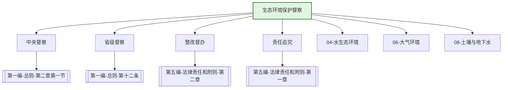

---
ace_review:
  curator: auto
  generator: auto
  reflector: auto
category: 技术规范
confidence: medium
created: '2026-07-22'
source_path: ''
source_type: regulatory
status: draft
subcategory: ''
tags:
- 管理要素
- 督察
- 中央督察
- 整改
title: 03管理要素 - 生态环境保护督察
updated: '2026-07-22'
---

# 03 生态环境保护督察

## 要素概述

生态环境保护督察是党中央、国务院推进生态文明建设和生态环境保护的重大制度安排，涵盖中央生态环境保护督察的组织实施、协调保障、整改督办、责任追究等内容。该要素是压实生态环境保护责任的关键抓手。

## 主要职责

监督生态环境保护党政同责、一岗双责落实情况，拟订生态环境保护督察制度、工作计划、实施方案并组织实施，承担中央生态环境保护督察组织协调工作。承担中央生态环境保护督察工作领导小组办公室具体事务。

## 内设机构

综合处、督察一处、督察二处、督察三处

## 法典对应条款

- **第一编 总则 第二章 监督管理 第一节 监督管理体制**
  - 第10条：生态环境保护督察制度
  - 第11条：中央生态环境保护督察
  - 第12条：省级生态环境保护督察
  - 第13条：督察结果运用与整改
- **第五编 法律责任和附则 第二章 法律责任分则**
  - 第XXX条：督察整改不力的法律责任
  - 第XXX条：拒绝、阻碍督察的法律责任
- **第五编 法律责任和附则 第一章 法律责任通则**
  - 第XXX条：行政处分
  - 第XXX条：刑事责任

## 相关法典编章

- [[第一编-总则]]（第二章第一节 监督管理体制）
- [[第五编-法律责任和附则]]（第二章 法律责任分则）

## 相关政策文件

- [[中央生态环境保护督察工作规定]]
- [[中央生态环境保护督察整改工作办法]]
- [[生态环境保护督察纪律规定]]

## 关系图谱

## 子目录说明

- [[法律法规]] - 督察相关法律法规
- [[政策文件]] - 督察工作规定及方案
- [[标准规范]] - 督察工作标准
- [[技术指南]] - 督察技术方法与指南
- [[典型案例]] - 督察整改典型案例
