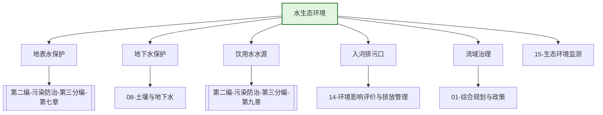

---
ace_review:
  curator: auto
  generator: auto
  reflector: auto
category: 技术规范
confidence: medium
created: '2026-07-23'
source_path: ''
source_type: regulatory
status: draft
subcategory: ''
tags:
- 管理要素
- 水环境
- 水生态
- 流域治理
title: 04管理要素 - 水生态环境
updated: '2026-07-23'
---

# 04 水生态环境

## 要素概述

水生态环境管理是污染防治攻坚战的核心领域，涵盖地表水、地下水生态环境保护监督管理，饮用水水源地保护，流域水生态环境保护，入河排污口设置管理等内容。该要素以实现水生态环境质量持续改善为目标。

## 主要职责

负责全国地表水生态环境监管工作，拟订和监督实施国家重点流域生态环境规划，建立和组织实施跨省（国）界水体断面水质考核制度，监督管理饮用水水源地生态环境保护工作，指导入河排污口设置。

## 内设机构

综合处、重点流域生态环境监督管理一处、重点流域生态环境监督管理二处、重点流域生态环境监督管理三处、饮用水水源与重大工程水质保障处

## 法典对应条款

- **第二编 污染防治 第三分编 水污染防治（第七章至第十章）**
  - 第七章 一般规定
    - 第XXX条：水污染防治基本要求
    - 第XXX条：水环境质量标准和水污染物排放标准
    - 第XXX条：水污染物排放总量控制
  - 第八章 水污染防治措施
    - 第XXX条：工业水污染防治
    - 第XXX条：城镇水污染防治
    - 第XXX条：农业和农村水污染防治
    - 第XXX条：船舶水污染防治
  - 第九章 饮用水水源保护
    - 第XXX条：饮用水水源保护区划定
    - 第XXX条：饮用水水源保护措施
  - 第十章 水污染事故处置
    - 第XXX条：水污染事故应急

## 相关法典编章

- [[第二编-污染防治]]（第三分编 水污染防治 第七章至第十章）
- [[第一编-总则]]（第四章 标准和监测、第五章 生态环境影响评价）

## 相关政策文件

- [[水污染防治行动计划]]
- [[重点流域水生态环境保护规划]]
- [[饮用水水源保护区划分技术规范]]
- [[入河入海排污口监督管理技术指南]]

## 关系图谱

## 子目录说明

- [[法律法规]] - 水污染防治相关法律法规
- [[政策文件]] - 水生态环境政策文件
- [[标准规范]] - 水质标准、排放标准
- [[技术指南]] - 水环境治理技术指南
- [[典型案例]] - 水生态环境治理典型案例
