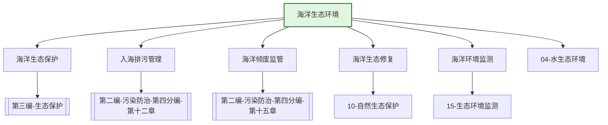

---
ace_review:
  curator: auto
  generator: auto
  reflector: auto
category: 技术规范
confidence: medium
created: '2026-07-22'
source_path: ''
source_type: regulatory
status: draft
subcategory: ''
tags:
- 管理要素
- 海洋环境
- 海洋生态
- 入海排污
title: 05管理要素 - 海洋生态环境
updated: '2026-07-22'
---

# 05 海洋生态环境

## 要素概述

海洋生态环境管理是保护海洋生态系统健康、维护海洋环境安全的重要领域，涵盖海洋生态环境监管、海洋生态保护修复、入海排污口管理、海洋倾废监管、海洋突发环境事件应急等内容。

## 主要职责

负责全国海洋生态环境监管工作，监督陆源污染物排海，负责防治海岸和海洋工程建设项目、海洋油气勘探开发和废弃物海洋倾倒对海洋污染损害的生态环境保护工作，组织划定海洋倾倒区。

## 内设机构

综合处、海洋生态保护与环境质量管理处、海域综合治理监督协调处、海洋污染防治监管一处、海洋污染防治监管二处

## 法典对应条款

- **第二编 污染防治 第四分编 海洋污染防治（第十一章至第十五章）**
  - 第十一章 一般规定
    - 第XXX条：海洋污染防治基本要求
    - 第XXX条：海洋环境质量标准
    - 第XXX条：海洋排污总量控制
  - 第十二章 陆源污染物污染防治
    - 第XXX条：入海排污口管理
    - 第XXX条：陆源污染物排放管控
  - 第十三章 海洋工程与海岸工程污染防治
    - 第XXX条：海洋工程环评与排污许可
    - 第XXX条：海岸工程污染防治
  - 第十四章 船舶及有关作业污染防治
    - 第XXX条：船舶污染物排放
    - 第XXX条：港口污染防治
  - 第十五章 海洋倾废与污染事故处置
    - 第XXX条：海洋倾废许可管理
    - 第XXX条：海洋污染事故应急

## 相关法典编章

- [[第二编-污染防治]]（第四分编 海洋污染防治 第十一章至第十五章）
- [[第三编-生态保护]]（海洋生态系统保护相关条款）

## 相关政策文件

- [[海洋环境保护法]]
- [[全国海洋生态环境保护规划]]
- [[入海排污口监督管理办法]]
- [[海洋倾废管理条例]]

## 关系图谱

## 子目录说明

- [[法律法规]] - 海洋环境保护法律法规
- [[政策文件]] - 海洋生态环境政策文件
- [[标准规范]] - 海洋环境质量标准
- [[技术指南]] - 海洋生态保护修复技术指南
- [[典型案例]] - 海洋生态环境治理典型案例
