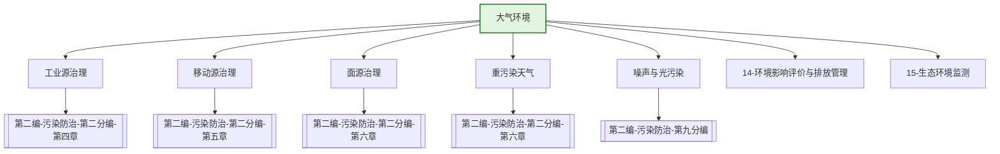

---
ace_review:
  curator: auto
  generator: auto
  reflector: auto
category: 技术规范
confidence: medium
created: '2026-07-22'
source_path: ''
source_type: regulatory
status: draft
subcategory: ''
tags:
- 管理要素
- 大气环境
- 空气质量
- 重污染天气
title: 06管理要素 - 大气环境
updated: '2026-07-22'
---

# 06 大气环境

## 要素概述

大气环境管理是深入打好蓝天保卫战的核心要素，涵盖大气污染防治监督管理、重污染天气应对、大气面源污染防治、噪声和光污染防治、应对气候变化协同等内容。该要素以改善环境空气质量为核心目标。

## 主要职责

负责全国大气、噪声、光、化石能源等污染防治的监督管理，建立对各地区大气环境质量改善目标落实情况考核制度，组织拟订重污染天气应对政策措施，组织协调大气面源污染防治工作。承担京津冀及周边地区大气污染防治有关工作。

## 内设机构

综合处、大气环境质量管理处、大气固定源处、大气移动源处、大气重点行业管理处、区域协调与重污染天气应对处、保护臭氧层处、噪声管理处

## 法典对应条款

- **第二编 污染防治 第二分编 大气污染防治（第三章至第六章）**
  - 第三章 一般规定
    - 第XXX条：大气污染防治基本要求
    - 第XXX条：大气环境质量标准和排放标准
    - 第XXX条：重点区域大气污染联合防治
  - 第四章 工业大气污染防治
    - 第XXX条：燃煤和其他能源大气污染
    - 第XXX条：工业废气排放管控
    - 第XXX条：挥发性有机物防治
  - 第五章 移动源大气污染防治
    - 第XXX条：机动车船排放管控
    - 第XXX条：非道路移动机械排放管控
  - 第六章 扬尘与农业大气污染防治
    - 第XXX条：扬尘污染防治
    - 第XXX条：农业活动大气污染防治
    - 第XXX条：重污染天气应对

## 相关法典编章

- [[第二编-污染防治]]（第二分编 大气污染防治 第三章至第六章）
- [[第二编-污染防治]]（第九分编 噪声、电磁辐射、光污染防治相关条款）

## 相关政策文件

- [[大气污染防治行动计划]]
- [[打赢蓝天保卫战三年行动计划]]
- [[重污染天气消除攻坚行动方案]]
- [[空气质量持续改善行动计划]]

## 关系图谱

## 子目录说明

- [[法律法规]] - 大气污染防治法律法规
- [[政策文件]] - 大气环境政策文件
- [[标准规范]] - 大气环境质量与排放标准
- [[技术指南]] - 大气污染治理技术指南
- [[典型案例]] - 大气污染治理典型案例
