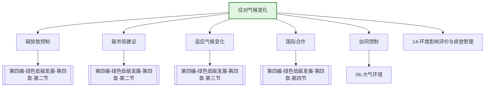

---
ace_review:
  curator: auto
  generator: auto
  reflector: auto
category: 技术规范
confidence: medium
created: '2026-07-24'
source_path: ''
source_type: regulatory
status: draft
subcategory: ''
tags:
- 管理要素
- 气候变化
- 碳排放
- 低碳发展
title: 07管理要素 - 应对气候变化
updated: '2026-07-24'
---

# 07 应对气候变化

## 要素概述

应对气候变化是生态环境管理的重要新兴领域，涵盖温室气体排放控制、碳排放权交易、适应气候变化、国家自主贡献目标落实、气候变化国际合作等内容。该要素是推动经济社会发展全面绿色转型的关键抓手。

## 主要职责

综合分析气候变化对经济社会发展的影响，牵头承担国家履行联合国气候变化框架公约相关工作，组织实施清洁发展机制工作。承担国家应对气候变化及节能减排工作领导小组有关具体工作。

## 内设机构

综合处、战略研究和协调处、国内政策和履约处（碳排放交易管理处）、国际政策和谈判处、对外合作与交流处

## 法典对应条款

- **第四编 绿色低碳发展 第四章 应对气候变化**
  - 第一节 一般规定
    - 第XXX条：应对气候变化基本要求
    - 第XXX条：碳达峰碳中和目标
    - 第XXX条：温室气体排放统计核算
  - 第二节 减缓气候变化
    - 第XXX条：温室气体排放控制
    - 第XXX条：碳排放权交易
    - 第XXX条：碳排放强度与总量双控
  - 第三节 适应气候变化
    - 第XXX条：适应气候变化战略
    - 第XXX条：气候韧性建设
    - 第XXX条：气候监测预警
  - 第四节 国际合作
    - 第XXX条：气候变化国际合作
    - 第XXX条：国家自主贡献
    - 第XXX条：技术转让与资金支持

## 相关法典编章

- [[第四编-绿色低碳发展]]（第四章 应对气候变化）
- [[第二编-污染防治]]（协同控制部分）

## 相关政策文件

- [[国家应对气候变化规划]]
- [[2030年前碳达峰行动方案]]
- [[碳排放权交易管理办法]]
- [[国家适应气候变化战略]]

## 关系图谱

## 子目录说明

- [[法律法规]] - 应对气候变化相关法律法规
- [[政策文件]] - 碳达峰碳中和政策文件
- [[标准规范]] - 温室气体核算、核查标准
- [[技术指南]] - 碳排放核算、核查技术指南
- [[典型案例]] - 低碳发展、碳市场典型案例
