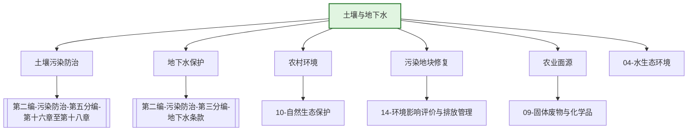

---
ace_review:
  curator: auto
  generator: auto
  reflector: auto
category: 技术规范
confidence: medium
created: '2026-07-22'
source_path: ''
source_type: regulatory
status: draft
subcategory: ''
tags:
- 管理要素
- 土壤
- 地下水
- 污染地块
title: 08管理要素 - 土壤与地下水
updated: '2026-07-22'
---

# 08 土壤与地下水

## 要素概述

土壤与地下水管理是保障农产品质量安全和人居环境安全的重要领域，涵盖土壤污染防治、地下水污染防治、农村生态环境保护、农业面源污染治理、污染地块风险管控与修复等内容。

## 主要职责

负责全国土壤、地下水等污染防治和生态保护的监督管理，组织指导农村生态环境保护，监督指导农业面源污染治理工作。

## 内设机构

综合处、建设用地土壤生态环境处、农用地土壤生态环境处、农村生态环境处、地下水生态环境处

## 法典对应条款

- **第二编 污染防治 第五分编 土壤污染防治（第十六章至第十八章）**
  - 第十六章 一般规定
    - 第XXX条：土壤污染防治基本要求
    - 第XXX条：土壤污染风险管控标准
    - 第XXX条：土壤污染状况调查与监测
  - 第十七章 农用地土壤污染防治
    - 第XXX条：农用地分类管理
    - 第XXX条：优先保护类耕地
    - 第XXX条：安全利用类耕地
    - 第XXX条：严格管控类耕地
  - 第十八章 建设用地土壤污染防治
    - 第XXX条：建设用地土壤污染风险管控和修复
    - 第XXX条：污染地块名录与管控
    - 第XXX条：土壤污染责任人认定

## 相关法典编章

- [[第二编-污染防治]]（第五分编 土壤污染防治 第十六章至第十八章）
- [[第二编-污染防治]]（第三分编 水污染防治 地下水相关条款）

## 相关政策文件

- [[土壤污染防治行动计划]]
- [[地下水管理条例]]
- [[农业农村污染治理攻坚战行动方案]]
- [[污染地块土壤环境管理办法]]

## 关系图谱

## 子目录说明

- [[法律法规]] - 土壤与地下水保护法律法规
- [[政策文件]] - 土壤污染防治政策文件
- [[标准规范]] - 土壤、地下水质量标准
- [[技术指南]] - 土壤修复、地下水治理技术指南
- [[典型案例]] - 土壤修复、地下水治理典型案例
