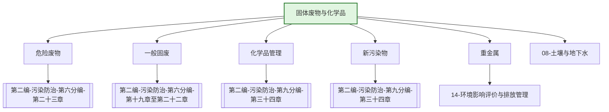

---
ace_review:
  curator: auto
  generator: auto
  reflector: auto
category: 技术规范
confidence: medium
created: '2026-07-22'
source_path: ''
source_type: regulatory
status: draft
subcategory: ''
tags:
- 管理要素
- 固废
- 危废
- 化学品
- 新污染物
title: 09管理要素 - 固体废物与化学品
updated: '2026-07-22'
---

# 09 固体废物与化学品

## 要素概述

固体废物与化学品管理是防范环境风险、保障人体健康的重要领域，涵盖固体废物、危险废物、化学品、重金属、新污染物等监督管理，包括越境转移、电子废物、塑料污染等专项管理内容。

## 主要职责

负责全国固体废物、化学品、重金属等污染防治的监督管理，组织实施危险废物经营许可及出口核准、固体废物进口许可、有毒化学品进出口登记、新化学物质环境管理登记等环境管理制度。

## 内设机构

综合处、固体废物处、化学品处、危险废物处

## 法典对应条款

- **第二编 污染防治 第六分编 固体废物污染防治（第十九章至第二十三章）**
  - 第十九章 一般规定
    - 第XXX条：固体废物污染防治基本要求
    - 第XXX条：固体废物污染环境防治原则
  - 第二十章 工业固体废物
    - 第XXX条：工业固体废物产生者责任
    - 第XXX条：工业固体废物贮存、处置
  - 第二十一章 生活垃圾
    - 第XXX条：生活垃圾分类
    - 第XXX条：生活垃圾处理处置
  - 第二十二章 建筑垃圾、农业固体废物等
    - 第XXX条：建筑垃圾分类处理
    - 第XXX条：农业固体废物回收利用
  - 第二十三章 危险废物
    - 第XXX条：危险废物名录与鉴别
    - 第XXX条：危险废物经营许可
    - 第XXX条：危险废物转移管理
- **第二编 污染防治 第九分编 化学物质、电磁辐射、光污染防治（第三十四章）**
  - 第三十四章 化学物质污染防治
    - 第XXX条：新化学物质登记
    - 第XXX条：化学品环境风险评估
    - 第XXX条：新污染物治理

## 相关法典编章

- [[第二编-污染防治]]（第六分编 固体废物污染防治 第十九章至第二十三章）
- [[第二编-污染防治]]（第九分编 化学物质污染防治 第三十四章）

## 相关政策文件

- [[固体废物污染环境防治法]]
- [[危险废物经营许可证管理办法]]
- [[新污染物治理行动方案]]
- [["十四五"塑料污染治理行动方案]]

## 关系图谱

## 子目录说明

- [[法律法规]] - 固体废物与化学品法律法规
- [[政策文件]] - 固废与化学品管理政策
- [[标准规范]] - 危废鉴别、固废利用标准
- [[技术指南]] - 固废处理处置技术指南
- [[典型案例]] - 固废治理、新污染物治理典型案例
