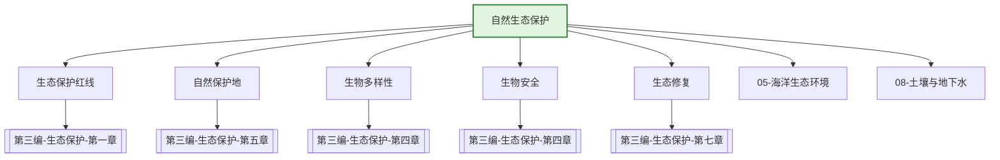

---
ace_review:
  curator: auto
  generator: auto
  reflector: auto
category: 技术规范
confidence: medium
created: '2026-07-22'
source_path: ''
source_type: regulatory
status: draft
subcategory: ''
tags:
- 管理要素
- 生态保护
- 生物多样性
- 自然保护区
title: 10管理要素 - 自然生态保护
updated: '2026-07-22'
---

# 10 自然生态保护

## 要素概述

自然生态保护是维护国家生态安全、保护生物多样性的核心要素，涵盖生态保护红线管理、自然保护地监管、生物多样性保护、生物安全管理、生态文明示范创建等内容。

## 主要职责

组织起草生态保护规划，开展全国生态状况评估，指导生态示范创建。承担自然保护地、生态保护红线相关监管工作。组织开展生物多样性保护、生物遗传资源保护、生物安全管理工作。承担中国生物多样性保护国家委员会秘书处和国家生物安全管理办公室工作。

## 内设机构

综合处、生态状况评估与监督处、自然保护地和生态保护红线监管处、生物多样性保护处

## 法典对应条款

- **第三编 生态保护（全部七章）**
  - 第一章 一般规定
    - 第XXX条：生态保护基本要求
    - 第XXX条：生态保护红线制度
  - 第二章 生态系统保护
    - 第XXX条：森林生态系统保护
    - 第XXX条：草原生态系统保护
    - 第XXX条：湿地生态系统保护
    - 第XXX条：海洋生态系统保护
    - 第XXX条：江河湖泊生态系统保护
    - 第XXX条：荒漠生态系统保护
  - 第三章 自然资源保护
    - 第XXX条：土地资源保护
    - 第XXX条：矿产资源保护
    - 第XXX条：水资源保护
    - 第XXX条：渔业资源保护
  - 第四章 物种保护
    - 第XXX条：野生动物保护
    - 第XXX条：野生植物保护
    - 第XXX条：外来入侵物种防控
  - 第五章 重要地理单元保护
    - 第XXX条：自然保护地体系
    - 第XXX条：长江、黄河等大江大河保护
  - 第六章 生态退化防治
    - 第XXX条：水土保持
    - 第XXX条：防沙治沙
  - 第七章 生态修复
    - 第XXX条：生态修复原则
    - 第XXX条：生态修复责任

## 相关法典编章

- [[第三编-生态保护]]（全部七章）
- [[第一编-总则]]（第三章 规划和生态环境分区管控）

## 相关政策文件

- [[关于划定并严守生态保护红线的若干意见]]
- [[关于建立以国家公园为主体的自然保护地体系的指导意见]]
- [[中国生物多样性保护战略与行动计划]]
- [[生物安全法]]

## 关系图谱

## 子目录说明

- [[法律法规]] - 自然生态保护法律法规
- [[政策文件]] - 生态保护政策文件
- [[标准规范]] - 生态保护红线、生物多样性标准
- [[技术指南]] - 生态修复、生物多样性调查技术指南
- [[典型案例]] - 生态保护修复典型案例
