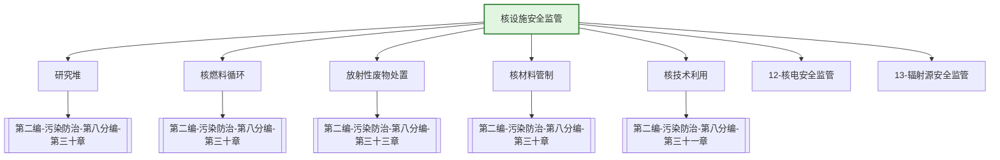

---
ace_review:
  curator: auto
  generator: auto
  reflector: auto
category: 技术规范
confidence: medium
created: '2026-07-24'
source_path: ''
source_type: regulatory
status: draft
subcategory: ''
tags:
- 管理要素
- 核设施
- 核安全
- 辐射
title: 11管理要素 - 核设施安全监管
updated: '2026-07-24'
---

# 11 核设施安全监管

## 要素概述

核设施安全监管是保障核安全、防范核风险的重要领域，涵盖核设施（除核电外）的安全许可、监督检查、辐射环境监测、核材料管制、核事故应急等内容，包括研究堆、核燃料循环设施、放射性废物处理处置设施等。

## 主要职责

承担核与辐射安全法律法规草案的起草，拟订有关政策，负责核安全工作协调机制有关工作，组织辐射环境监测，承担核与辐射事故应急工作，负责核材料管制和民用核安全设备设计、制造、安装及无损检验活动的监督管理。

## 内设机构

办公室、核安全协调处（国家安全协调处）、政策与技术处、辐射监测与应急处（核与辐射事故应急办公室）、人员资质管理处、核安全设备处

## 法典对应条款

- **第二编 污染防治 第八分编 放射性污染防治（第二十九章至第三十三章）**
  - 第二十九章 一般规定
    - 第XXX条：放射性污染防治基本要求
    - 第XXX条：放射性污染防治标准
  - 第三十章 核设施放射性污染防治
    - 第XXX条：核设施选址、建造、运行、退役许可
    - 第XXX条：核设施安全监督
    - 第XXX条：核设施辐射环境监测
    - 第XXX条：核事故应急管理
  - 第三十一章 核技术利用放射性污染防治
    - 第XXX条：核技术利用许可
    - 第XXX条：放射性同位素与射线装置管理
  - 第三十二章 铀（钍）矿和伴生放射性矿污染防治
    - 第XXX条：铀（钍）矿开发利用
    - 第XXX条：伴生放射性矿管理
  - 第三十三章 放射性废物管理
    - 第XXX条：放射性废物分类管理
    - 第XXX条：放射性废物处理处置许可

## 相关法典编章

- [[第二编-污染防治]]（第八分编 放射性污染防治 第二十九章至第三十三章）
- [[第五编-法律责任和附则]]（放射性污染防治法律责任）

## 相关政策文件

- [[核安全法]]
- [[放射性废物安全管理条例]]
- [[民用核设施安全监督管理条例]]
- [[核材料管制条例]]

## 关系图谱

## 子目录说明

- [[法律法规]] - 核设施安全法律法规
- [[政策文件]] - 核安全监管政策文件
- [[标准规范]] - 核安全标准、导则
- [[技术指南]] - 核安全技术指南
- [[典型案例]] - 核安全监管典型案例
