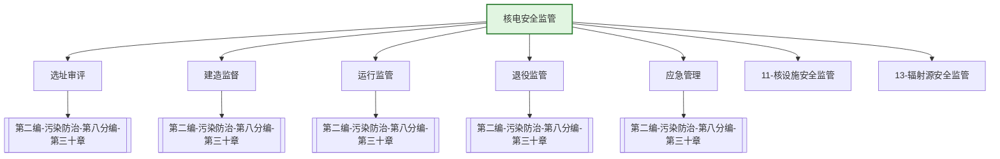

---
ace_review:
  curator: auto
  generator: auto
  reflector: auto
category: 技术规范
confidence: medium
created: '2026-07-24'
source_path: ''
source_type: regulatory
status: draft
subcategory: ''
tags:
- 管理要素
- 核电
- 核电厂
- 核安全
title: 12管理要素 - 核电安全监管
updated: '2026-07-24'
---

# 12 核电安全监管

## 要素概述

核电安全监管是保障核电厂安全运行、保护公众和环境免受核辐射危害的关键领域，涵盖核电厂选址、设计、建造、运行、退役全生命周期的核安全许可与监督，以及核电厂辐射环境监测、核事故应急等内容。

## 主要职责

负责核电厂、研究型反应堆、临界装置等核设施的核安全、辐射安全、辐射环境保护的监督管理。

## 内设机构

综合处、运行安全与质量保证处、核电一处、核电二处、核电三处、反应堆处

## 法典对应条款

- **第二编 污染防治 第八分编 放射性污染防治 第三十章 核设施放射性污染防治**
  - 第XXX条：核动力厂选址安全审查
  - 第XXX条：核动力厂建造许可
  - 第XXX条：核动力厂运行许可
  - 第XXX条：核动力厂退役许可
  - 第XXX条：核动力厂安全监督
  - 第XXX条：核动力厂辐射环境监测
  - 第XXX条：核动力厂核事故应急
  - 第XXX条：核安全设备监督管理
  - 第XXX条：核电厂操纵人员资质

## 相关法典编章

- [[第二编-污染防治]]（第八分编 放射性污染防治 第三十章 核设施放射性污染防治）
- [[第五编-法律责任和附则]]（放射性污染防治法律责任）

## 相关政策文件

- [[核安全法]]
- [[民用核设施安全监督管理条例]]
- [[核电厂核事故应急管理条例]]
- [[核动力厂设计安全规定]]

## 关系图谱

## 子目录说明

- [[法律法规]] - 核电安全法律法规
- [[政策文件]] - 核电安全监管政策
- [[标准规范]] - 核电厂安全标准
- [[技术指南]] - 核电安全技术指南
- [[典型案例]] - 核电安全监管典型案例
