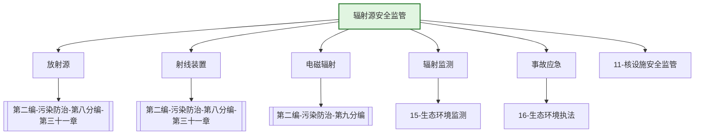

---
ace_review:
  curator: auto
  generator: auto
  reflector: auto
category: 技术规范
confidence: medium
created: '2026-07-22'
source_path: ''
source_type: regulatory
status: draft
subcategory: ''
tags:
- 管理要素
- 辐射
- 放射源
- 电磁辐射
title: 13管理要素 - 辐射源安全监管
updated: '2026-07-22'
---

# 13 辐射源安全监管

## 要素概述

辐射源安全监管是保护公众和从业人员免受电离辐射和电磁辐射危害的重要领域，涵盖放射源、射线装置、电磁辐射设施的辐射安全许可与监督，辐射环境监测，辐射事故应急等内容。

## 主要职责

负责核燃料循环设施、放射性废物处理和处置设施、核设施退役项目、核技术利用项目、铀（钍）矿和伴生放射性矿、电磁辐射装置和设施、放射性物质运输的核安全、辐射安全和辐射环境保护、放射性污染治理的监督管理。

## 内设机构

综合处、核燃料与运输处、放射性废物管理处、核技术利用处、电磁辐射与矿冶处

## 法典对应条款

- **第二编 污染防治 第八分编 放射性污染防治（第三十一章至第三十三章）**
  - 第三十一章 核技术利用放射性污染防治
    - 第XXX条：核技术利用许可
    - 第XXX条：放射源安全管理
    - 第XXX条：射线装置安全管理
    - 第XXX条：放射性同位素转让与转移
  - 第三十二章 铀（钍）矿和伴生放射性矿污染防治
    - 第XXX条：铀（钍）矿开发利用
    - 第XXX条：伴生放射性矿管理
    - 第XXX条：放射性污染防治措施
  - 第三十三章 放射性废物管理
    - 第XXX条：放射性废物分类管理
    - 第XXX条：放射性废物处理处置许可
    - 第XXX条：放射性废物减量化
- **第二编 污染防治 第九分编 化学物质、电磁辐射、光污染防治**
  - 第XXX条：电磁辐射污染防治

## 相关法典编章

- [[第二编-污染防治]]（第八分编 放射性污染防治 第三十一章至第三十三章）
- [[第二编-污染防治]]（第九分编 电磁辐射污染防治相关条款）

## 相关政策文件

- [[放射性污染防治法]]
- [[放射性同位素与射线装置安全和防护条例]]
- [[电磁辐射环境保护管理办法]]
- [[放射性物品运输安全管理条例]]

## 关系图谱

## 子目录说明

- [[法律法规]] - 辐射安全法律法规
- [[政策文件]] - 辐射安全监管政策
- [[标准规范]] - 辐射防护标准
- [[技术指南]] - 辐射安全技术指南
- [[典型案例]] - 辐射安全监管典型案例
