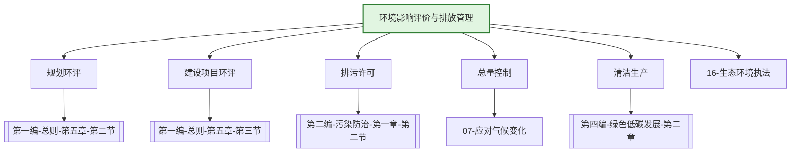

---
ace_review:
  curator: auto
  generator: auto
  reflector: auto
category: 技术规范
confidence: medium
created: '2026-07-23'
source_path: ''
source_type: regulatory
status: draft
subcategory: ''
tags:
- 管理要素
- 环评
- 排污许可
- 排放管理
title: 14管理要素 - 环境影响评价与排放管理
updated: '2026-07-23'
---

# 14 环境影响评价与排放管理

## 要素概述

环境影响评价与排放管理是生态环境准入和污染源管控的核心要素，涵盖建设项目环境影响评价、排污许可管理、污染物排放总量控制、环境统计、清洁生产审核等内容，是预防环境污染和生态破坏的第一道防线。

## 主要职责

承担规划环境影响评价、政策环境影响评价、项目环境影响评价工作，承担排污许可综合协调和管理工作，拟订生态环境准入清单并组织实施。

## 内设机构

综合处、区域与规划环境影响评价处、环境影响评价与固定污染源排污许可一处、环境影响评价与固定污染源排污许可二处、资源开发与基础设施环境影响评价处

## 法典对应条款

- **第一编 总则 第五章 生态环境影响评价**
  - 第一节 一般规定
    - 第40条：生态环境影响评价制度
    - 第41条：生态环境影响评价分类管理
  - 第二节 规划生态环境影响评价
    - 第42条：规划环评范围与要求
    - 第43条：规划环评审查
    - 第44条：规划环评与建设项目环评联动
  - 第三节 建设项目生态环境影响评价
    - 第45条：建设项目环评程序
    - 第46条：建设项目环评审批
    - 第47条：建设项目环评与排污许可衔接
- **第二编 污染防治 第一章 通则 第二节 排污许可管理**
  - 第XXX条：排污许可制度
  - 第XXX条：排污许可证申请与核发
  - 第XXX条：排污单位义务
  - 第XXX条：排污许可与环评衔接

## 相关法典编章

- [[第一编-总则]]（第五章 生态环境影响评价）
- [[第二编-污染防治]]（第一章第二节 排污许可管理）

## 相关政策文件

- [[环境影响评价法]]
- [[排污许可管理条例]]
- [[建设项目环境保护管理条例]]
- [[固定污染源排污许可分类管理名录]]

## 关系图谱

## 子目录说明

- [[法律法规]] - 环评与排放管理法律法规
- [[政策文件]] - 环评、排污许可政策文件
- [[标准规范]] - 环评技术导则、排放标准
- [[技术指南]] - 环评技术指南、排污许可技术规范
- [[典型案例]] - 环评审批、排污许可典型案例
