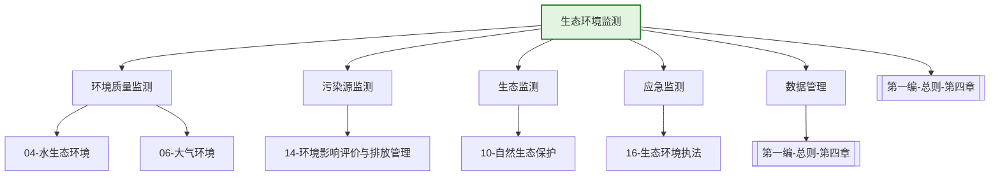

---
ace_review:
  curator: auto
  generator: auto
  reflector: auto
category: 技术规范
confidence: medium
created: '2026-07-24'
source_path: ''
source_type: regulatory
status: draft
subcategory: ''
tags:
- 管理要素
- 监测
- 环境质量
- 污染源监测
title: 15管理要素 - 生态环境监测
updated: '2026-07-24'
---

# 15 生态环境监测

## 要素概述

生态环境监测是生态环境管理的"耳目"和"基石"，涵盖环境质量监测、污染源监测、生态监测、遥感监测、监测网络建设、监测数据管理等内容，为环境管理决策提供科学依据和数据支撑。

## 主要职责

组织开展生态环境监测、温室气体减排监测、应急监测，调查评估全国生态环境质量状况并进行预测预警，承担国家生态环境监测网建设和管理工作。

## 内设机构

综合处、监测网络管理处、环境质量监测与评估处、生态监测与评估处（卫星遥感监测处）、监测质量监督管理处

## 法典对应条款

- **第一编 总则 第四章 标准和监测**
  - 第33条：生态环境标准体系（含监测标准）
  - 第37条：国家生态环境监测标准
  - 第39条：标准实施评估
  - 第XXX条：生态环境监测制度
  - 第XXX条：生态环境监测网络
  - 第XXX条：监测数据质量管理
  - 第XXX条：监测信息公开
- **第一编 总则 第二章 监督管理 第二节 监督管理制度**
  - 第19条：生态环境监测制度

## 相关法典编章

- [[第一编-总则]]（第二章第二节 监督管理制度、第四章 标准和监测）
- [[第二编-污染防治]]（各要素监测要求）

## 相关政策文件

- [[生态环境监测条例]]
- [[生态环境监测网络建设方案]]
- [[关于深化环境监测改革提高环境监测数据质量的意见]]
- [["十四五"生态环境监测规划]]

## 关系图谱

## 子目录说明

- [[法律法规]] - 生态环境监测法律法规
- [[政策文件]] - 监测管理政策文件
- [[标准规范]] - 监测方法标准、技术规范
- [[技术指南]] - 监测技术指南
- [[典型案例]] - 监测网络建设、数据应用典型案例
