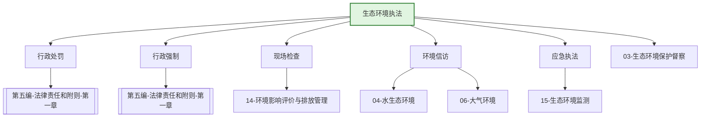

---
ace_review:
  curator: auto
  generator: auto
  reflector: auto
category: 技术规范
confidence: medium
created: '2026-07-22'
source_path: ''
source_type: regulatory
status: draft
subcategory: ''
tags:
- 管理要素
- 执法
- 行政处罚
- 现场检查
title: 16管理要素 - 生态环境执法
updated: '2026-07-22'
---

# 16 生态环境执法

## 要素概述

生态环境执法是保障生态环境法律法规有效实施的关键手段，涵盖生态环境行政处罚、行政强制、现场检查、执法监督、环境信访、环境应急执法等内容。该要素是维护生态环境法治秩序的重要保障。

## 主要职责

监督生态环境政策、规划、法规、标准的执行，组织拟订重特大突发生态环境事件和生态破坏事件的应急预案，指导协调调查处理工作，协调解决有关跨区域环境污染纠纷，组织实施建设项目环境保护设施同时设计、同时施工、同时投产使用制度。

## 内设机构

办公室、队伍规范建设与稽查处、行政处罚与强制处、监督执法一处、监督执法二处、监督执法三处

## 法典对应条款

- **第五编 法律责任和附则 第一章 法律责任通则**
  - 第XXX条：法律责任一般规定
  - 第XXX条：行政责任
  - 第XXX条：民事责任
  - 第XXX条：刑事责任
  - 第XXX条：按日连续处罚
  - 第XXX条：双罚制（单位与责任人）
- **第五编 法律责任和附则 第二章 法律责任分则**
  - 第一节 污染防治法律责任
    - 第XXX条：大气、水、土壤等污染防治违法责任
  - 第二节 生态保护法律责任
    - 第XXX条：生态破坏违法责任
  - 第三节 绿色低碳发展法律责任
    - 第XXX条：碳排放、固废等违法责任
  - 第四节 放射性污染防治法律责任
    - 第XXX条：核与辐射违法责任
- **第五编 法律责任和附则 第三章 附则**
  - 第XXX条：术语定义
  - 第XXX条：施行日期

## 相关法典编章

- [[第五编-法律责任和附则]]（全部三章）
- [[第一编-总则]]（第二章 监督管理）

## 相关政策文件

- [[生态环境保护综合行政执法事项指导目录]]
- [[环境行政处罚办法]]
- [[环境保护主管部门实施按日连续处罚办法]]
- [[突发环境事件应急管理办法]]

## 关系图谱

## 子目录说明

- [[法律法规]] - 生态环境执法法律法规
- [[政策文件]] - 执法工作规定及方案
- [[标准规范]] - 执法程序标准
- [[技术指南]] - 执法技术方法与指南
- [[典型案例]] - 生态环境执法典型案例
