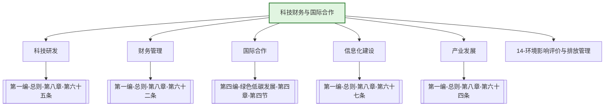

---
ace_review:
  curator: auto
  generator: auto
  reflector: auto
category: 技术规范
confidence: medium
created: '2026-07-22'
source_path: ''
source_type: regulatory
status: draft
subcategory: ''
tags:
- 管理要素
- 科技
- 财务
- 国际合作
- 投资
title: 17管理要素 - 科技财务与国际合作
updated: '2026-07-22'
---

# 17 科技财务与国际合作

## 要素概述

科技财务与国际合作是生态环境管理的支撑保障要素，涵盖生态环境科技研发与推广、财务与资金管理、国际合作与交流、外资项目管理、生态环境信息化建设等内容。该要素为生态环境保护提供技术、资金和国际合作支撑。

## 主要职责

### 科技与财务司

承担生态环境领域固定资产投资和项目管理相关工作，承担机关和直属单位财务、国有资产管理、内部审计工作。承担生态环境科技工作，负责组织拟订并实施科技促进生态环境发展规划和政策，组织实施生态环境科技计划（专项、基金等）项目，指导受托科研管理专业机构开展具体项目管理工作。参与指导和推动循环经济与生态环保产业发展。

科技与财务司内设机构：综合处、科技发展处、科技管理处、预算与财务资产处、投资与技术指导处、审计与项目监督办公室

### 国际合作司

研究提出国际生态环境合作中有关问题的建议，牵头组织有关国际条约的谈判工作，参与处理涉外的生态环境事务，承担与生态环境国际组织联系事务。

国际合作司内设机构：综合处（国合会秘书处）、国际组织处、生态环境公约处、亚非拉处、欧洲美大处、核安全国际合作处

## 法典对应条款

- **第一编 总则 第八章 保障措施**
  - 第62条：财政保障
  - 第63条：税收、价格、金融政策
  - 第64条：生态环境产业发展
  - 第65条：生态环境科技创新
  - 第66条：生态环境统计
  - 第67条：生态环境信息化建设
- **第四编 绿色低碳发展 第四章 应对气候变化 第四节 国际合作**
  - 第XXX条：气候变化国际合作
  - 第XXX条：国家自主贡献
  - 第XXX条：技术转让与资金支持
  - 第XXX条：国际条约履约

## 相关法典编章

- [[第一编-总则]]（第八章 保障措施）
- [[第四编-绿色低碳发展]]（第四章第四节 国际合作）

## 相关政策文件

- [[国家环境保护重点实验室管理办法]]
- [[国家生态环境科技成果转化引导基金管理办法]]
- [[生态环境保护专项资金管理办法]]
- [[生态环境国际合作工作指南]]

## 关系图谱

## 子目录说明

- [[法律法规]] - 科技、财务、国际合作相关法律法规
- [[政策文件]] - 科技、财务、国际合作政策文件
- [[标准规范]] - 科技项目管理、财务管理制度
- [[技术指南]] - 科技成果转化、国际合作指南
- [[典型案例]] - 科技项目、国际合作典型案例
