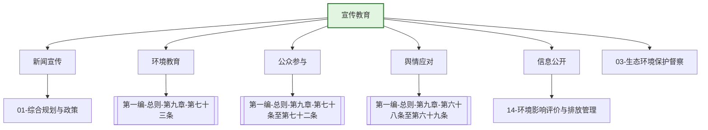

---
ace_review:
  curator: auto
  generator: auto
  reflector: auto
category: 技术规范
confidence: medium
created: '2026-07-23'
source_path: ''
source_type: regulatory
status: draft
subcategory: ''
tags:
- 管理要素
- 宣传教育
- 公众参与
- 环境教育
title: 18管理要素 - 宣传教育
updated: '2026-07-23'
---

# 18 宣传教育

## 要素概述

宣传教育是生态环境管理的社会基础要素，涵盖生态环境宣传教育、公众参与、环境信息公开、舆情应对、环境文化建设、社会组织引导等内容。该要素旨在提升全社会生态文明意识，推动形成绿色低碳生产生活方式。

## 主要职责

研究拟订并组织实施生态环境保护宣传教育纲要，组织开展生态文明建设和环境友好型社会建设的宣传教育工作。承担部新闻审核和发布，指导生态环境舆情收集、研判、应对工作。

## 内设机构

综合处、新闻与舆情处、宣传教育处

## 法典对应条款

- **第一编 总则 第九章 信息公开与公众参与**
  - 第68条：政府生态环境信息公开
  - 第69条：企业事业单位生态环境信息公开
  - 第70条：建设项目环评公众参与
  - 第71条：环境公益诉讼
  - 第72条：公众参与环境决策
  - 第73条：环境宣传教育
  - 第74条：绿色低碳生活方式倡导
  - 第75条：生态环境志愿服务
  - 第76条：公众举报与监督

## 相关法典编章

- [[第一编-总则]]（第九章 信息公开与公众参与）
- [[第五编-法律责任和附则]]（公众参与相关法律责任）

## 相关政策文件

- [[全国环境宣传教育行动纲要]]
- [[关于推进环境保护公众参与的指导意见]]
- [[企业环境信息依法披露管理办法]]
- [[公民生态环境行为规范]]

## 关系图谱

## 子目录说明

- [[法律法规]] - 环境信息公开、公众参与法律法规
- [[政策文件]] - 宣传教育、公众参与政策文件
- [[标准规范]] - 环境教育基地建设标准
- [[技术指南]] - 宣传教育、舆情应对指南
- [[典型案例]] - 环境教育、公众参与典型案例
