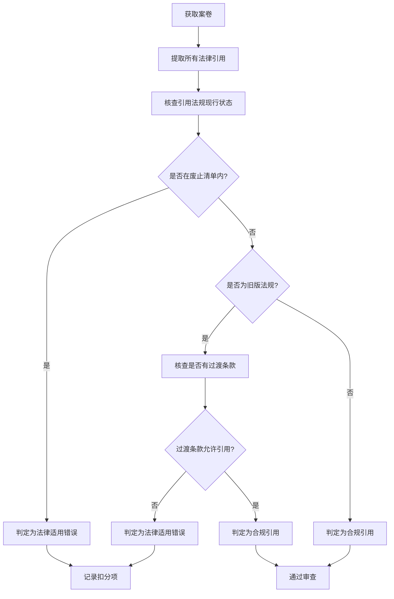

# 法律适用正确性审查（8-15后禁引废止10法）

## 一、审查背景与目的

根据《生态环境行政执法案卷评查细则（2024年版）》第8-15项规定，**自2024年8月15日起**，执法案卷中**禁止引用**已废止或失效的法律法规作为执法依据。本playbook旨在帮助评查人员系统识别案卷中是否存在引用废止法规的情形，确保法律适用的准确性和时效性。

> ⚠️ **核心原则**：法律适用正确性审查是案卷评查的**一票否决项**。引用废止法规的案卷，直接判定为**不合格**。

## 二、10部重点禁引废止法规清单

以下10部法规为案卷评查中**高频误引**的已废止/失效法规，评查时应重点核查：

| 序号 | 法规名称 | 废止/失效时间 | 替代法规 | 常见误引场景 |
|:----:|----------|:-------------:|----------|:------------:|
| 1 | 《环境保护法》（1989版） | 2015-01-01 | 《环境保护法》（2014修订） | 引用旧法条文编号 |
| 2 | 《大气污染防治法》（2015版） | 2018-10-26 | 《大气污染防治法》（2018修正） | 引用旧版处罚条款 |
| 3 | 《水污染防治法》（2008版） | 2018-01-01 | 《水污染防治法》（2017修正） | 引用旧版限期治理条款 |
| 4 | 《环境影响评价法》（2002版） | 2016-09-01 | 《环境影响评价法》（2016修正） | 引用旧版环评等级 |
| 5 | 《建设项目环境保护管理条例》（1998版） | 2017-10-01 | 《建设项目环境保护管理条例》（2017修订） | 引用旧版验收程序 |
| 6 | 《环境行政处罚办法》（2010版） | 2021-07-15 | 《生态环境行政处罚办法》（2021） | 引用旧版处罚程序 |
| 7 | 《固体废物污染环境防治法》（2004版） | 2020-09-01 | 《固体废物污染环境防治法》（2020修订） | 引用旧版危废管理条款 |
| 8 | 《环境噪声污染防治法》（1996版） | 2022-06-05 | 《噪声污染防治法》（2022） | 引用旧版噪声标准 |
| 9 | 《清洁生产促进法》（2002版） | 2012-07-01 | 《清洁生产促进法》（2012修正） | 引用旧版审核要求 |
| 10 | 《环境保护主管部门实施按日连续处罚办法》（2014版） | 2023-07-01 | 《生态环境行政处罚办法》（2021） | 引用旧版计罚方式 |

## 三、审查要点与操作流程

### 3.1 审查范围

- **处罚决定书**：引用的法律依据条款
- **责令改正通知书**：引用的法律依据条款
- **现场检查（勘察）笔录**：引用的法律依据条款
- **行政处罚事先告知书**：引用的法律依据条款
- **听证告知书**：引用的法律依据条款
- **其他执法文书**：凡涉及法律引用的部分

### 3.2 审查步骤

### 3.3 重点核查项

1. **法规名称完整性**：是否写明法规全称（含“中华人民共和国”前缀）
2. **法规版本准确性**：是否注明修正/修订年份（如“2014修订”）
3. **条款编号正确性**：是否与现行版本条款编号一致
4. **引用时效性**

## 相关概念
- [[第一次随督察队现场指南]]
- [[第一次做案卷评查指南]]

## 相关引用
- [[index]]
